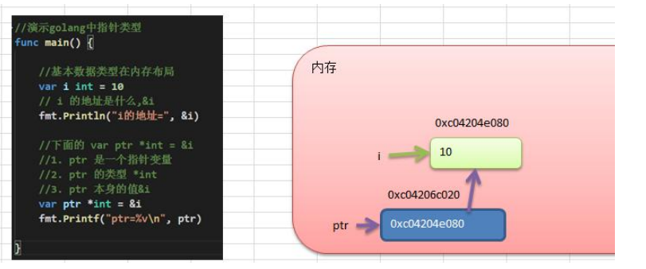
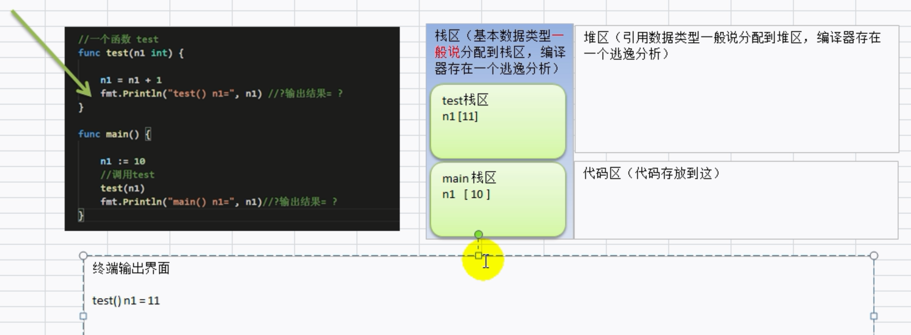
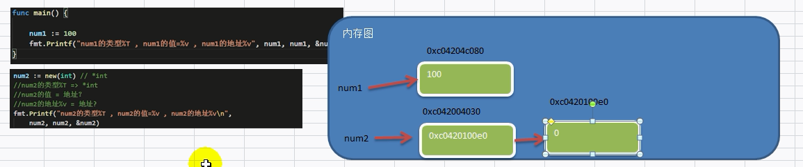
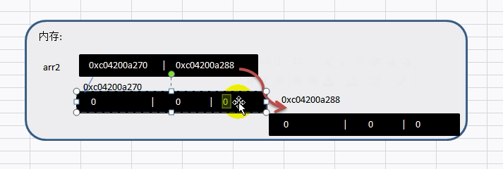
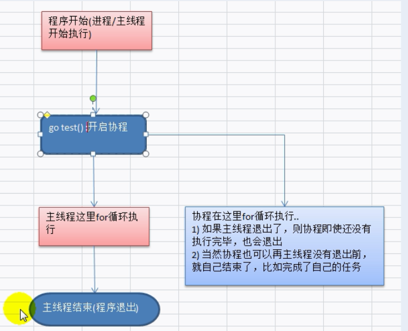
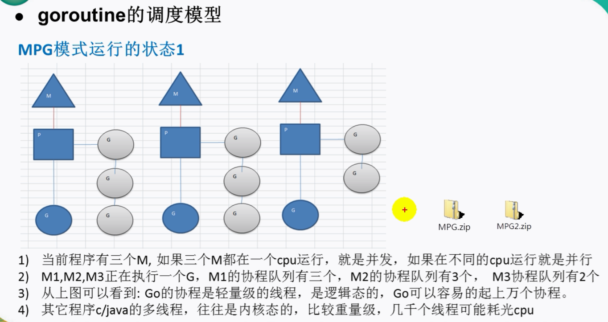
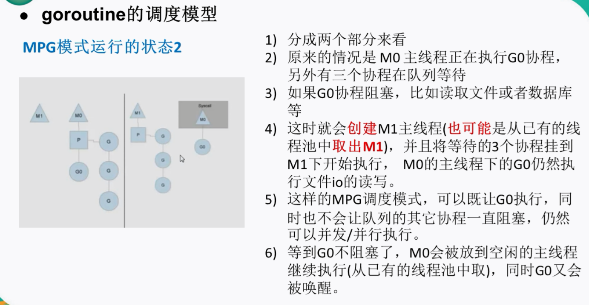

# Go学习笔记

2023.08.23

学习教程：[尚硅谷 Golang入门到实战教程丨一套精通GO语言 共386集(117小时)](https://www.bilibili.com/video/BV1ME411Y71o)

## Go语言简介

### 诞生

Go语言（又称Golang）是由Google开发的一种编程语言。它的诞生背景可以追溯到2007年左右，以下是Go语言诞生的一些关键背景和动机：

1. **软件复杂性的挑战：** 在Google内部，软件系统变得越来越复杂，开发和维护变得困难。Google当时主要使用C++和Python等语言，但这些语言在大规模系统开发中可能存在一些问题，如编译速度慢、难以处理并发等。

2. **开发效率：** Google希望有一种可以提高开发效率、降低维护成本的新型编程语言。

3. **并发需求：** 随着多核处理器的普及，编写高效的并发代码变得越来越重要。Google内部许多任务都需要处理高并发，现有语言中的并发支持可能不够满足需求。

4. **编译速度：** 在Google这样的大型组织中，编译速度也变得至关重要。开发者希望有一种能够更快编译的语言，以加快迭代和测试。

基于以上的背景，Google决定开发一种新的编程语言，即Go语言。Go语言的开发始于2007年，其中主要的设计者包括Robert Griesemer、Rob Pike和Ken Thompson，他们都在Google工作。Go语言的设计注重简洁、可读性和高效性，同时提供了强大的并发支持，以满足Google内部开发的需求。

Go语言的公开发布是在2009年11月，这也是Go语言1.0版本的发布。随着时间的推移，Go语言受到了广泛的关注和采用，不仅在Google内部得到了应用，还在全球范围内的开发者社区中获得了越来越多的支持。至今，Go语言已经成为一种流行的编程语言，被用于开发各种类型的应用，从系统编程到网络服务和分布式系统等。

### 发展史

自Go语言于2009年发布1.0版本以来，Go团队不断进行了版本的更新和改进，每个版本都带来了新功能、改进和修复。以下是Go语言一些重要版本的简要概述：

1. **Go 1.0（2012年3月）：** Go 1.0标志着Go语言的正式发布。此版本的主要目标是稳定性和兼容性，确保代码在未来的版本中仍然有效。它引入了一些基本的标准库和语言特性。

2. **Go 1.1（2013年5月）：** 这个版本引入了一些小的语言和库的改进，以及对ARM架构的支持。

3. **Go 1.2（2013年12月）：** 引入了一些重要的改进，包括垃圾回收性能提升、工具链改进以及语言特性的增强。

4. **Go 1.3（2014年6月）：** 引入了新的Go工具、垃圾回收改进和一些语言特性的调整。

5. **Go 1.4（2014年12月）：** 该版本引入了新的编译器、新的垃圾回收器、并行测试等功能。

6. **Go 1.5（2015年8月）：** 引入了逐步采用的新的垃圾回收器、更好的并行编译器等。

   > 本次更新中移除了”最后残余的C代码”。go1.5的发布被认为是历史性的。完全移除C语言部分，使用GO编译GO（ps：少量代码使用汇编实现），GO编译GO称之为Go的自举，是一门编程语言走向成熟的表现。

7. **Go 1.6（2016年2月）：** 引入了并行测试、内存性能优化、调度器等改进。

8. **Go 1.7（2016年8月）：** 引入了基于SSA的编译器、性能改进和一些库的更新。

9. **Go 1.8（2017年2月）：** 引入了HTTP/2支持、上下文包、性能改进等。

10. **Go 1.9（2017年8月）：** 引入了类型别名、Map类型的改进、性能优化等。

11. **Go 1.10（2018年2月）：** 引入了语法改进、并行编译性能优化等。

12. **Go 1.11（2018年8月）：** 引入了模块支持、WebAssembly支持、性能改进等。

13. **Go 1.12（2019年2月）：** 引入了模块支持的改进、更好的垃圾回收等。

14. **Go 1.13（2019年9月）：** 引入了模块支持的改进、更快的编译速度等。

15. **Go 1.14（2020年2月）：** 引入了模块支持的改进、新的内存分配器等。

16. **Go 1.15（2020年8月）：** 引入了链接器性能改进、错误处理的改进等。

17. **Go 1.16（2021年2月）：** 引入了嵌套的if/else、支持对错误的is操作等。

18. **Go 1.17（2021年8月）：** 引入了新的操作符、错误处理的改进、Fuzz测试支持等。

19. **Go 1.18（2022年3月）**。

20. **Go 1.19（2022年8月）**。

21. **Go 1.20（2023年2月）**。

22. **Go 1.21（2023年8月）**。

Go语言的版本更迭旨在持续改进语言和工具，以满足开发者的需求，提高性能和效率，并保持向后兼容性，以便现有的Go代码可以在新版本上继续运行。你可以在Go的官方网站上找到完整的版本发布历史和详细的变更说明。

参考：[Go Release History(官方)](https://golang.google.cn/doc/devel/release#pre.go1)

[go语言图标的发展史是什么](https://www.if98.com/328131696/program/234314.html)

### 特性

Go，通常称为Golang，是一种开源的编程语言，由Google于2007年启动并在2009年首次发布。Go的设计目标是提供一种简单、高效、可靠的编程语言，适用于大规模软件系统开发。它具有以下特点：

1. **并发支持：** Go内置了强大的并发支持，通过goroutine和channel来实现。Goroutine是一种轻量级的线程，可以在程序中同时运行成千上万个goroutine，而不会消耗大量的内存。Channel是一种用于在goroutine之间通信的机制，使并发编程更加简单和安全。

2. **快速编译：** Go编译器非常快速，从源代码到可执行文件的编译过程通常只需要几秒钟。这有助于开发者更迅速地迭代和测试代码。

3. **垃圾回收：** Go拥有自动垃圾回收（Garbage Collection）机制，开发者无需手动管理内存。这有助于减少内存泄漏和其他与内存管理相关的错误。

4. **静态类型：** Go是一种静态类型语言，这意味着变量的类型在编译时必须明确指定，这有助于提早捕获一些类型相关的错误。

5. **简洁的语法：** Go的语法设计简洁，去掉了一些冗余的特性，使代码更易于阅读和维护。

6. **面向接口：** Go鼓励使用接口（interfaces）进行抽象和多态编程。这使得代码更具灵活性，容易扩展和修改。

7. **内置工具：** Go附带了许多实用的工具，如格式化工具（`gofmt`）、文档生成工具（`godoc`）和测试工具（`go test`），这些工具有助于提高开发效率和代码质量。

8. **跨平台支持：** Go支持多种操作系统和硬件架构，可以在不同平台上进行开发和部署。

9. **开源：** Go是一个开源项目，其源代码可以在GitHub上找到，这意味着任何人都可以查看、使用和贡献代码。

10. **适用领域：** Go适用于各种类型的应用程序，从系统工具和网络服务器到分布式系统和云计算平台等。

### 官方文档

Golang 官方网站：https://go.dev/

Golang 官方标准库 API文档： https://pkg.go.dev/std 可以查看 Golang 所有包下的函数和使用。

Golang 中文网 在线标准库文档：https://studygolang.com/pkgdoc

## 准备工作

### 环境安装

安装Go语言的开发环境非常简单。以下是在常见操作系统上安装Go的步骤：

#### 在 Windows 上安装 Go：

1. 前往 [Go 官方下载页面](https://golang.org/dl/)，找到适用于 Windows 的安装包（`.msi` 文件）。

2. 下载并运行安装包。按照安装向导的指示进行安装。默认情况下，Go会安装到 `C:\Go` 目录。

3. 安装完成后，打开命令提示符（Command Prompt）或 PowerShell，并输入以下命令验证安装：

```bash
go version
```

#### 在 macOS 上安装 Go：

1. 打开终端。

2. 使用以下命令安装 `brew`，如果你还没有安装它：

```bash
/bin/bash -c "$(curl -fsSL https://raw.githubusercontent.com/Homebrew/install/HEAD/install.sh)"
```

3. 使用 `brew` 安装 Go：

```bash
brew install go
```

4. 安装完成后，在终端中输入以下命令验证安装：

```bash
go version
```

#### 在 Linux 上安装 Go：

1. 打开终端。

2. 使用以下命令下载 Go 的安装包（根据你的系统架构选择合适的链接）：

```bash
wget https://golang.org/dl/goX.Y.Z.linux-amd64.tar.gz
```

3. 解压安装包并移动到适当的目录：

```bash
sudo tar -C /usr/local -xzf goX.Y.Z.linux-amd64.tar.gz
```

4. 配置环境变量。在终端中打开你的配置文件（如 `~/.bashrc`、`~/.zshrc` 等），添加以下行并保存：

```bash
export PATH=$PATH:/usr/local/go/bin
```

5. 在终端中输入以下命令刷新配置：

```bash
source ~/.bashrc
```

6. 验证安装：

```bash
go version
```

完成上述步骤后，你应该成功安装了 Go 的开发环境。现在你可以开始编写和运行 Go 程序了。

### 编程规范

Go语言有一套严格的编程规范，这些规范有助于保持代码的一致性、可读性和易于维护。以下是Go语言的一些主要编程规范：

1. **包名：** 包名应为小写字母，可以使用下划线分隔多个单词，遵循驼峰命名法。避免使用复数形式。

2. **导入语句：** 导入的包应使用全名，不要使用相对路径。导入语句按照标准库、第三方库、本地库的顺序分组。

3. **可见性：** 首字母大写的标识符是可导出的（public），可以在其他包中使用。首字母小写的标识符是私有的（private），只能在当前包内使用。

4. **注释：** 使用 `//` 进行单行注释，使用 `/* */` 进行多行注释。对于函数和变量，应编写清晰的注释来解释其功能。

5. **格式化：** 使用 `gofmt` 工具来格式化代码，保持一致的风格。Go语言官方推荐的格式化风格是没有缩进，只有一个Tab，且大括号与函数名同行。

6. **函数：** 函数名使用驼峰命名法，首字母大写表示导出，首字母小写表示私有。函数应当有明确的参数和返回值，避免过多的参数。

7. **错误处理：** 使用多值返回来返回函数的结果和错误。在函数中，如果出现错误，应将错误值返回给调用者。

8. **变量声明：** 使用短小的变量名，避免使用单个字符作为变量名，除非是临时的计数器或迭代变量。

9. **常量：** 使用全大写字母和下划线来表示常量，例如 `const MaxSize = 100`。

10. **枚举：** Go语言没有传统的枚举类型。可以使用常量来模拟枚举，也可以使用内置的 `iota` 常量生成器。

11. **结构体：** 结构体的字段名使用驼峰命名法，首字母大写表示导出，首字母小写表示私有。

12. **方法：** 方法的接收者类型应当尽量保持一致，要么是指针接收者，要么是值接收者，避免混用。

13. **错误类型：** 使用内置的 `error` 类型来表示错误，错误信息应当清晰、简洁并可读。

14. **空白导入：** 不应该使用空白导入，即 `import _ "package"`。

15. **包的划分：** 包应当有明确的功能，避免将太多不相关的功能放在同一个包中。

16. **测试：** 使用标准库的 `testing` 包来编写单元测试，并在测试文件中以 `_test.go` 结尾。

这只是Go语言编程规范的一部分。你可以在Go官方的 [代码风格指南](https://golang.org/doc/effective_go.html) 中找到更详细的指导。遵循这些规范有助于写出清晰、一致和易于维护的Go代码。

### 注意事项

1. Go源文件以“go"为扩展名。

2. Go应用程序的执行入口是main()函数。

3. Go语言严格区分大小写。

4. Go方法由一条条语句构成，每个语句后不需要分号(Go语言会在每行后自动加分号)，这也体现出Golang的简洁性。

5. Go编译器是一行行进行编译的，因此我们一行就写一条语句，不能把多条语句写在同一个，否则报错。

6. **Go语言定义的变量或者import的包如果没有使用到，代码不能编译通过。**

   > 这个和其他编程语言是不一样的，未了防止多余变量或包的存在。

7. 大括号都是成对出现的，缺一不可。

### 简单案例

以下是一个简单的Go语言案例，展示了如何编写一个打印 "Hello, World!" 的程序：

```go
package main

import "fmt"

func main() {
    fmt.Println("Hello, World!")
}
```

让我们逐行解释一下这个程序：

- `package main`: 这是一个Go程序的起始点。每个Go程序都必须有一个`main`包，它包含了程序的入口函数。

- `import "fmt"`: 这里我们导入了标准库中的`fmt`包，它提供了格式化输出和输入的功能。

- `func main() { ... }`: 这是程序的主函数。在Go中，每个可执行程序都必须有一个名为`main`的函数，它是程序的入口。代码块内的内容是主函数的实际逻辑。

- `fmt.Println("Hello, World!")`: 这行代码使用了`fmt`包中的`Println`函数来打印文本。`Println`函数会在文本后添加一个换行符，所以输出会在终端上显示为一行。

要运行这个程序，你需要安装Go编译器，并将上述代码保存为`.go`文件，然后在终端中使用以下命令编译并运行程序：

```bash
go run filename.go
```

请将 "filename.go" 替换为你保存代码的文件名。

### 执行过程

Go 语言的代码执行过程涉及多个步骤，从代码编写到最终执行都包含在其中。以下是大致的执行过程：

1. **编写代码：** 首先，你需要编写 Go 代码。这可以在任何文本编辑器或集成开发环境（IDE）中完成。

2. **保存代码：** 将编写好的代码保存为以 `.go` 为后缀的文件，确保文件名符合Go的命名规范。

3. **编译：** 在终端中，使用 `go build` 命令编译你的代码。编译过程将把 Go 代码转换为可执行文件。如果你的代码有语法错误，编译器将会报告并指出错误所在。

   > 如：go build HelloWorld.go

4. **运行可执行文件：** 使用终端运行生成的可执行文件。例如，如果你的可执行文件名为 `myprogram`，那么在终端中运行：

```bash
./myprogram
```

5. **初始化：** Go 程序的执行从 `main` 包中的 `main` 函数开始。在 `main` 函数被调用之前，Go 运行时会进行一些初始化工作，例如设置运行时环境和加载包。

6. **执行 main 函数：** 一旦初始化完成，Go 运行时会调用 `main` 函数。这是程序的入口点，你可以在这里编写你的应用逻辑。

7. **并发执行：** 如果你在 `main` 函数中使用了 goroutine 和 channel，这些并发部分会在运行时创建并按需执行。

8. **结束程序：** `main` 函数执行完成后，程序将退出。如果你在代码中使用了类似 `os.Exit` 的方法，程序也可以在任何时候被显式地终止。

需要注意的是，Go 是一种编译型语言，但也有一些命令（例如 `go run`）可以一次性编译并运行代码。编译过程会将代码编译成机器码，这有助于提高执行效率。此外，Go 也支持交叉编译，允许你在一个操作系统上生成另一个操作系统的可执行文件。

## 语法基础

### 标识符的命名规则

在Go语言中，标识符是用来命名变量、函数、类型、常量等程序实体的名称。标识符的命名需要遵循一些规范和约定，以保持代码的可读性和一致性。以下是Go语言中标识符的命名规范：

1. **大小写敏感：** Go语言是大小写敏感的，因此 `myVar` 和 `MyVar` 是两个不同的标识符。

2. **只能以字母或下划线开头：** 标识符的第一个字符只能是字母（包括大小写）或下划线 `_`，不能以数字或其他特殊字符开头。

3. **后续字符可以是字母、数字或下划线：** 标识符的后续字符可以是字母、数字或下划线，但不能包含空格或其他特殊字符。

4. **不能使用关键字：** 不能将Go语言的关键字（如 `if`、`for`、`func` 等）作为标识符。

5. **约定使用驼峰命名法：** Go语言中的标识符通常使用驼峰命名法来命名，即将多个单词连接在一起，每个单词的首字母大写（除第一个单词外）。

6. **公开和私有标识符：** 标识符的首字母大写表示它是公开的，可以在不同包中访问。首字母小写的标识符是私有的，只能在同一个包中访问。

   > Go语言中没有`private`和`public`关键字，通过这种方式来表示权限。

7. **命名要有意义：** 标识符的命名应该具有描述性，能够清楚地表达其用途。避免使用过于简单或无意义的名称。

8. **遵循惯例：** 尽量遵循Go社区的命名惯例，例如使用 `camelCase` 来命名变量和函数，使用 `PascalCase` 来命名类型和导出的变量或函数。

   > 导出的变量或函数：权限为public，其他包也可以使用。

示例：
```go
package main

import "fmt"

func main() {
    var userName string // 符合驼峰命名法
    var user_name string // 不推荐的命名方式
    fmt.Println(userName)
}
```

遵循标识符的命名规范可以让你的代码更易于阅读、维护和协作。

### 运算符

Go语言支持多种运算符，用于执行各种数学和逻辑操作。以下是Go语言中常见的运算符分类：

1. **算术运算符：** 用于执行基本的数学操作。
   - `+`：加法
   - `-`：减法
   - `*`：乘法
   - `/`：除法
   - `%`：取模（求余数）

2. **赋值运算符：** 用于将值赋给变量。
   - `=`：赋值
   - `+=`：加法赋值
   - `-=`：减法赋值
   - `*=`：乘法赋值
   - `/=`：除法赋值
   - `%=`：取模赋值

3. **比较运算符：** 用于比较两个值之间的关系。
   - `==`：等于
   - `!=`：不等于
   - `<`：小于
   - `>`：大于
   - `<=`：小于等于
   - `>=`：大于等于

4. **逻辑运算符：** 用于执行逻辑操作。
   - `&&`：逻辑与
   - `||`：逻辑或
   - `!`：逻辑非

5. **位运算符：** 用于操作二进制位。
   - `&`：按位与
   - `|`：按位或
   - `^`：按位异或
   - `<<`：左移
   - `>>`：右移

6. **其他运算符：**
   - `&`：取地址运算符
   - `*`：指针运算符
   - `++`：自增
   - `--`：自减

需要注意的是，不同运算符之间的优先级是不同的，如果需要改变表达式的计算顺序，可以使用圆括号来明确优先级。

示例：

```go
package main

import "fmt"

func main() {
    a := 10
    b := 5

    fmt.Println(a + b) // 输出: 15
    fmt.Println(a - b) // 输出: 5
    fmt.Println(a * b) // 输出: 50
    fmt.Println(a / b) // 输出: 2
    fmt.Println(a % b) // 输出: 0

    x := 8
    y := 3
    fmt.Println(x == y) // 输出: false
    fmt.Println(x > y)  // 输出: true
    fmt.Println(x <= y) // 输出: false

    isTrue := true
    isFalse := false
    fmt.Println(isTrue && isFalse) // 输出: false
    fmt.Println(isTrue || isFalse) // 输出: true
    fmt.Println(!isTrue)           // 输出: false

    num := 8
    fmt.Println(num & 1) // 输出: 0（8的二进制是 1000，1的二进制是 0001，按位与后为 0000）
    fmt.Println(num | 1) // 输出: 9（按位或后为 1001）
    fmt.Println(num ^ 1) // 输出: 9（按位异或后为 1001）
    fmt.Println(num << 1) // 输出: 16（左移一位，相当于乘以2）
    fmt.Println(num >> 1) // 输出: 4（右移一位，相当于除以2）

    p := &num
    fmt.Println(p)  // 输出: 内存地址
    fmt.Println(*p) // 输出: 8（通过指针访问变量的值）
}
```

这些运算符是编写Go程序时常用的工具，能够处理各种数学计算、逻辑判断以及位操作等任务。

**关于运算符的一道面试题**

有两个变量，a 和 b，要求将其进行交换，但是不允许使用中间变量，最终打印结果。

```go
var a int = 10
var b int = 20
a = a + b
b = a - b            // b = (a+b)-b = a
a = a - b            // a = (a+b)-a = b
fmt.Println("a=", a) // 20
fmt.Println("b=", b) // 10
```

### 转义字符

Go语言中的转义字符用于表示一些特殊字符，例如换行符、制表符等。以下是一些常见的转义字符及其对应的含义：

- `\\`：反斜杠
- `\'`：单引号（使用\来转义，表示我们需要输出单引号，而不是字符串的结尾）
- `\"`：双引号
- `\n`：换行符
- `\r`：回车符
- `\t`：制表符（Tab）
- `\b`：退格符
- `\f`：换页符
- `\v`：垂直制表符
- `\0`：空字符
- `\xhh`：十六进制表示的字符，其中 `hh` 是两位十六进制数字
- `\uhhhh`：Unicode字符，其中 `hhhh` 是四位十六进制数字
- `\Uhhhhhhhh`：Unicode字符，其中 `hhhhhhhh` 是八位十六进制数字

这些转义字符可以在字符串字面值（用双引号或反引号括起来的内容）中使用，以便表示特殊字符。例如：

```go
fmt.Println("Hello, \nWorld!")
```

这会打印出：

```
Hello,
World!
```

请注意，在原始字符串字面值（使用反引号括起来的内容）中，转义字符不会被解释，原样输出。例如：

```go
fmt.Println(`Hello, \nWorld!`)
```

这会打印出：

```
Hello, \nWorld!
```

转义字符在Go语言中用于控制字符串的格式和特殊字符的表示，有助于编写更清晰和可读性更好的代码。

### 数据类型和变量

#### 常见数据类型

Go语言中的数据类型用于定义变量、函数参数和返回值的类型。以下是Go语言中的一些常见数据类型：

1. **整数类型：**
   - `int`：根据系统架构，可以是32位或64位整数。
   - `int8`、`int16`、`int32`、`int64`：分别表示8位、16位、32位、64位有符号整数。
   - `uint`：根据系统架构，可以是32位或64位无符号整数。
   - `uint8`、`uint16`、`uint32`、`uint64`：分别表示8位、16位、32位、64位无符号整数。

2. **浮点数类型：**
   - `float32`：单精度浮点数。
   - `float64`：双精度浮点数。

3. **复数类型：**
   - `complex64`：由两个`float32`表示的复数。
   - `complex128`：由两个`float64`表示的复数。

4. **布尔类型：**
   - `bool`：表示真或假。

5. **字符串类型：**
   - `string`：表示文本字符串。

6. **字节类型：**
   - `byte`：`uint8` 的别名，用于表示一个字节。

7. **符文类型：**
   - `rune`：`int32` 的别名，用于表示一个Unicode字符。

8. **指针类型：**
   - `*T`：表示指向类型 `T` 的指针。

9. **数组类型：**
   - `[n]T`：表示由类型 `T` 组成的固定大小的数组，其中 `n` 是数组长度。

10. **切片类型：**
    - `[]T`：表示一个动态大小的切片，其中 `T` 是切片元素的类型。

11. **映射类型：**
    - `map[K]V`：表示一个映射，其中 `K` 是键的类型，`V` 是值的类型。

12. **结构体类型：**
    - `struct`：自定义的结构类型，可以包含不同类型的字段。

13. **接口类型：**
    - `interface`：表示一组方法的集合，用于实现多态。

14. **函数类型：**
    
    - `func`：表示函数类型。
    
    > 在Go中，函数也是一种数据类型，可以赋值给一个变量，则该变量就是一个函数类型的变量了。通过该变量可以对函数调用。
    > 函数既然是一种数据类型，因此在Go中，函数可以作为形参，并且调用。
    
15. **通道类型：**
    
    - `chan T`：表示一个通道，其中 `T` 是通道元素的类型。
    
16. **自定义数据类型：**

为了简化数据类型定义，Go支持自定义数据类型。

基本语法: `type 自定义数据类型名 数据类型`  // 理解: 相当于一个别名，但Go认为这是两种类型

> 案例1：`type mylnt int`   // 这时mylnt 就等价int来使用了。（但不能将int类型的变量直接赋值给 mylnt  类型的变量，会报类型不相同的错误，需要显式转换）
>
> 案例2：`type mySum func(int,int) int`   //  这时 mySum 就等价一个函数类型 func(int, int) int。

【注】前7种为基本数据类型。

> 和Java不同的是：Golang中没有专门的字符类型，而且string类型为基本数据类型。

这只是Go语言中一些常见的数据类型。通过使用这些数据类型，你可以声明并操作不同类型的变量、数据结构以及进行函数参数和返回值的定义。

#### 各类型的默认值

在Go语言中，各个数据类型在未经初始化时都会有默认值。以下是一些常见数据类型的默认值：

1. **整数类型（包括有符号和无符号整数）：**
   - `int`、`int8`、`int16`、`int32`、`int64`：0
   - `uint`、`uint8`、`uint16`、`uint32`、`uint64`：0

2. **浮点数类型：**
   - `float32`：0.0
   - `float64`：0.0

3. **复数类型：**
   - `complex64`：0 + 0i
   - `complex128`：0 + 0i

4. **布尔类型：**
   - `bool`：false

5. **字符串类型：**
   - `string`：""

6. **字节类型：**
   - `byte`（实际上是 `uint8` 的别名）：0

7. **符文类型：**
   - `rune`（实际上是 `int32` 的别名）：0

8. **指针类型：**
   - 指针类型的默认值是 `nil`，表示指针未指向任何地址。

9. **切片类型：**
   - 切片类型的默认值是 `nil`，表示切片未指向任何底层数组。

10. **映射类型：**
    - 映射类型的默认值是 `nil`，表示映射未初始化。

11. **结构体类型：**
    - 结构体类型的默认值会根据字段的类型来确定，每个字段都会赋予其类型的默认值。

12. **接口类型：**
    - 接口类型的默认值是 `nil`，表示接口未指向任何值。

请注意，Go语言在变量声明时会自动为变量分配默认值，因此在未初始化之前，变量会具有其相应数据类型的默认值。

#### 声明变量

在Go语言中，变量的声明使用关键字 `var` 或 `:=`（短变量声明）。以下是两种方式的示例：

**使用 `var` 关键字声明变量**

```go
var age int  // 声明一个名为 age 的整数变量
var name string  // 声明一个名为 name 的字符串变量

// 同时声明多个变量
var x, y int
var message string
```

**使用 `:=` 短变量声明**

短变量声明是Go语言中的一种便捷方式，用于声明并初始化变量。**它适用于局部变量，不能用于全局变量。**

```go
age := 25  // 声明并初始化一个名为 age 的整数变量
name := "Alice"  // 声明并初始化一个名为 name 的字符串变量

// 同时声明并初始化多个变量
x, y := 10, 20
message := "Hello, world!"
```

需要注意的是：

- 变量名在Go语言中遵循驼峰命名法，首字母小写表示私有变量，首字母大写表示公有变量（在包外可见）。
- 变量声明时必须指定变量的类型，除非使用短变量声明方式，Go会根据右侧的表达式推导出变量的类型。
- 使用 `:=` 短变量声明方式时，变量只能在函数内部使用，不能用于全局变量。

无论你使用 `var` 关键字还是 `:=` 短变量声明，Go语言都会自动推导变量的类型，这使得变量声明变得简洁和高效。

#### 查看变量的类型

**【方式1】格式化输出**

使用Printf()函数的 %T，可以格式化输出变量的数据类型。

```go
c = 12.2
fmt.Printf("变量c的类型：%T\n", c) // float64
```

> 注：这种方式底层也是使用的方式2中的reflect包的Typeof()函数。
>
> `p.fmt.fmtS(reflect.TypeOf(arg).String())`

**【方式2】使用reflect包的Typeof()函数**

在Go语言中，可以使用 `reflect` 包来查看变量的类型。`reflect` 包提供了一些函数和数据类型，用于在运行时获取变量的信息，包括其类型。以下是一个简单的示例：

```go
package main

import (
	"fmt"
	"reflect"
)

func main() {
	var age int
	var name string

	age = 25
	name = "Alice"

	fmt.Println("age:", reflect.TypeOf(age))  // age: int
	fmt.Println("name:", reflect.TypeOf(name))  // name: string
}
```

在上面的示例中，我们导入了 `reflect` 包，并使用 `reflect.TypeOf()` 函数来获取变量的类型。这将打印出类似 `<type>` 的输出，表示变量的类型。注意，`reflect.TypeOf()` 返回的是 `reflect.Type` 类型，而不是字符串。

需要注意的是，Go语言是静态类型语言，变量的类型在编译时就已经确定了。`reflect` 包主要用于在运行时动态获取变量的类型和信息，通常用于编写通用函数或调试目的。不建议在正常的程序逻辑中频繁使用 `reflect` 包，因为它会引入一些性能开销。

#### 类型转换

在Go语言中，严格来说是不能直接改变数据类型赋值的。Go是一门静态类型语言，变量在声明时就确定了其类型，之后无法直接改变变量的类型。例如，**你不能直接将一个整数类型赋值给一个字符串类型的变量**。

然而，你可以通过类型转换来实现从一个数据类型到另一个数据类型的转换。类型转换需要显式地指定目标类型，但在进行类型转换时需要注意以下几点：

1. **只能进行兼容的类型转换：** **只能将兼容的类型进行转换**，例如数字类型之间的转换、字符串和字节切片之间的转换等。

2. **不支持隐式类型转换：** **Go语言不支持隐式的自动类型转换，因此你必须显式地执行类型转换。**

以下是一些示例：

```go
package main

import (
	"fmt"
)

func main() {
	var x int = 10
	var y float64 = float64(x) // 将整数类型转换为浮点数类型
	fmt.Println(y)

	var a float64 = 3.14
	var b int = int(a) // 将浮点数类型转换为整数类型（小数部分会被截断），b=3
	fmt.Println(b)

	var a int = 10
	//a = 10.2  // 注意，这样写会报错，因为a为int类型，不能保存float类型的数据
	fmt.Println("a=", a)

	var b float32 = 21.2
	b = 20 // 这里不会报错（因为20可以看做20.0），但b的类型还是float，而不是int
	fmt.Println("b=", b)
	fmt.Println("TypeOf(b)=", reflect.TypeOf(b)) // TypeOf(b)= float32

	c := 23
	d := 2
	e := c / d                                   // 这里e的类型，系统会推断为int而不是float，因为参与运算的c和d都是int类型
	fmt.Println("e=", e)                         // e= 11
	fmt.Println("TypeOf(e)=", reflect.TypeOf(e)) // TypeOf(e)= int

	// go语言中也不允许int类型和float类型相除
	//x := 100
	//y := 33.0
	//result := x / y // 报错：invalid operation: x / y (mismatched types float64 and int)
	//fmt.Println("result=", result)

	// 可以使用int()，float32()等函数，来进行强制类型转换
	// 但应该注意的是，由于Go语言中不存在隐式类型转换，所以强制类型转换不一定能得到我们想要的结果。
	var f_e float32 = float32(c / d) // 这里得到的f_e值为11，而不是11.5。
	// 因为这里是将c/d得到的11转换成float类型，而不是11.5。

	fmt.Println("f_e=", f_e)                         // 11
	fmt.Println("TypeOf(f_e)=", reflect.TypeOf(f_e)) // TypeOf(f_e)= float32
}
```

在这些示例中，我们使用类型转换将不同类型的数据进行了转换。请注意，类型转换可能会导致精度丢失或溢出，因此在进行类型转换时需要注意数据范围和精度。

细节说明：

1.**被转换的是变量存储的数据（即值），变量本身的数据类型并没有变化**。

> ```golang
> var t1 int = 20
> var t2 float32 = float32(t1)
> fmt.Println("t1的类型：", reflect.TypeOf(t1)) // int
> fmt.Println("t2的类型：", reflect.TypeOf(t2)) // float32
> ```

2.在转换中，比如将 int64 转成 int8 ，编译器不会报错，只是转换的结果是按溢出处理，和我们希望的结果不一样。

### 变量作用城

1. 函数内部声明/定义的变量叫局部变量，作用域仅限于函数内部。
2. 函数外部声明/定义的变量叫全局变量，作用域在整个包都有效，如果其首字母为大写，则作用域在整个程序有效。
3. 如果变量是在一个代码块，比如 for /if中，那么这个变量的的作用域就在该代码块。

### 格式化输出

在Go语言中，`fmt.Printf()` 函数用于格式化输出，它允许你将各种类型的值格式化成字符串，并在控制台打印出来。`Printf()` 函数使用格式字符串来指定输出的格式，格式字符串包含占位符，占位符会被实际的值替换。

以下是一些常见的格式化占位符及其用法：

1. **类型格式化：**
   - `%T`：变量的类型，例如 `int`、`string` 等。
   
2. **整数格式化：**
   - `%d`：有符号十进制整数。
   - `%b`：二进制表示。
   - `%o`：八进制表示。
   - `%x`、`%X`：十六进制表示（小写或大写）。
   
3. **浮点数格式化：**
   - `%f`：浮点数（默认精度为6位）。
   - `%.nf`：指定精度的浮点数（n代表要保留的小数位数）。
   
4. **布尔值格式化：**
   - `%t`：布尔值（true或false）。
   
5. **字符格式化：**
   - `%c`：字符（使用ASCII码值）。
   
6. **指针格式化：**
   - `%p`：指针的十六进制表示。
   
7. **宽度和对齐：**
   - `%5d`：至少占5个字符的整数，不足时用空格填充。
   - `%-5d`：至少占5个字符的整数，不足时用空格填充，左对齐。
   - `%05d`：至少占5个字符的整数，不足时用0填充。

8. **换行符和制表符：**
   - `\n`：换行。
   - `\t`：制表符。

9. **格式化输出结构体：**
   - `%v`：根据值的默认格式输出。
   - `%+v`：在每个字段上添加字段名。
   - `%#v`：输出值的 Go 语法表示。

示例：

```go
package main

import "fmt"

type Person struct {
    Name string
    Age  int
}

func main() {
    name := "Alice"
    age := 25
    height := 5.8
    person := Person{Name: "Bob", Age: 30}

    fmt.Printf("Name: %s, Age: %d, Height: %.2f\n", name, age, height)
    fmt.Printf("Name: %s, Age: %d\n", person.Name, person.Age)
    fmt.Printf("Person: %+v\n", person)
}
```

### +号的使用

在Go语言中，`+` 号用于不同数据类型的加法操作。具体使用方式取决于操作数的类型。以下是 `+` 号的常见用法：

1. **整数和浮点数相加：**
```go
a := 5
b := 3.14
result := a + b // result 的值为 8.14
```

2. **字符串相加（字符串拼接）：**
```go
str1 := "Hello, "
str2 := "world!"
result := str1 + str2 // result 的值为 "Hello, world!"
```

3. **复数相加：**
```go
c1 := complex(2, 3) // 2 + 3i
c2 := complex(1, 5) // 1 + 5i
result := c1 + c2   // result 的值为 3 + 8i
```

需要注意的是，`+` 号对于不同的数据类型有不同的行为。例如，对于整数和浮点数，`+` 号表示加法运算；对于字符串，`+` 号表示字符串的拼接；对于复数，`+` 号表示复数的加法运算。

如果操作数类型不匹配，将会导致编译错误。在字符串拼接时，Go语言会自动将其他数据类型转换为字符串，然后进行拼接。但是，对于其他类型的加法，数据类型必须匹配，否则会出现编译错误。

### 字符串底层相关

#### UTF-8编码

UTF-8 编码是一种变长的字符编码，它能够表示 Unicode 字符集中的所有字符，包括英文字母和汉字。在 UTF-8 编码下，不同的字符占用不同数量的字节，具体规则如下：

1. **ASCII 字符（0-127）：** ASCII 字符在 UTF-8 编码下使用一个字节表示，其编码值和 ASCII 码值相同。这包括英文字母、数字和常见符号。

2. **非 ASCII 字符：** 非 ASCII 字符（如汉字）在 UTF-8 编码下占用多个字节。UTF-8 使用多字节序列来表示这些字符，字节数的数量取决于字符的 Unicode 码点值。

对于英文字母（ASCII 范围内的字符），它们的 UTF-8 编码与其 ASCII 码值相同，因此在 UTF-8 编码下，英文字母仍然只占用一个字节。

对于汉字等非 ASCII 字符，UTF-8 编码使用多字节表示。常见的汉字通常使用 3 个字节来编码，但有些汉字会使用 4 个字节。具体的字节编码规则如下：

- 对于字符码点在 U+0000 到 U+007F 之间的字符，使用一个字节进行编码，与 ASCII 码兼容。
- 对于字符码点在 U+0080 到 U+07FF 之间的字符，使用两个字节进行编码。
- 对于字符码点在 U+0800 到 U+FFFF 之间的字符（包括常见的汉字），使用三个字节进行编码。
- 对于一些较大的字符码点，使用四个字节进行编码。

UTF-8 编码的设计目标是在保持与 ASCII 编码的兼容性的同时，能够表示更广泛的字符集，包括不同语言的字符和特殊符号。这使得 UTF-8 成为了一种通用的字符编码方式。

#### 字符的底层存储

和其他编程语言不同的是，Golang底层存储字符串是用字节数组存的，而不是字符数组。

字符串使用UTF-8编码来存储Unicode字符。
在UTF-8编码中，每个字符由一个或多个字节组成。
ASCII字符（0-127）仍然使用单个字节表示，因此与ASCII兼容。
非ASCII字符（如汉字）使用多个字节表示，具体取决于字符的Unicode代码点。

对于单个字符，如果其码值小于等于255（在Ascii表里面），则可以直接保存到byte
如果其对应的码值大于255，则byte存放不下，可以考虑用int类型保存

```go
package main

import (
    "fmt"
    "reflect"
)

func main() {

    c1 := 'h'
    fmt.Println(c1)                           // 这里会输出h的ascii码104，而不是字符'h'
    fmt.Println("c1的类型：", reflect.TypeOf(c1)) // 系统推断的类型为：int32，也可以显式地指定类型为byte
    fmt.Printf("c1 = %c\n", c1)               // 使用%c来格式化输出，c1=h

    var c2 byte = 'h'
    fmt.Println(c2)                           // 这里会输出h的ascii码104，而不是字符'h'
    fmt.Println("c2的类型：", reflect.TypeOf(c2)) // uint8（等价于byte）
    fmt.Printf("c2 = %c\n", c2)               // h

    // 存储中文的情况
    c3 := '中'
    fmt.Println(c3)                           // 输出Unicode码值：20013
    fmt.Println("c3的类型：", reflect.TypeOf(c3)) // int32
    fmt.Printf("c3 = %c\n", c3)               // 使用%c来格式化输出，c2=中

    // var c4 byte = '中'
    // 报错：cannot use '中' (untyped rune constant 20013) as byte value in variable declaration (overflows)
    // 因为byte类型存不下Unicode码值为20013的”中“字符，可以考虑用int来存。
}
```

#### 字符串的底层存储

在Go语言中，字符串（`string` 类型）是由一系列字节组成的，这些字节表示Unicode编码的字符。Go使用UTF-8编码来表示字符，UTF-8是一种可变长度的字符编码，它能够表示Unicode字符集中的所有字符。

在内存中，**Go语言的字符串是一个只读的字节数组，每个字节表示一个字符的UTF-8编码**。字符串的长度是字节数，而不是字符数。Go使用字节切片（`[]byte`）来表示字符串的底层数据，这是一种方便的方式来处理字符串的字节表示。

以下是一个示意图，表示字符串 `"Hello"` 的底层字节表示：

```
H   e   l   l   o
72  101 108 108 111
```

每个字节对应一个字符的UTF-8编码。字符串的索引是从0开始的，可以通过索引来访问字符串中的单个字节。这也意味着字符串的访问是O(1)时间复杂度。

需要注意的是，字符串是不可变的，一旦创建，就不能修改其内容。如果需要修改字符串，通常会将其转换为可变的字节切片，进行修改，然后再将字节切片转换回字符串。

总之，Go语言的字符串底层是由一系列字节组成的，使用UTF-8编码表示字符。字符串的索引访问和转换为字节切片是操作字符串的常见方式。

#### 字符和字节的区别

字符和字节是计算机中的两个不同概念，虽然它们有些相似，但在某些情况下有着重要的区别。

**字节（Byte）：**

- 字节是计算机内存中存储数据的最小单位。
- 一个字节由8个比特（bits）组成。
- 字节是二进制数据的基本单位，在计算机中通常表示为整数值（0 到 255）。
- 字节用于存储各种数据，包括数字、字符、图像、音频等。

**字符（Character）：**
- 字符是人类语言的基本单位，表示一个字母、数字、标点符号或其他可见符号。
- 字符可以是单个字母（如英文字母）、数字、符号（如 `!`、`#`）等。
- 不同的字符可能需要不同数量的字节来进行存储，这取决于字符编码方案（如ASCII、UTF-8、UTF-16等）。

区别总结：
- 字节是计算机内存存储的基本单位，通常由8个比特组成。
- 字符是人类语言的基本单位，通常由一个或多个字节组成，具体取决于字符的编码方式。
- 一个字节可以存储一个字符，也可以存储多个字符，具体取决于字符的编码方式。
- 字符和字节之间的关系取决于字符编码方案。在UTF-8编码中，一个字符可能由多个字节组成，而在ASCII编码中，一个字符只需要一个字节。

在处理文本数据时，了解字符和字节的区别非常重要，特别是在涉及不同字符编码的情况下。

#### 存储英文字母

在Go语言中，英文字母是使用UTF-8编码来存储的，和其他Unicode字符一样。UTF-8是一种变长的字符编码方式，它将ASCII字符（0-127）表示为一个字节，这意味着英文字母在UTF-8编码下占用一个字节。

对于英文字母，其UTF-8编码与ASCII编码是兼容的。ASCII编码范围内的字符在UTF-8中保持不变，因此英文字母A到Z和a到z的UTF-8编码与其ASCII编码是一样的。

以下是一些英文字母的示例，展示了它们在UTF-8编码下的字节表示：

```
字符：  A    B    a    b
ASCII:  65   66   97   98
UTF-8:  41   42   61   62（16进制）
```

在这个示例中，字符A的ASCII编码是65，在UTF-8编码下也是65（16进制值为41），字符B的ASCII编码是66，在UTF-8编码下也是66（16进制值为42），以此类推。

在Go语言中，当你处理字符串时，无论是英文字母还是其他Unicode字符，Go会根据UTF-8编码自动进行字符解析。这使得在处理不同语言和字符集的文本数据时变得非常方便。

#### 存储汉字

在Go语言中，字符串使用UTF-8编码来存储Unicode字符，包括汉字。UTF-8是一种变长的字符编码方式，它能够表示Unicode字符集中的所有字符，包括ASCII字符和非ASCII字符（如汉字）。

在UTF-8编码中，每个字符由一个或多个字节组成。ASCII字符（0-127）仍然使用单个字节表示，因此与ASCII兼容。非ASCII字符（如汉字）使用多个字节表示，具体取决于字符的Unicode代码点。

以下是一个示例，展示了UTF-8编码下汉字 "你好" 的字节表示：

```
字符：   你   好
Unicode: U+4F60 U+597D
UTF-8:   E4 BD A0 E5 A5 BD
```

在这个示例中，"你好" 这两个汉字的Unicode代码点分别为U+4F60和U+597D，它们的UTF-8编码分别为E4 BD A0和E5 A5 BD，这些编码表示了多个字节。

在Go语言中，当你创建一个字符串时，你实际上是在为每个字符使用UTF-8编码的字节序列分配内存。当你处理字符串时，Go会自动处理这些字节来表示正确的字符。这使得在Go中处理不同语言和字符集的文本数据变得非常方便。

目前学习到第41集。

2023.08.24

### 字符串的使用

在Go语言中，`string` 是一种表示文本字符串的数据类型。字符串是不可变的，意味着一旦创建，就不能修改字符串的内容。字符串类型在Go中非常常见，用于存储和操作文本数据。

以下是有关Go语言中字符串类型的一些说明：

1. **字符串字面值：** 字符串字面值是用双引号 `""` 或反引号 ``` `` ``` 括起来的文本内容。双引号括起的字符串支持转义字符，而反引号括起的字符串是原始字符串，不会解释转义字符。

2. **字符串是不可变的：** 一旦创建，字符串的内容就不可更改。如果需要对字符串进行修改，通常需要将其转换为字节切片，然后操作字节切片，最后再转换回字符串。

   ```go
   var str1 string = "hello"
   str1[0] = 'a'  // 报错：cannot assign to str1[0] (neither addressable nor a map index expression)
   ```

3. **字符串的长度：** 使用 `len()` 函数可以获取字符串的字节数（一个UTF-8编码字符可能占用多个字节）。

   > 注意，这里返回的是字节数，而不是字符数。
   >
   > ```go
   > var str1 string = "hello"
   > var str2 string = "中"
   > fmt.Printf("%d\n", len(str1))  // 5
   > fmt.Printf("%d\n", len(str2))  // 3，UTF-8编码中，一个汉字占三个字节
   > ```

4. **字符串的索引和切片：** 可以通过索引获取字符串中的单个字符（字节），也可以使用切片操作来获取子字符串。Go中的索引是从0开始的。

   > ```go
   > var str1 string = "hello"
   > 
   > fmt.Printf("%s\n", str1)  // hello
   > fmt.Printf("%c\n", str1[0])  // h
   > fmt.Printf("%c\n", str1[1])  // e
   > ```

5. **字符串的拼接：** 使用 `+` 号可以将两个字符串拼接在一起。但在大量拼接字符串时，最好使用 `strings.Join()` 函数或 `bytes.Buffer` 类型，以避免性能问题。

   > ```go
   > // 当字符串的拼接需要换行时，必须把“+”号写在上一行而不能写在下一行
   > // 因为编译器在每行的末尾自动加上“;”，而如果我们写了“+”号，就不会再添加“;”。
   > str2 := "hello" + "hello" +
   >     "hello" + "hello"
   > // str2 := "hello" + "hello"  // 这样写会报错
   > //   + "hello" + "hello"
   > fmt.Println(str2)
   > ```

6. **字符串的迭代：** 可以使用 `range` 关键字迭代字符串，它会将字符串分解为单个字符（字节）。

7. **字符串的转换：** 使用 `strconv` 包可以进行字符串和其他数据类型（如整数、浮点数等）之间的转换。

8. **字符串的比较：** 使用 `==` 运算符可以比较两个字符串是否相等。Go语言中的字符串比较是基于字典序的。

9. **字符串处理包：** Go语言提供了 `strings` 包用于处理字符串，其中包含许多有用的函数，如查找、替换、分割等。

10. **Unicode和UTF-8：** Go语言的字符串使用UTF-8编码，因此它支持Unicode字符集的所有字符。

总之，字符串在Go语言中是非常重要的数据类型，用于处理文本数据。**要注意字符串是不可变的，对字符串的操作会生成新的字符串副本，而不是修改原始字符串。**

### 基本数据类型和string相互转换

在Go语言中，可以通过类型转换将不同类型的值相互转换。下面是基本数据类型和`string`类型之间相互转换的一些示例：

1. **基本数据类型转换为字符串：**
   - 1.使用 `fmt.Sprintf()` 函数。
   - 2.使用 `strconv.Itoa()`函数（整数到字符串）

```go
package main

import (
	"fmt"
	"strconv"
)

func main() {
	// 使用 fmt.Sprintf()
	num := 42
	str1 := fmt.Sprintf("%d", num)
	fmt.Printf("String from int: %s\n", str1)

	// 使用 strconv.Itoa()（整数到字符串）
    // Itoa()等价于FormatInt(int64(i), 10)
	str2 := strconv.Itoa(num)
	fmt.Printf("String from int using strconv: %s\n", str2)

	// 使用 strconv.FormatFloat()（浮点数到字符串）
	f := 3.14159
	str3 := strconv.FormatFloat(f, 'f', 2, 64) // 'f': 格式，2: 小数位数，64: 位数
	fmt.Printf("String from float using strconv: %s\n", str3)
}
```

> 注意，不能使用string(num)，将数字转换为字符串。
>
> `string(g1)` 这样的表达式将会把 `g1` 的整数值转换为对应的 Unicode 字符，然后将这个字符作为一个长度为 1 的字符串。因此，当你执行以下代码：
>
> ```go
> var g1 int = 65
> var g2 string = string(g1)
> ```
>
> 变量 `g2` 将会被赋值为一个包含一个 Unicode 字符的字符串，这个字符的 Unicode 码点是 65。在 Unicode 编码中，65 对应的字符是A。
>
> 要注意的是，这种整数到字符的转换通常用于处理字符编码和字符操作，而不是将整数转换为字符串的一种方式。
>

2. **字符串转换为基本数据类型：**
   - 使用 `strconv` 包中的函数可以将字符串转换为不同的基本数据类型。

```go
package main

import (
	"fmt"
	"strconv"
)

func main() {
	// 使用 strconv.Atoi()（字符串到整数）（等价于：ParseInt(s, 10, 0)）
	str1 := "42"
    // strconv.ParseXxx()函数有两个返回值：(i int64, err error)
	// 我们现在只需要第一个返回值，那么第二个返回值可以使用“_”接收，表示忽略该返回值。
	num1, _ := strconv.Atoi(str1)
	fmt.Printf("num2=%d\n", num1)  // num1= 42
    
    num2, _ := strconv.ParseInt(str1, 10, 64)
	fmt.Println("num2=", num2) // num2= 42

	// 使用 strconv.ParseFloat()（字符串到浮点数）
	str2 := "3.14"
	num2, _ := strconv.ParseFloat(str2, 64) // 64: 位数
	fmt.Printf("Float from string: %f\n", num2)

	// 使用 strconv.ParseBool()（字符串到布尔值）
	str3 := "true"
	boolVal, _ := strconv.ParseBool(str3)
	fmt.Printf("Bool from string: %t\n", boolVal)
}
```

> 注：如果string不能转换成指定的基本数据类型，则第一个参数得到该类型的默认值（int就是0，bool就是false），第二个参数的得到的是报错的信息。
>
> ```go
> str3 := "hello"
> str3Int, err := strconv.ParseInt(str3, 10, 64)
> fmt.Println("str3Int=", str3Int) // “hello”不能转换成Int，str3Int值为0
> fmt.Println("err=", err)         // err= strconv.ParseInt: parsing "hello": invalid syntax
> ```

这些示例演示了如何在Go语言中进行基本数据类型和`string`类型之间的转换。需要注意的是，类型转换可能会引发错误，你可以使用错误处理机制来处理转换可能的异常情况。

### bool类型

在Go语言中，`bool` 类型是布尔类型，用于表示真（`true`）和假（`false`）两个值。布尔类型用于条件判断和逻辑操作，例如在条件语句和循环中。

以下是关于 Go 中 `bool` 类型的一些重要信息：

- `bool` 类型只有两个可能的值：`true` 和 `false`，它们都是预定义的标识符。

- 布尔类型在逻辑运算、条件语句和循环等地方非常常见。

- `if` 语句、`for` 循环、`while` 循环等都使用布尔表达式来判断条件是否成立。

- 布尔值可以用于与、或、非等逻辑运算，如 `&&`（与）、`||`（或）、`!`（非）。

- 在Go语言中，条件语句的判断部分必须是布尔表达式，不能使用非布尔类型进行隐式转换。

  > 不可以使用0或非0的整数来替代false和true，这点和C语言不同。

示例：

```go
package main

import "fmt"

func main() {
    var isTrue bool = true
    var isFalse bool = false

    fmt.Println(isTrue)  // 输出: true
    fmt.Println(isFalse) // 输出: false

    age := 20
    isAdult := age >= 18
    fmt.Println("Is adult?", isAdult) // 输出: Is adult? true

    a := true
    b := false
    fmt.Println(a && b) // 逻辑与，输出: false
    fmt.Println(a || b) // 逻辑或，输出: true
    fmt.Println(!a)     // 逻辑非，输出: false
}
```

布尔类型在程序中用于控制逻辑流程和判断条件，是编程中非常重要的数据类型之一。

### 常量

2023.09.10补

在Go语言中，常量是一种固定的值，无法被修改的标识符。它们通常是在程序运行时不会改变的值，例如数字、字符串或布尔值。

**常量只能修饰bool、数值类型(int，float系列)、string 类型。**

在Go语言中，常量使用关键字`const`进行声明。常量的声明格式如下：

```go
const identifier [type] = value
```

- `identifier`是常量的名称，遵循标识符命名规则。
- `[type]`是常量的类型，可选项。如果省略类型，则会根据赋给常量的值自动推断类型。
- `value`是常量的值。

以下是一些常量声明的示例：

```go
const pi = 3.14159  
const name string = "John"  
const isTrue = true
```

在上述示例中，`pi`是一个没有指定类型的浮点数常量，`name`是一个字符串常量，`isTrue`是一个布尔型常量。

常量在程序中的使用类似于变量，但它们的值是无法修改的。**你只能在声明常量时为其赋值，并且不能在后续的代码中修改它们的值。**

需要注意的是，**常量的值必须是在编译时可确定的**，因此不能使用运行时才能确定的表达式来初始化常量。**只能使用基本类型的字面值（如数字、字符串、布尔值）或已声明的常量来初始化常量。**

总结一下，在Go语言中，常量是用于存储固定值的标识符，使用`const`关键字进行声明，并且它们的值无法在程序运行时修改。

**注意事项**

- Golang 中**没有常量名必须字母大写的规范**，比如 TAX_RATE。如：


 ```go
 const (
      Nanosecond  Duration = 1
      Microsecond          = 1000 * Nanosecond
      Millisecond          = 1000 * Microsecond
      Second               = 1000 * Millisecond
      Minute               = 60 * Second
      Hour                 = 60 * Minute
  )
 ```

- 仍然通过首字母的大小写来控制常量的访问范围。

**iota常量递增**

在Go语言中，常量`iota`是一个预定义的标识符，用于表示一个整数常量。它在常量声明中的每一行都会自动递增，并且可以用于执行一些算术操作。`iota`常量的写法如下：

```go
package main

import (
	"fmt"
)

func main() {
	const num = 100
	fmt.Println("num:", num) // 100

	const (
		a    = iota       // a的值为0
		b                 // b的值为1
		c                 // c的值为2
		d    = "Hello"    // d的值为"Hello"
		e                 // e的值也为"Hello"
		f    = iota       // f的值为5，接着上面的值的个数递增
		g, h = iota, iota // f和g的值都为6。如果在同一行中有多个常量声明，iota只会递增一次
	)
	fmt.Println(a, b, c, d, e, f, g, h) // 0 1 2 Hello Hello 5 6 6
}

```

在上面的示例中，`iota`在常量声明中从0开始递增，每行递增1。因此，`a`的值为0，`b`的值为1，`c`的值为2，`d`的值为字符串"Hello"，而`e`的值为字符串"Hello"。

注意，当给一个常量赋值后，后面的每一个元素都会被赋给该值。再继续使用iota的话，会按照变量的个数进行递增赋值。

说明：

> 在Go语言中，`iota`常量是一个预定义的标识符，用于在常量声明中自动生成递增的整数序列。它有一些限制和规则，需要注意以下几点：
>
> 1. `iota`常量的值从0开始，并在每一行自动递增。
> 2. `iota`常量的类型默认为`int`，但可以通过显式声明来改变类型。
> 3. `iota`常量只能用在常量声明中，不能用于变量声明。
> 4. `iota`常量在赋值给其他变量或用作表达式中的值时，会被转换为对应类型的值。
> 5. 如果给`iota`赋值，后面的每一个元素都会被赋给该值。再继续使用iota的话，会按照变量的个数进行递增赋值。
> 6. `iota`常量在常量声明中的每一行都会递增，**但是如果在同一行中有多个常量声明，`iota`只会递增一次。**
> 7. `iota`常量不能用于函数参数、函数返回值或函数调用的参数中。
> 8. `iota`常量在编译时求值，因此不能用于运行时计算。
> 9. `iota`常量的值在编译时确定，因此不能在运行时修改。
> 10. `iota`常量不能用于循环或条件语句中。
>
> 需要注意的是，`iota`常量是Go语言的一个特殊特性，并不是所有情况下都适用。在一般情况下，可以使用普通的常量或变量来代替`iota`常量。

### 指针

在Go语言中，指针是一种特殊的数据类型，用于存储变量的内存地址。指针允许你直接访问内存中的数据，而不是通过变量名来访问。Go语言的指针提供了更直接的内存控制，同时也能减少内存和性能上的开销。

以下是关于Go语言中指针的一些重要概念和用法：

1. **创建指针：**
   - 使用 `&` 运算符可以获取变量的内存地址，从而创建一个指向该变量的指针。

```go
package main

import "fmt"

func main() {
    num := 42
    // var ptr *int = &num的解析：
	// 1.ptr 是一个指针变量
	// 2.ptr 的类型是 *int
	// 3.ptr 本身的值是 &num

	var ptr *int = &num
    fmt.Println("Value:", num)  // 输出: Value: 42
    fmt.Println("Pointer:", ptr) // 输出: Pointer: 0xc0000...（内存地址）
}
```

​	指针内存解析：



2. **解引用指针：**
   - 使用 `*` 运算符可以获取指针所指向的变量的值。

```go
package main

import "fmt"

func main() {
    num := 42
    ptr := &num
    fmt.Println("Value:", *ptr) // 输出: Value: 42
}
```

3. **修改指针指向的值：**
   - 通过指针可以直接修改其指向的变量的值。

```go
package main

import "fmt"

func main() {
    num := 42
    var ptr := &num
    fmt.Println("Before:", *ptr) // 输出: Before: 42
    *ptr = 99
    fmt.Println("After:", *ptr)  // 输出: After: 99
}
```

4. **空指针：**
   - 指针的零值是 `nil`，表示空指针。在创建指针时没有显式赋值时，指针将自动初始化为 `nil`。

```go
package main

import "fmt"

func main() {
    var ptr *int
    if ptr == nil {
        fmt.Println("Pointer is nil")
    }
}
```

指针在Go语言中广泛用于多种场景，如在函数间传递大的数据结构、修改函数参数的值、在数据结构中创建链接等。然而，在使用指针时要小心，确保不会出现悬空指针或内存泄漏等问题。

**指针使用细节说明**

> 1.值类型，都有**对应的指针类型**， 形式为*数据类型，比如 int 的对应的指针就是 \*int，float32对应的指针类型就是\*float32、依次类推。
>
> 2.值类型包括：基本数据类型 int 系列，float 系列，bool，string，数组和结构体 struct。

### 值类型和引用数据类型

在Go语言中，数据类型可以分为值类型（Value Types）和引用类型（Reference Types）。这两种类型在内存中的存储方式和传递方式上有所不同。

**值类型（Value Types）：**
值类型直接存储数据的值，每个值都在内存中独立存在，不会因为复制而影响其他变量。当将值类型的数据传递给函数或者赋值给其他变量时，会发生数据的复制。常见的值类型有：基本数据类型（如整数、浮点数、布尔值、字符）、数组和结构体。

示例：
```go
package main

import "fmt"

func main() {
    a := 10
    b := a // 发生值的复制
    b = 20
    fmt.Println(a) // 输出: 10，a的值没有受到影响
}
```

**引用类型（Reference Types）：**
引用类型存储的是数据在内存中的地址，不直接存储数据的值。当将引用类型的数据传递给函数或者赋值给其他变量时，传递的是数据的引用（地址），而不是复制整个数据。常见的引用类型有：切片、映射（map）、通道（channel）、指针、接口等。

示例：
```go
package main

import "fmt"

func main() {
    slice1 := []int{1, 2, 3}
    slice2 := slice1 // 传递引用（切片的底层数组的引用）
    slice2[0] = 99
    fmt.Println(slice1) // 输出: [99 2 3]，slice1的值被影响
}
```

需要注意的是，虽然切片、映射和通道等在表现上更类似引用类型，但它们在内部实现上更复杂，使用了引用和底层数组的结合来提供更高效的内存管理和访问。因此，在Go语言中，不同于传统的引用类型，这些类型更常被称为“引用”或“引用型”。

### 获取键盘输入

`fmt.Scan()`、`fmt.Scanln()` 和 `fmt.Scanf()` 都是 Go 语言标准库 `fmt` 包中用于从标准输入（键盘）读取用户输入的函数，但它们之间有一些差异和用法上的不同。

1. **`fmt.Scan()`：**
   - `fmt.Scan()` 用于按空格分隔读取多个值，将用户输入的数据按空格分隔开，并依次存储到提供的变量中。用户输入的数据的数量必须与提供的变量数量相匹配。
   - 在遇到换行符（Enter键）之前，`fmt.Scan()` 会等待用户输入。
   - 通常用于读取多个值的情况，但输入时要注意空格的分隔。

```go
package main

import "fmt"

func main() {
    var name string
    var age int

    fmt.Print("Enter your name and age: ")
    fmt.Scan(&name, &age) // 读取用户输入并存储到 name 和 age 变量

    fmt.Printf("Name: %s, Age: %d\n", name, age)
}
```

2. **`fmt.Scanln()`：**
   - `fmt.Scanln()` 类似于 `fmt.Scan()`，但它会一直读取，直到遇到换行符（Enter键）为止，然后将输入的数据存储到提供的变量中。
   - 可以用于读取多个值，但不需要担心空格分隔的问题。

```go
package main

import "fmt"

func main() {
    var name string
    var age int

    fmt.Print("Enter your name: ")
    fmt.Scanln(&name) // 读取用户输入并存储到 name 变量

    fmt.Print("Enter your age: ")
    fmt.Scanln(&age) // 读取用户输入并存储到 age 变量

    fmt.Printf("Name: %s, Age: %d\n", name, age)
}
```

3. **`fmt.Scanf()`：**
   - `fmt.Scanf()` 是格式化输入函数，类似于 C 语言的 `scanf()`，它允许你指定输入的格式，然后根据格式读取用户输入的数据。
   - 在输入时，用户需要按照指定的格式输入数据，可以包含占位符。

```go
package main

import "fmt"

func main() {
    var name string
    var age int

    fmt.Print("Enter your name and age: ")
    fmt.Scanf("%s %d", &name, &age) // 读取用户输入并根据格式存储到 name 和 age 变量

    fmt.Printf("Name: %s, Age: %d\n", name, age)
}
```

总的来说，`fmt.Scan()`、`fmt.Scanln()` 和 `fmt.Scanf()` 都提供了不同的方式来读取用户输入。你可以根据具体的需求选择适合的函数。

> 2023.09.04补
>
> 如果想要一行读取多个数据，但又不知道数据的个数时，可以采用下面的方式：
>
> ```go
> package main
> 
> import (
> 	"bufio"
> 	"fmt"
> 	"os"
> 	"reflect"
> 	"strings"
> )
> 
> func main() {
> 
> 	// 创建一个Scanner对象，用于从标准输入读取数据
> 	scanner := bufio.NewScanner(os.Stdin)
> 
> 	// 读取一行数据
> 	scanner.Scan()
> 	lineStr := scanner.Text()
> 	nums := strings.Split(lineStr, " ")  // 返回分割之后的字符串切片
> 	fmt.Println("numStr:", nums)
> 	fmt.Println("type of numStr:", reflect.TypeOf(nums))
> }
> ```
> 比如输入：12 23 34
> 输出结果：
>
> ```
> numStr: [12 23 34]      
> type of numStr: []string
> ```

### 进制和位移

#### 进制的说明

Go语言支持多种进制表示，包括二进制、八进制、十进制和十六进制。这些不同的进制表示方式可以用来表示整数常量。以下是各种进制在Go语言中的说明：

1. **二进制表示（Binary）：**
   - 二进制数以 `0b` 或 `0B` 开头，后面跟着一串由 0 和 1 组成的数字。
   - 示例：`0b1101` 表示十进制的 13。

2. **八进制表示（Octal）：**
   - 八进制数以 `0` 开头，后面跟着一串由 0 到 7 的数字组成。
   - 示例：`0754` 表示十进制的 492。

3. **十进制表示（Decimal）：**
   - 十进制数是我们常用的十进制表示方式，不需要前缀，直接使用数字即可。
   - 示例：`123` 表示十进制的 123。

4. **十六进制表示（Hexadecimal）：**
   - 十六进制数以 `0x` 或 `0X` 开头，后面跟着一串由 0 到 9 和 A 到 F（大小写均可）的字母组成。
   - 示例：`0x1A` 表示十进制的 26。

示例代码：
```go
package main

import "fmt"

func main() {
    binaryValue := 0b1101   // 二进制
    octalValue := 0754      // 八进制
    decimalValue := 123    // 十进制
    hexadecimalValue := 0x1A // 十六进制

    fmt.Println("Binary:", binaryValue)         // 输出: Binary: 13
    fmt.Println("Octal:", octalValue)           // 输出: Octal: 492
    fmt.Println("Decimal:", decimalValue)       // 输出: Decimal: 123
    fmt.Println("Hexadecimal:", hexadecimalValue) // 输出: Hexadecimal: 26
}
```

在Go语言中，你可以根据需要使用不同的进制表示整数常量，这在处理各种问题时非常有用。

#### 负数在底层表示

在Go语言中，负数是以二进制补码形式存储的。这种表示方式被广泛用于计算机中，它能够方便地处理整数的加减运算，而不需要额外的逻辑。以下是关于负数在Go语言底层的存放方式的一些解释：

1. **原码（Sign-Magnitude）：** 原码是一种最基本的整数表示方法。对于一个 N 位的有符号整数，它的最高位表示符号位，0 表示正数，1 表示负数。其余 N-1 位表示数值的绝对值。但原码的缺点是在加法和减法运算中需要额外的逻辑判断。

2. **反码（Ones' Complement）：** 反码是将原码中的除符号位外的每一位取反，0 变成 1，1 变成 0。这样可以方便实现负数的加减运算，但仍然需要处理有两个零的问题。

3. **补码（Two's Complement）：** 补码是目前最广泛使用的整数表示方法。负数的补码是正数的反码加 1。补码表示能够很好地处理加法和减法运算，而且没有两个零的问题。在补码表示中，负数的最高位为 1，其余位表示数值的绝对值。

Go语言使用补码来表示整数，包括负数。这种表示方式在计算机内部非常高效，并且允许简单而直接的加法和减法运算。因此，在Go语言中，负数以补码的形式存放在内存中。

#### 位移操作

在Go语言中，负数的位移操作的结果是依赖于具体的机器架构和编译器实现的。在进行位移操作时，对于有符号整数，如果结果超出了位数，可能会导致未定义的行为。因此，应该避免对负数进行位移操作，以确保代码的可移植性和正确性。

对于负数的位移操作，可能的结果会因编译器和机器架构的不同而有所不同。一些常见的情况如下：

1. **右移操作：**
   - 对于有符号整数的右移操作（`>>`），**一般情况下，右移操作会将最高位的符号位进行扩展。这是为了保持负数的负号。**具体扩展的方式取决于机器的位数和编译器的实现。但在实践中，右移操作对于负数的结果是不确定的，应该避免使用。

2. **左移操作：**
   - 对于负数的左移操作（`<<`），同样存在不确定的情况，因为左移可能导致符号位溢出。

综上所述，负数的位移操作在Go语言中是不确定的行为，可能会因不同的编译器和机器架构而有所不同。因此，推荐避免对负数进行位移操作，以避免不确定性和错误。如果需要位移操作，建议使用无符号整数类型。

#### 位移题目考察

位移运算后，a,b,c,d 结果是多少

```go
var a int = 1 >> 2
var b int = -1 >> 2
var c int = 1 << 2
var d int = -1 << 2
```

解析：

> ```
> a= 0
> b= -1
> c= 4
> d= -4
> ```
>
> 这是因为这段代码中使用了位移运算符，而位移运算符会对整数在二进制位上进行移位操作。
>
> 1. `1 >> 2`：将二进制数 `0001` 向右移动两位，得到 `0000`，即十进制的 0。
> 2. `-1 >> 2`：在补码表示中，-1 的二进制是全1，向右移动两位得到 `1111`，再取补码得到 `-1`。
> 3. `1 << 2`：将二进制数 `0001` 向左移动两位，得到 `0100`，即十进制的 4。
> 4. `-1 << 2`：在补码表示中，-1 的二进制是全1，向左移动两位得到 `1100`，再取补码得到 `-4`。
>

## 包

在 Go 语言中，包（Package）是一种用于组织和管理代码的机制。一个包是一组相关的函数、类型、变量和常量的集合，可以将代码模块化、分层，并通过包名进行访问控制。包的使用有助于提高代码的可维护性、可读性和重用性。

以下是关于 Go 语言中包的一些重要概念：

1. **包的组织：**
   在 Go 中，每个源代码文件都属于一个包。包的名称通常与文件夹的名称相同。例如，一个名为 `example` 的包可以存储在名为 `example` 的文件夹中。

   > 同一个包不同文件中的代码是共享的。（等同于在同一个文件中）。所以，同一个包中不能有同名的全局变量、函数。
   >
   > 如果你要编译成一个可执行程序文件，就需要将这个包声明为main，即package main。这个就是一个语法规范，如果你是写一个库，包名可以自定义。

2. **包的导入：**
   在其他代码中使用一个包的功能时，需要使用 `import` 语句导入该包。导入的包名通常是包的路径，可以是标准库的包，也可以是自定义的包。

```go
import "fmt"
import "math"
```

或者使用圆括号来导入多个包：

```go
import (
    "fmt"
    "math"
)
```

> **如果包名较长，G0支持给包取别名**，注意细节：取别名后，原来的包名就不能使用了。
>
> ```go
> package main 
> import (
>  "fmt" 
>  util "go_code/chapter06/fundemo01/utils"
> )
> ```
>
> 说明：如果给包取了别名，则需要使用别名来访问该包的函数和变量。

3. **可见性规则：**
   Go 语言中，标识符（函数、变量、类型等）的可见性由标识符的首字母大小写决定。以大写字母开头的标识符在包外部是可导出的，可以被其他包访问；以小写字母开头的标识符只在包内部可见。

4. **包的主要功能：**
   - 组织代码：将相关的功能组织在一个包中，使代码结构清晰。
   - 代码重用：通过导入其他包，可以在不同的项目中重用相同的功能。
   - 隔离作用域：不同的包具有独立的作用域，可以避免命名冲突。
   - 封装：通过限制外部访问可见的标识符，实现信息隐藏和封装性。

5. **自定义包：**
   开发者可以编写自己的包，将相关的代码放入其中，并按照可见性规则进行组织。自定义包可以被其他项目导入和使用。

6. **标准库包：**
   Go 语言标准库提供了大量的包，涵盖了各种基本功能，如输入输出、字符串处理、数学运算、网络通信等。这些标准库包在 Go 语言中非常常见，可以直接导入并使用。

## 分支循环结构

### 条件分支

#### if...else...

Go语言中的条件分支由 `if`、`else if` 和 `else` 关键字组成，用于根据条件来执行不同的代码块。以下是 Go 语言中条件分支的基本用法：

1. **if 语句：**
   `if` 语句用于执行一个代码块，当条件满足（为真）时。可以单独使用，也可以与 `else` 或 `else if` 配合使用。

```go
if condition {
    // 如果条件为真，执行这里的代码
}
```

2. **if-else 语句：**
   `if-else` 语句用于在条件满足和条件不满足时执行不同的代码块。

```go
if condition {
    // 如果条件为真，执行这里的代码
} else {
    // 如果条件不为真，执行这里的代码
}
```

3. **if-else if-else 语句：**
   `if-else if-else` 语句用于处理多个条件，根据不同的条件来执行不同的代码块。

```go
if condition1 {
    // 如果条件1为真，执行这里的代码
} else if condition2 {
    // 如果条件2为真，执行这里的代码
} else {
    // 如果条件1和条件2都不为真，执行这里的代码
}
```

示例代码：

```go
package main

import "fmt"

func main() {
    age := 18

    if age < 18 {
        fmt.Println("You are underage.")
    } else if age == 18 {
        fmt.Println("You just turned 18!")
    } else {
        fmt.Println("You are an adult.")
    }
}
```

需要注意的是，Go语言中的条件表达式不需要使用圆括号，但代码块（花括号包裹的部分）是必需的。

**在使用多个条件分支时，注意条件的顺序，因为只会执行第一个满足条件的分支。**

#### switch

Go语言中的 `switch` 语句用于根据一个表达式的值，在多个可能的情况中执行不同的代码块。`switch` 语句可以代替多个 `if-else` 分支，使代码更简洁和可读。以下是Go语言中 `switch` 语句的基本用法：

```go
package main

import "fmt"

func main() {
    day := 3

    switch day {
    case 1:
        fmt.Println("Monday")
    case 2:
        fmt.Println("Tuesday")
    case 3:
        fmt.Println("Wednesday")
    case 4:
        fmt.Println("Thursday")
    case 5:
        fmt.Println("Friday")
    default:
        fmt.Println("Weekend")
    }
}
```

在上面的示例中，`switch` 语句根据 `day` 的值执行不同的代码块。如果 `day` 的值是 3，则输出 "Wednesday"。**如果没有匹配的情况，会执行 `default` 分支。**

`switch` 语句还可以在 `case` 中使用多个值，或者不使用表达式，实现更灵活的匹配。此外，Go语言中的 `switch` 语句还可以不带表达式，用于处理布尔值的情况。

示例代码：

```go
package main

import "fmt"

func main() {
    fruit := "apple"

    switch fruit {
    case "apple", "pear":
        fmt.Println("It's a fruit.")
    case "carrot", "lettuce":
        fmt.Println("It's a vegetable.")
    default:
        fmt.Println("Unknown.")
    }
}
```

**switch穿透——fallthrough**

在 Go 语言中，`switch` 语句默认情况下是不会穿透（fallthrough）的，即当一个 `case` 匹配成功后，不会继续执行下一个 `case`。然而，你可以通过使用 `fallthrough` 关键字来实现 `switch` 语句的穿透效果，使其继续执行下一个 `case`。

下面是一个使用 `fallthrough` 的示例：

```go
package main

import "fmt"

func main() {
    num := 2

    switch num {
    case 1:
        fmt.Println("One")
        fallthrough
    case 2:
        fmt.Println("Two")
        fallthrough
    case 3:
        fmt.Println("Three")
    default:
        fmt.Println("Unknown")
    }
}
```

在上面的示例中，当 `num` 的值为 2 时，`case 2` 匹配成功后，`fallthrough` 使程序继续执行下一个 `case`，即 `case 3`，因此会输出：

```
Two
Three
```

需要注意的是，**`fallthrough` 只会执行下一个 `case` 的代码块，不会检查下一个 `case` 的条件。**因此，在使用 `fallthrough` 时，要特别注意代码的逻辑和执行顺序，以免造成意料之外的结果。

在大多数情况下，`fallthrough` 的使用是可避免的，因为它可能会增加代码的复杂性和不可预测性。在实际编程中，要谨慎使用 `fallthrough`，并确保你了解它的影响。

#### 嵌套条件分支

Go语言中的嵌套分支是指在一个条件分支的代码块内部再使用其他的条件分支结构。通过嵌套分支，可以更复杂地处理多个条件的情况。以下是Go语言中嵌套分支的示例：

```go
package main

import "fmt"

func main() {
    age := 18
    isStudent := true

    if age >= 18 {
        fmt.Println("You are an adult.")
        
        if isStudent {
            fmt.Println("You are a student.")
        } else {
            fmt.Println("You are not a student.")
        }
    } else {
        fmt.Println("You are underage.")
    }
}
```

在上面的示例中，首先检查了 `age` 是否大于等于 18，如果满足条件，则进入第一个嵌套的 `if` 代码块。在这个嵌套的 `if` 代码块中，又检查了 `isStudent` 的值，根据不同的情况输出相应的消息。

嵌套分支可以根据具体的需求进行多层嵌套，以处理更复杂的条件判断。但请注意，嵌套过深可能会导致代码可读性下降，应尽量保持代码的简洁和清晰。在需要使用多层嵌套时，考虑使用函数或提前进行条件判断，以避免过于复杂的代码结构。

### 循环结构

Go语言中的 `for` 循环是一种常用的循环结构，用于重复执行代码块。Go语言提供了多种形式的 `for` 循环，包括基本的 `for`、`for` + `range`、以及类似于其他编程语言的 `while` 形式的循环。以下是这些 `for` 循环的用法示例：

#### 1.**基本的 for循环**

`for` 循环的基本形式包含初始化语句、循环条件和循环后操作，它们都使用分号分隔。

```go
package main

import "fmt"

func main() {
    for i := 0; i < 5; i++ {
        fmt.Println(i)
    }
}
```

#### 2.**for+ range 循环**

`for` 循环与 `range` 一起使用，用于遍历数组、切片、映射等集合类型。

```go
package main

import "fmt"

func main() {
    numbers := []int{1, 2, 3, 4, 5}
    for index, value := range numbers {
        fmt.Printf("Index: %d, Value: %d\n", index, value)
    }
}
```

#### 3.**无限循环（类似于 while true）**

Go语言的 `for` 循环可以省略初始化和后操作，实现类似于 `while true` 的无限循环。

```go
package main

import "fmt"

func main() {
    count := 0
    for {
        fmt.Println("This will run forever.")
        count++
        if count == 3 {
            break  // break：跳出循环
        }
    }
}
```

#### 4.**条件循环（类似于 while）**

可以省略初始化和后操作，只保留循环条件，实现类似于 `while` 循环。

```go
package main

import "fmt"

func main() {
    num := 0
    for num < 5 {
        fmt.Println(num)
        num++
    }
}
```

Go语言中的 `for` 循环非常灵活，适用于多种不同的循环场景。根据具体的需求，你可以选择适合的循环形式。

> Go语言中没有while循环。

### break和continue

在 Go 语言中，`break` 和 `continue` 都是用于控制循环流程的关键字。它们分别用于终止循环和跳过当前迭代，从而在循环中实现不同的行为。

#### break 语句

`break` 用于立即终止当前循环，不再执行循环中剩余的迭代。它通常在满足某个条件时使用，用于提前跳出循环。

```go
package main

import "fmt"

func main() {
    for i := 1; i <= 5; i++ {
        if i == 3 {
            break // 当 i 等于 3 时，终止循环
        }
        fmt.Println(i)
    }
}
```

在上面的示例中，当 `i` 等于 3 时，`break` 语句会终止循环，不再输出后续的数字。

#### continue 语句

continue` 用于跳过当前迭代，直接进入下一次迭代。它通常在满足某个条件时使用，用于跳过某些迭代。

```go
package main

import "fmt"

func main() {
    for i := 1; i <= 5; i++ {
        if i == 3 {
            continue // 当 i 等于 3 时，跳过这次迭代，进入下一次迭代
        }
        fmt.Println(i)
    }
}
```

在上面的示例中，当 `i` 等于 3 时，`continue` 语句会跳过这次迭代，直接进入下一次迭代，因此输出不包括数字 3。

#### 带标签的 break 和 continue

在 Go 语言中，可以使用标签（label）来标记循环语句，然后在嵌套循环中使用带标签的 `break` 和 `continue` 来控制指定标签的循环。

```go
package main

import "fmt"

func main() {
OuterLoop:
    for i := 1; i <= 3; i++ {
        for j := 1; j <= 3; j++ {
            fmt.Printf("i: %d, j: %d\n", i, j)
            if i*j > 2 {
                break OuterLoop // 使用标签终止外层循环
            }
        }
    }
}
```

在上面的示例中，`break OuterLoop` 会终止外层循环。类似地，你也可以使用带标签的 `continue` 来跳过指定标签的迭代。

总之，`break` 和 `continue` 关键字可以在循环中控制代码的执行流程，使得循环更加灵活和可控。带标签的 `break` 和 `continue` 可以用于多重嵌套循环中，以实现精确的控制。但在使用标签时，要确保代码的可读性，避免过度复杂的嵌套结构。

### goto语句

Go语言中提供了 `goto` 语句，它可以用来实现无条件的跳转到代码中的指定标签位置。然而，`goto` 语句容易导致代码的结构混乱，使得程序难以理解和维护，因此在实际编程中应该谨慎使用，尽量避免使用 `goto`。

以下是 `goto` 语句的基本语法：

```go
goto label
// ...
label:
// 这里是代码块
```

示例：

```go
package main

import "fmt"

func main() {
    i := 1

start:
    fmt.Println(i)
    i++
    if i <= 5 {
        goto start
    }
}
```

在上面的示例中，使用 `goto` 标签 `start` 实现了一个简单的循环。然而，这种使用方式容易导致代码变得混乱不堪，不利于代码的可读性和维护性。

在实际开发中，应该优先考虑使用结构化的控制流，如 `for`、`if`、`switch` 等，而不是使用 `goto`。结构化的控制流能够更清晰地表示代码逻辑，并且使得代码更易于理解和维护。只有在极少数情况下，当需要处理一些特殊情况时，才应该考虑使用 `goto`。

### return语句

在 Go 语言中，`return` 语句用于从函数中返回一个值，并终止函数的执行。函数可以返回一个或多个值，也可以没有返回值。`return` 语句在函数内部使用，用于指定函数的返回值。

说明

> - 如果 return 是在普通的函数，则表示跳出该函数，即不再执行函数中 return 后面代码，也可以理解成终止函数。
>
> - 如果 return 是在 main 函数，表示终止 main 函数，也就是说终止程序。

以下是 `return` 语句的基本用法：

```go
func add(a, b int) int {
    result := a + b
    return result
}
```

在上面的示例中，函数 `add` 接受两个整数参数 `a` 和 `b`，然后计算它们的和，并通过 `return` 语句返回结果。

如果函数没有返回值，可以省略 `return` 语句中的表达式。例如：

```go
func greet(name string) {
    fmt.Println("Hello,", name)
    // 没有返回值的 return 语句
    return
}
```

如果函数声明了返回值类型，在函数体内就必须使用 `return` 语句来返回一个对应类型的值，否则会导致编译错误。

多个返回值的函数示例：

```go
func divide(a, b float64) (float64, error) {
    if b == 0 {
        return 0, errors.New("division by zero")
    }
    return a / b, nil
}
```

在上面的示例中，函数 `divide` 返回两个值，第一个值是 `a / b` 的结果，第二个值是可能的错误信息。如果除数 `b` 为零，函数返回一个错误信息。

总之，`return` 语句在 Go 语言中用于从函数中返回值，终止函数的执行。函数可以返回一个或多个值，也可以没有返回值。在编写函数时，根据函数的需求选择合适的返回值类型和返回值。

目前学习到第113集。

2023.08.25

## 函数

### 函数的定义

在 Go 语言中，函数是一种独立的代码块，用于执行特定的任务或操作。函数在程序中用于组织代码、实现代码的重用，以及将程序逻辑划分为更小的可管理单元。以下是关于 Go 语言中函数的一些重要特点和用法：

1. **函数的定义：**
   在 Go 语言中，函数的定义使用关键字 `func`，后面跟着函数的名称、参数列表、返回值类型以及函数体。

```go
func add(a, b int) int {
    result := a + b
    return result
}
```

2. **函数的参数：**
   函数可以接受零个或多个参数，参数列表位于函数名称后的括号内，多个参数使用逗号分隔。

```go
func greet(name string) {
    fmt.Println("Hello,", name)
}
```

3. **函数的返回值：**
   函数可以返回一个或多个值，也可以没有返回值。在函数签名中通过指定返回值的类型来定义函数的返回值。

```go
func divide(a, b float64) (float64, error) {
    if b == 0 {
        return 0, errors.New("division by zero")
    }
    return a / b, nil
}
```

> Go语言支持返回值命名：
>
> ```do
> func addSub(a, b int) (sum int, sub int) {
> 	sum = a + b
> 	sub = a - b
> 	return
> }
> ```
>
> return后面不需要再写返回的值，系统会根据返回值的名称自动返回。

4. **多返回值：**
   Go 语言支持多个返回值，可以在函数签名中定义多个返回值的类型。

5. **匿名函数：**
   Go 语言支持匿名函数，也就是没有函数名的函数，可以在其他函数内部定义匿名函数。

```go
func main() {
    add := func(a, b int) int {
        return a + b
    }
    result := add(3, 5)
    fmt.Println(result) // 输出: 8
}
```

6. **可变参数函数：**
   Go 语言支持可变数量的参数，使用 `...` 表示，可变参数会被转化为一个切片。

```go
func sum(numbers ...int) int {
    total := 0
    for _, num := range numbers {
        total += num
    }
    return total
}
```

> 可变参数只能写在参数列表的最后，否则会报错。

7. **函数作为参数和返回值：**
   在 Go 语言中，函数可以作为参数传递给其他函数，也可以作为返回值返回。

```go
func applyOperation(a, b int, operation func(int, int) int) int {
    return operation(a, b)
}

func multiply(x, y int) int {
    return x * y
}

func main() {
    result := applyOperation(3, 4, multiply)
    fmt.Println(result) // 输出: 12
}
```

8. **Go语言中不支持函数的重载**

总之，函数是 Go 语言中的重要组成部分，用于组织代码、实现代码重用和划分程序逻辑。了解函数的定义、参数、返回值、匿名函数、可变参数、函数作为参数和返回值等概念，有助于编写清晰、灵活和可维护的代码。

### 函数-调用过程



对上图说明
(1) 在调用一个函数时，会给该函数分配一个新的空间，编译器会通过自身的处理让这个新的空间和其它的栈的空间区分开来。
(2) 在每个函数对应的栈中，数据空间是独立的，不会混淆。
(3) 当一个函数调用完毕(执行完毕)后，程序销毁这个函数对应的栈空间。

### 递归调用

Go 语言支持函数的递归调用，就像许多其他编程语言一样。递归是一种编程技术，其中函数可以调用自身来解决问题。在使用递归时，关键是确保有基准情况（终止条件），以及每次递归都朝着基准情况逼近。

以下是一个简单的示例，演示了如何在 Go 中实现递归函数：

```go
package main

import "fmt"

func factorial(n int) int {
    // 基准情况：0的阶乘为1，1的阶乘也为1
    if n == 0 || n == 1 {
        return 1
    }
    
    // 递归调用：n的阶乘 = n * (n - 1)的阶乘
    return n * factorial(n-1)
}

func main() {
    num := 5
    result := factorial(num)
    fmt.Printf("%d的阶乘是%d\n", num, result)
}
```

在这个示例中，`factorial` 函数计算一个整数的阶乘。它在递归调用中不断减少输入的数字，直到达到基准情况（0或1），然后逐步返回计算结果。注意，递归函数必须在每个递归调用中趋近于基准情况，否则可能会导致无限递归。

尽管递归是一个有用的编程技术，但在实际使用时需要注意一些问题，比如递归深度过大可能会导致栈溢出。在某些情况下，迭代（循环）也可以用来替代递归，以避免这些问题。

**函数递归需要遵守的重要原则：**

1) 执行一个函数时，就创建一个新的受保护的独立空间(新函数栈)。
2) 函数的局部变量是独立的，不会相互影响。
3) 递归必须向退出递归的条件逼近，否则就是无限递归。
4) 当一个函数执行完毕，或者遇到return，就会返回，遵守谁调用，就将结果返回给谁。

**一个帮助理解递归的案例**

请说明下面这段代码的输出结果。

```go
func main() {
	test(4)
}

func test(n int) {
    if n > 2 {
       n--
       test(n)
    }
    fmt.Println("n=", n)
}
```

解析：

1.第1次调用：test(4)

   n=4，n>2，进入 if 语句块：

   ​	n--：n=3

   ​	test(3)：调用test(3)

2.第2次调用：test(3)

   n=3，n>2，进入 if 语句块：

   ​	n--：n=2

   ​	test(2)：调用test(2)

3.第3次调用：test(2)

   n=2，n>2，不满足 if 条件，往下执行输出语句：

   ​	fmt.Println("n=", n)：输出n=2

 **【注意】到这里，整个递归调用的过程并没有结束，而是回到前一个递归层次（这是很容易出错的地方）。**

4.回到第2次调用，继续执行下面的输出语句：

   ​	fmt.Println("n=", n)：输出n=2（注意，这里的局部变量n值为2）

   再回到前一个递归层次。

5.回到第1次调用，继续执行下面的输出语句：

   ​	fmt.Println("n=", n)：输出n=3

   这已经是第1次调用了，整个递归调用结束。

综上，代码的输出结果为：

```
n= 2
n= 2
n= 4
```

注意，虽然 `test` 函数在递归时修改了 `n` 的值，但每个递归调用都有自己的局部变量副本，因此修改不会影响到其他调用。

### 值传递机制

在 Go 语言中，函数参数的传递方式是值传递（Pass by Value）。这意味着当你将一个参数传递给函数时，函数会接收该参数的一个副本，而不是原始数据本身。这样做的结果是，在函数内部对参数的修改不会影响到函数外部的原始数据。

以下是一个简单的例子，用于说明 Go 语言中的值传递机制：

```go
package main

import "fmt"

func modifyValue(x int) {
    x = 10
    fmt.Println("Inside function:", x)
}

func main() {
    num := 5
    modifyValue(num)
    fmt.Println("Outside function:", num)
}
```

在这个示例中，我们将一个整数 `num` 传递给了 `modifyValue` 函数。在函数内部，我们将参数 `x` 修改为 10，然后在函数外部打印 `num` 的值。

运行这段代码，你会看到输出如下：

```
Inside function: 10
Outside function: 5
```

从输出结果可以看出，在函数内部修改了 `x` 的值，但是函数外部的 `num` 的值并没有受到影响。这是因为函数参数的值传递方式导致函数内部操作的是参数的副本，而不是原始数据。

需要注意的是，**如果参数是指针类型，那么传递的是指针的副本，但仍然是值传递。如果在函数内部通过指针修改了指向的数据，那么函数外部的数据也会受到影响，因为它们指向同一块内存。**

> **如果希望函数内的变量能修改函数外的变量，可以传入变量的地址&，函数内以指针的方式操作变量。从效果上看类似引用**。

总结起来，Go 语言中的函数参数传递是值传递，这意味着函数内部操作的是参数的副本，而不会直接影响原始数据。

### init()函数

在 Go 语言中，`init()` 函数是一个特殊的函数，它在程序运行时被自动调用。每个包可以包含一个或多个 `init()` 函数，它们用于执行一些初始化操作，如设置变量、执行计算等。这些初始化操作会在程序启动时自动执行，无需显式调用。

以下是关于 `init()` 函数的一些重要特点：

1. **自动调用：** `init()` 函数在程序启动时自动被调用，无需手动调用。每个导入的包中的 `init()` 函数都会被执行。

2. **执行顺序：** 如果一个包被导入多次，`init()` 函数只会执行一次。多个包的 `init()` 函数的执行顺序是不确定的，因此不应该依赖于其他包的 `init()` 函数的执行顺序。

3. **没有参数和返回值：** `init()` 函数没有参数和返回值。它的唯一目的是进行初始化工作。

4. **不可显式调用：** 你不能在代码中显式调用 `init()` 函数。它由 Go 编译器自动调用。

5. **在包级别：** `init()` 函数是在包级别上执行的，不会被外部调用，也不能在其他函数中被调用。

以下是一个示例，演示了如何在 Go 中使用 `init()` 函数：

```go
package main

import "fmt"

func init() {
    fmt.Println("Initialization from main package")
}

func main() {
    fmt.Println("Main function")
}
```

在这个示例中，`init()` 函数在 `main` 包中进行了初始化操作。当程序启动时，`init()` 函数会在 `main()` 函数之前被自动调用。

总之，`init()` 函数是一个在包初始化时自动执行的函数，用于执行一些初始化操作。在大多数情况下，我们会将初始化代码放在普通的函数中，但在需要在程序启动时立即执行的情况下，可以使用 `init()` 函数。

注：

> 如果一个文件同时包含全局变量定义，init() 函数和 main() 函数，则执行的流程：
> **全局变量定义 -> init() 函数 -> main() 函数**
>
> 详见案例：[init_functuion](E:\code\golang\Go_FirstProject\first_package\src\02_function\04.init_functuion.go)

> 如果在程序中引入其他的包（包含init()函数），则先执行引入包的init()函数，然后在执行程序本身的init()函数。

### 匿名函数

Go 语言支持匿名函数。匿名函数是一种可以在代码中内联定义的函数，无需事先命名，通常用于需要定义一些临时逻辑的地方。它们可以作为参数传递给其他函数，或者直接被调用。

**匿名函数使用方式1**
	在定义匿名函数时就直接调用。
**匿名函数使用方式2**
	将匿名函数赋给一个变量(函数变量)，再通过该变量来调用匿名函数。
**全局匿名函数**
	如果将匿名函数赋给一个全局变量，那么这个匿名函数，就成为一个全局匿名函数，可以在程序有效。

以下是匿名函数的基本语法和用法示例：

```go
package main

import "fmt"

func main() {
    // 定义匿名函数并立即调用
    result := func(a, b int) int {
        return a + b
    }(3, 5)

    fmt.Println("Result:", result)

    // 将匿名函数赋值给变量，后续可通过变量调用
    multiply := func(x, y int) int {
        return x * y
    }

    product := multiply(2, 4)
    fmt.Println("Product:", product)
}
```

在上述示例中，我们定义了两个匿名函数。第一个匿名函数在定义时立即调用，计算了 3 和 5 的和。第二个匿名函数被赋值给了名为 `multiply` 的变量，然后通过该变量调用函数，计算了 2 和 4 的乘积。

总之，匿名函数是一种灵活的方式来定义临时的逻辑块，可以直接调用，也可以赋值给变量。它们在需要在某个作用域内定义短暂逻辑的情况下非常有用，尤其是与闭包结合使用时。

### 闭包

闭包（Closures）是指在**一个函数内部定义的函数，它可以访问其外部函数的变量**。换句话说，闭包包含了其声明时作用域内的变量，即使在其外部函数已经执行完毕后，闭包仍然可以访问和操作这些变量。

在 Go 语言中，匿名函数通常和闭包结合使用。闭包可以用来创建一些具有状态的函数，这些状态在函数调用之间保留。这使得闭包在并发编程中变得特别有用。

以下是一个示例，展示了如何在 Go 中使用闭包：

```go
package main

import "fmt"

func outerFunction() func() int {
    count := 0

    // 返回一个匿名函数
    return func() int {
        count++
        return count
    }
}

func main() {
    counter := outerFunction()

    fmt.Println(counter()) // 输出 1
    fmt.Println(counter()) // 输出 2
    fmt.Println(counter()) // 输出 3
}
```

在这个示例中，`outerFunction` 返回一个匿名函数。该匿名函数可以访问并修改 `outerFunction` 的局部变量 `count`。每次调用匿名函数，`count` 都会递增并返回新的值，这就形成了一个闭包，可以保留状态。

> 这个匿名函数和count这个变量共同构成了一个闭包。
>
> 大家可以这样理解: 闭包是类，函数是操作，n 是字段。函数和它使用到 n 构成闭包。
>
> 当我们反复的调用 counter 函数时，因为 count 是初始化一次，因此每调用一次就进行累计。
>
> 我们要搞清楚闭包的关键，就是要分析出返回的函数它使用(引用)到哪些变量，因为**函数和它引用到的变量共同构成闭包**。

闭包在一些需要保留状态的情况下非常有用，比如在创建计数器、实现延迟绑定（delayed binding）、生成不同的函数变体等场景中。

需要注意的是，闭包可能导致一些内存泄漏问题，因为闭包函数可以保留外部作用域的变量，从而延长了这些变量的生命周期。在使用闭包时，需要注意管理资源和变量的生命周期，以避免不必要的内存占用。

总之，闭包是 Go 语言中的一个重要概念，可以在函数内部创建保留状态的函数。它可以用于许多编程场景，但在使用时需要谨慎考虑资源管理和内存使用。

**闭包的最佳实践**

1. 编写一个函数 makeSuffix(suffix string) 可以接收一个文件后缀名(比如jpg)，并返回一个闭包。
2. 调用闭包，可以传入一个文件名，如果该文件名没有指定的后缀(比如.jpg) ，则返回 文件名.jpg，如果已经有.jpg后缀，则返回原文件名。
3. 要求使用闭包的方式完成。
4. strings.HasSuffix：func HasSuffix(s, suffix string) bool，判断s是否有后缀字符串suffix。

```go
func main() {
    mySuffix := makeSuffix(".jpg") // 先获得一个闭包

    fmt.Println(mySuffix("hello.jpg")) // hello.jpg
    fmt.Println(mySuffix("winter"))    // winter.jpg
    fmt.Println(mySuffix("pic.png"))   // pic.png.jpg

}
func makeSuffix(suffix string) func(string) string {
    return func(name string) string {
       if strings.HasSuffix(name, suffix) {
          return name
       } else {
          return name + suffix
       }
    }
}
```

代码说明
1) 返回的匿名函数和 makeSuffix (suffix string)的 suffix 变量组合成个闭包，因为返回的函数用到suffix这个变量。
2) 我们体会一下闭包的好处，如果使用传统的方法，也可以轻松实现这个功能，但是传统方法需要每次都传入 后缀名，比如 .jpg，而闭包因为可以保留上次引用的某个值，所以我们传入一次就可以反复使用。

### defer

在 Go 语言中，`defer` 是一种用于延迟执行函数调用的机制。使用 `defer` 可以确保某个函数在当前函数执行完成后才被调用，无论函数是正常返回还是发生了错误。`defer` 通常用于在函数执行完毕后释放资源、关闭文件、解锁互斥锁等操作。

`defer` 语句将函数调用推迟到包含它的函数（或语句块）执行完毕后再执行。即使在函数内部多次使用 `defer`，它们的调用顺序仍然是后进先出（LIFO，Last-In-First-Out）的。

以下是一些示例，演示了如何使用 `defer` 语句：

**示例1：**

```go
func sum(n1 int, n2 int) int {
	//当执行到defer时，暂时不执行，会将defer后面的语句压入到独立的栈(defer栈)
	//当函数执行完毕后，再从defer栈，按照先入后出的方式出栈，执行
	defer fmt.Println("ok1 n1=", n1) //defer  3.ok1 n1= 10
	defer fmt.Println("ok2 n2=", n2) //defer  2.ok2 n2= 20
	res := n1 + n2                   // res = 30
	fmt.Println("ok3 res=", res)     // 1. ok3 res= 30
	return res
}
func main() {
	res := sum(10, 20)
	fmt.Println("res=", res) // 4.res= 30
}
```

在这个示例中，两个 `defer` 语句被使用，它们会在`sum`函数之后、回到`main` 函数之前被调用。因此，输出顺序是：

```
ok3 res= 30
ok2 n2= 20
ok1 n1= 10
res= 30  
```

**示例2：**

另一个示例，展示了 `defer` 如何用于资源管理：

```go
package main

import "fmt"

func main() {
    file := openFile("example.txt")
    defer closeFile(file)

    // 其他操作，如读取文件内容等
    fmt.Println("File operations here...")
}

func openFile(filename string) *File {
    fmt.Println("Opening file:", filename)
    // 模拟打开文件操作
    return &File{}
}

func closeFile(file *File) {
    fmt.Println("Closing file...")
    // 模拟关闭文件操作
}
```

在这个示例中，`openFile` 函数用于打开文件，`closeFile` 函数用于关闭文件。在 `main` 函数中，通过 `defer` 语句确保在执行完文件操作后关闭文件，即使出现错误也会执行关闭操作。

**示例3**

在defer 将语句放入到栈时，也会将相关的值拷贝同时入栈。请看一段代码：

```go
func sum(n1 int, n2 int) int {
	defer fmt.Println("ok1 n1=", n1) //defer  3.ok1 n1= 10（这里的n1是入栈时的值10而不是入栈后才增加的值11）
	defer fmt.Println("ok2 n2=", n2) //defer  2.ok2 n2= 20
	n1++                             // n1 = 11
	n2++                             // n2 = 21
	res := n1 + n2                   // res = 32
	fmt.Println("ok3 res=", res)     // 1. ok3 res= 32
	return res
}
func main() {
	res := sum(10, 20)
	fmt.Println("res=", res) // 4.res= 32
}
```

总之，`defer` 语句是 Go 语言中一种非常有用的机制，用于延迟执行函数调用，通常用于资源管理和清理操作。使用 `defer` 可以提高代码的可读性和维护性，确保重要的清理操作不会被遗漏。

### 常用字符串函数

在 Go 语言中，字符串是一个常见的数据类型，并且标准库提供了许多用于操作字符串的函数。以下是一些常用的字符串函数和方法：

1. **len(s string) int：** 返回字符串的字节数（不是字符数）。可以用来获取字符串的长度。

2. **str[i] byte：** 获取字符串的第 i 个字节（字节切片中的元素）。

3. **strings.HasPrefix(s, prefix string) bool：** 检查字符串是否以指定的前缀开头。

4. **strings.HasSuffix(s, suffix string) bool：** 检查字符串是否以指定的后缀结尾。

5. **strings.Contains(s, substr string) bool：** 检查字符串是否包含指定的子串。

6. **strings.Index(s, substr string) int：** 返回子串在字符串中第一次出现的索引，如果未找到则返回 -1。

7. **strings.LastIndex(s, substr string) int：** 返回子串在字符串中最后一次出现的索引，如果未找到则返回 -1。

8. **strings.Replace(s, old, new string, n int) string：** 将字符串中的旧子串替换为新子串，替换次数由 n 指定。

9. **strings.Count(s, substr string) int：** 统计子串在字符串中出现的次数。

10. **strings.ToUpper(s string) string：** 将字符串转换为大写。

11. **strings.ToLower(s string) string：** 将字符串转换为小写。

12. **strings.TrimSpace(s string) string：** 去除字符串两端的空白字符。

13. **strings.Trim(s string, cutset string) string：** 去除字符串两端指定的字符集合。

14. **strings.Split(s, sep string) []string：** 使用指定的分隔符将字符串拆分为子串切片。

15. **strings.Join(a []string, sep string) string：** 将字符串切片连接为一个字符串，使用指定的分隔符。

16. **strconv.Itoa(i int) string：** 将整数转换为字符串。

17. **strconv.Atoi(s string) (int, error)：** 将字符串转换为整数。

18. **fmt.Sprintf(format string, a ...interface{}) string：** 格式化输出，类似于 C 的 printf。

以上只是一些常用的字符串函数，Go 标准库还提供了更多的字符串处理函数。要了解更多细节，请查阅官方文档或其他资源。

### 日期时间函数

在 Go 语言中，时间和日期的处理涉及到 `time` 包。`time` 包提供了许多函数和类型，用于操作时间、日期以及时间间隔。以下是一些常用的日期时间函数和类型：

1. **time.Now() time.Time：** 获取当前的本地时间。

2. **time.Now().Unix() int64 ：**获取自UTC 1970 年1月1日以来经过的秒数。

   > 如果需要统计更加精确的时间，可以使用UnixMilli()(毫秒)/UnixMicro()(微秒)/UnixNano()(纳秒)函数，返回的就是对应粒度的时间。

3. **time.Date(year int, month Month, day, hour, min, sec, nsec int, loc *Location) time.Time：** 创建一个指定日期和时间的 `time.Time` 对象。

4. **time.Time.Format(layout string) string：** 将时间格式化为指定的字符串布局，例如："2006-01-02 15:04:05"。

   > ```go
   > // 日期时间格式化
   > currentTime := time.Now()
   > 
   > // 格式化为 RFC3339 标准时间格式
   > fmt.Println("RFC3339:", currentTime.Format(time.RFC3339))
   > 
   > // 自定义格式化布局
   > fmt.Println("Custom format:", currentTime.Format("2006-01-02 15:04:05"))
   > // "2006-01-02 15:04:05"，这个字符串的各个数字是固定的，必须是这样写。
   > // 但是数字的组合格式可以自定义修改。
   > // 使用预定义的常用布局
   > fmt.Println("Standard layout:", currentTime.Format(time.RFC1123))
   > 
   > // 格式化为 Unix 时间戳
   > unixTimestamp := currentTime.Unix()
   > fmt.Println("Unix timestamp:", unixTimestamp)
   > 
   > // 解析 Unix 时间戳
   > unixTime := time.Unix(unixTimestamp, 0)
   > fmt.Println("Parsed Unix time:", unixTime.Format("2006-01-02 15:04:05"))
   > ```

5. **time.Parse(layout, value string) (time.Time, error)：** 将字符串解析为时间对象，使用与 `Format` 函数相同的布局。

6. **time.Duration：** 表示时间间隔的类型，可以进行加减运算。

7. **time.Sleep(d Duration)：** 让程序休眠一段时间。

   > ```go
   > // 休眠1秒
   > time.Sleep(time.Second)
   > 
   > // 休眠100毫秒
   > // 注意，休眠100毫秒只能写成time.Millisecond*100，不能写成time.Second*0.1
   > // 因为，Sleep函数能接受的参数类型为Duration类型：Sleep(d Duration)，其中type Duration int64
   > //time.Sleep(time.Second * 0.1)  // 报错：0.1 (untyped float constant) truncated to int64
   > time.Sleep(time.Millisecond * 100)
   > ```

8. **time.After(d Duration) <-chan Time：** 返回一个通道，会在指定的时间间隔后发送当前时间。

9. **time.Tick(d Duration) <-chan Time：** 返回一个通道，会定期发送时间间隔。

10. **time.Since(t Time) Duration：** 返回当前时间与给定时间之间的时间间隔。

11. **time.Until(t Time) Duration：** 返回给定时间与当前时间之间的时间间隔。

12. **time.Time.Year() int：** 获取年份。

13. **time.Time.Month() Month：** 获取月份。

14. **time.Time.Day() int：** 获取日期。

15. **time.Time.Hour() int：** 获取小时。

16. **time.Time.Minute() int：** 获取分钟。

17. **time.Time.Second() int：** 获取秒数。

18. **time.Time.Location() *time.Location：** 获取时区信息。

19. **time.Time.Add(d Duration) Time：** 在当前时间上添加一个时间间隔。

20. **time.Time.Sub(t Time) Duration：** 计算两个时间之间的时间间隔。

这些函数和类型提供了对时间和日期的基本操作，可以用于计算时间差、格式化时间、解析时间字符串等操作。在处理时间和日期时，建议仔细查阅 `time` 包的官方文档，以了解更多详细信息和示例。

### 内置函数

#### 常见内置函数

Go 语言内置了许多常用的函数，这些函数可以在任何地方直接使用，无需导入额外的包。以下是一些常见的内置函数：

1. **close(chan)：** 关闭通道，通知接收方不会再有更多的数据。

2. **len(v) int：** 返回字符串、数组、切片、映射、通道或数组的长度。

3. **cap(v) int：** 返回数组、切片或通道的容量。

4. **new(T) *T：** 创建一个新的 T 类型的零值，返回指向该值的指针。

5. **make(T, args) T：** 创建一个 T 类型的值，用于切片、映射和通道的初始化。

6. **append(s []T, x ...T) []T：** 向切片 s 追加元素 x，返回新的切片。

7. **copy(dst, src []T) int：** 将 src 中的元素复制到 dst，返回复制的元素个数。

8. **delete(m map[T]T, key T)：** 从映射 m 中删除指定的键值对。

9. **panic(v interface{})：** 引发 panic，通常用于异常情况。

10. **recover() interface{}：** 在 defer 函数中捕获 panic，通常用于恢复程序。

11. **print(args ...Type)：** 在标准输出上打印值，不添加换行符。

12. **println(args ...Type)：** 在标准输出上打印值，添加换行符。

13. **complex(r, i floatT) complexT：** 创建一个复数，其中 r 为实部，i 为虚部。

14. **real(c complexT) floatT：** 获取复数 c 的实部。

15. **imag(c complexT) floatT：** 获取复数 c 的虚部。

16. **panic和recover：** 用于处理 Go 语言的错误恢复机制。`panic` 用于引发异常，`recover` 用于在 `defer` 函数中捕获异常并进行处理。

这些是一些常见的内置函数，它们在 Go 语言的日常编程中非常有用。同时，Go 语言还提供了更多的内置函数，用于各种任务，包括类型转换、位操作、数学计算等。你可以查阅官方文档以获得完整的列表和详细信息。

#### new的使用

在 Go 语言中，`new` 是一个内置函数，用于创建一个新的值，并返回该值的指针。这个值的类型由传递给 `new` 的参数类型决定。在内存中，使用 `new` 创建的值会被初始化为该类型的零值。

`new` 函数的基本语法如下：

```go
new(T)
```

其中，`T` 是一个类型，可以是基本数据类型、结构体、数组、指针等任何合法的类型。

以下是一些示例，展示了如何使用 `new` 创建不同类型的值：

```go
package main

import "fmt"

type Person struct {
    Name string
    Age  int
}

func main() {
    // 创建一个指向整数的指针
    intPointer := new(int)
    fmt.Println("Value of intPointer:", *intPointer) // 输出：0

    // 创建一个指向 float64 的指针
    floatPointer := new(float64)
    fmt.Println("Value of floatPointer:", *floatPointer) // 输出：0

    // 创建一个指向结构体的指针
    personPointer := new(Person)
    fmt.Println("Value of personPointer:", *personPointer) // 输出：{ 0}

    // 使用 new 创建的值的指针，可以像普通指针一样使用
    *intPointer = 42
    *floatPointer = 3.14
    personPointer.Name = "Alice"
    personPointer.Age = 30

    fmt.Println("Value of intPointer:", *intPointer)
    fmt.Println("Value of floatPointer:", *floatPointer)
    fmt.Println("Value of personPointer:", *personPointer)
}
```

需要注意的是，`new` 创建的值是指向零值的指针。在使用 `new` 创建的指针后，你可以直接对指针所指向的值进行操作，就像对普通的指针所指向的变量进行操作一样。

**参考示例图**



总之，`new` 是 Go 语言中的一个内置函数，用于创建一个新的值，并返回该值的指针。这在创建结构体、基本数据类型和数组等类型时很有用。

#### make的使用

在 Go 语言中，`make` 是一个用于创建切片、映射和通道的内置函数。与 `new` 函数不同，`make` 函数返回的是特定类型（切片、映射或通道）的初始化后的值，而不是一个指针。因为切片、映射和通道都需要在底层进行一些初始化操作，所以需要使用 `make` 函数来创建它们。

`make` 函数的基本语法如下：

```go
make(T, size)
```

其中，`T` 是切片、映射或通道的类型，`size` 是可选参数，表示创建的容量（对于切片和通道）或初始大小（对于映射）。

以下是一些示例，展示了如何使用 `make` 创建切片、映射和通道：

```go
package main

import "fmt"

func main() {
    // 创建一个切片，长度为 3，容量为 5
    slice := make([]int, 3, 5)
    fmt.Println("Slice:", slice)      // 输出：[0 0 0]
    fmt.Println("Length:", len(slice)) // 输出：3
    fmt.Println("Capacity:", cap(slice)) // 输出：5

    // 创建一个映射
    m := make(map[string]int)
    m["one"] = 1
    m["two"] = 2
    fmt.Println("Map:", m) // 输出：map[one:1 two:2]

    // 创建一个通道
    ch := make(chan int)
    go func() {
        ch <- 42
    }()
    value := <-ch
    fmt.Println("Channel value:", value) // 输出：42
}
```

需要注意的是，`make` 函数只适用于切片、映射和通道的创建。对于其他类型，如结构体、数组等，应使用 `new` 或直接声明变量来创建。

总之，`make` 是 Go 语言中的一个内置函数，用于创建切片、映射和通道，返回初始化后的值。使用 `make` 可以确保这些数据类型被正确初始化，以便能够正常使用。

#### make和new的区别

在 Go 语言中，`new` 和 `make` 是两个不同的内置函数，用于不同的目的，主要用于创建不同类型的数据结构。

**`new`：**

`new` 函数用于创建一个指向某个类型零值的指针。它接受一个参数，该参数是一个类型（不是值），并返回一个指向该类型零值的指针。`new` 创建的是一个值的指针，而不是一个初始化后的值。主要用于基本数据类型、结构体和数组等类型的初始化。

```go
var x *int
x = new(int) // 创建一个 int 类型的零值的指针
```

**`make`：**

`make` 函数用于创建切片、映射和通道，返回一个已初始化的、可用于存储数据的值。`make` 接受一个类型参数，然后是一些用于创建指定类型的数据结构所需的参数。主要用于创建切片、映射和通道，因为它们需要底层的数据结构和内部状态。

```go
slice := make([]int, 0, 10) // 创建一个切片，长度为 0，容量为 10
```

**总结区别：**

1. `new` 函数返回一个指向新分配的类型零值的指针，主要用于基本数据类型和结构体等的初始化。

2. `make` 函数返回已初始化的数据结构（切片、映射、通道），主要用于创建这些类型的数据结构。

3. `new` 创建的是值的指针，而 `make` 创建的是已初始化的值。

4. `new` 没有额外的参数，只需要传入类型。`make` 需要根据具体类型的需求传入相应的参数。

总之，`new` 和 `make` 在使用上有明显的区别，根据需要选择正确的函数来创建适当类型的数据结构。

目前学习到第135集。

## 异常处理

2023.08.26

### 简单处理

在 Go 语言中，异常处理的方式与许多其他编程语言不同。Go 语言鼓励使用返回值来处理错误情况，而不是使用异常。因此，Go 语言没有像其他语言那样的“try-catch”块来捕获异常。

错误处理的基本方法是通过函数返回值来传递错误信息。函数在遇到错误时，通常会返回一个非空的 `error` 值，如果执行成功，则返回 `nil`。调用者在调用函数后，可以检查返回的 `error` 值是否为 `nil` 来判断是否发生了错误。

以下是一个示例，展示了如何处理错误而不是使用异常：

```go
package main

import (
    "fmt"
    "errors"
)

func divide(a, b float64) (float64, error) {
    if b == 0 {
        return 0, errors.New("division by zero")
    }
    return a / b, nil
}

func main() {
    result, err := divide(10, 2)
    if err != nil {
        fmt.Println("Error:", err)
    } else {
        fmt.Println("Result:", result)
    }

    result, err = divide(10, 0)
    if err != nil {
        fmt.Println("Error:", err)
    } else {
        fmt.Println("Result:", result)
    }
}
```

如果你仍然想要实现类似于“try-catch”的错误处理，可以结合使用 `defer` 和 `recover`，但请注意，这不是 Go 语言中常见的错误处理方式，而且只能在处理 panic（Go 的异常机制）时使用。

```go
package main

import "fmt"

func main() {
	//test01()   // 报错后，程序中断，后面的代码不再执行
	test02() // 捕获异常之后，代码出错会提示，但不会中断程序，下面的代码继续执行
	fmt.Println("test01()下面的代码继续执行...")
}
func test01() {
	num1 := 10
	num2 := 0
	res := num1 / num2 // 报错：panic: runtime error: integer divide by zero
	fmt.Println("res=", res)
}

func test02() {
	// 使用defer + recover 来捕获异常
	defer func() {
		err := recover()
		if err != nil {
			fmt.Println("err:", err) // err: runtime error: integer divide by zero
		}
	}()

	num1 := 10
	num2 := 0
	res := num1 / num2 // 报错：panic: runtime error: integer divide by zero
	fmt.Println("res=", res)
}

```

上面的代码中，定义了一个匿名函数，加上了defer关键字来修饰，当本函数发生异常或结束时，自动调用，以此达到捕获异常的作用。

在匿名函数中，使用了recover()函数，来捕获当前协程中的panic。

然后检查返回的 `err` 值是否为 `nil` 来判断是否发生了错误。

> `recover` 是一个内置函数，用于捕获并恢复在当前协程中的 panic。`recover` 只能在 `defer` 函数中使用，用于在程序发生 panic 时进行恢复操作，以避免整个程序崩溃。
>
> 使用 `recover` 可以捕获 panic 的值，并进行相应的处理，比如记录日志、输出错误信息等。

### 手动抛出指定错误信息

Go程序中，也支持自定义错误， 使用 errors.New 和 panic 内置函数。

1. errors.New("错误说明")：返回一个 error 类型的值，表示一个错误。

   > 这里的错误说明是可以自定义的。

2. panic()内置函数：接收一个 interface{} 类型的值(也就是任何值了)作为参数。可以接收 error 类型的变量，输出错误信息，并退出程序。

```go
package main

import (
    "errors"
    "fmt"
)

func main() {
    testMyErr()
    fmt.Println("main()中代码继续执行...")
}

func readConf(name string) (err error) {
    if name != "config.ini" {
       return errors.New("读取配置文件出错！") // 当文件名不匹配时，返回一个 error 类型的值
    }
    return nil
}

func testMyErr() {
    err := readConf("config.ini")
    if err != nil {
       panic(err) // 使用panic()函数，手动抛出一个panic，会被系统捕获并中止程序
    } else {
       fmt.Println("配置文件读取成功！")
    }
    fmt.Println("testMyErr()继续执行...")
}
```

### 自定义错误类型

在 Go 语言中，你可以通过实现 `error` 接口来定义自己的错误类型。`error` 接口只包含一个方法 `Error()`，该方法返回一个描述错误的字符串。通过实现这个接口，你可以创建自定义的错误类型，以便在程序中使用。

以下是一个示例，展示了如何定义和使用自定义错误：

```go
package main

import (
	"fmt"
)

// 自定义错误类型
type MyError struct {
	Code    int
	Message string
}

// 实现 error 接口的 Error 方法
func (e MyError) Error() string {
	return fmt.Sprintf("Error: %d - %s", e.Code, e.Message)
}

// 函数，可能返回自定义错误
func doSomething() error {
	return MyError{Code: 404, Message: "Page not found"}
}

func main() {
	err := doSomething()
	if err != nil {
		fmt.Println(err)
	}
}
```

在上述示例中，我们定义了一个自定义错误类型 `MyError`，实现了 `error` 接口的 `Error` 方法。然后，我们在 `doSomething` 函数中返回了一个 `MyError` 类型的错误。在 `main` 函数中，我们调用 `doSomething` 并检查返回的错误。

自定义错误类型的好处在于，你可以根据你的程序逻辑和需求，为不同的错误情况创建适当的错误类型，从而使错误处理更加明确和有意义。

需要注意的是，Go 语言中的错误处理是一种约定，通常函数在发生错误时会返回一个非空的 `error` 值，如果成功则返回 `nil`。因此，自定义错误类型应该按照这种约定来实现，以便在整个代码库中保持一致的错误处理方式。

## 数组与切片

### 数组的定义

在Go语言中，数组（Array）是一种固定长度且具有相同数据类型的数据结构。数组的长度在创建时确定，之后无法更改。每个数组的元素可以通过索引来访问，索引从0开始，逐个递增。以下是关于Go语言中数组的一些重要信息：

1. **数组的声明和初始化**：

在Go中，可以使用以下语法声明和初始化数组：

```go
var arr [5]int          // 声明一个包含5个整数的数组，初始值都为0
arr := [3]string{"a", "b", "c"}  // 声明并初始化一个包含3个字符串的数组

// 几种初始化数组的方式
// 方式1
var arr01 [5]int = [5]int{1, 2, 3, 4, 5}
// 前面的类型可以省略：var arr01 = [5]int{1, 2, 3, 4, 5}
fmt.Println("arr01：", arr01)

// 方式2：类型推断
// 也可以写成：arr02 := [5]int{1, 2, 3, 4, 5}
arr02 := [5]int{1, 2, 3, 4, 5}
fmt.Println("arr02：", arr02)

// 方式3：[...]，动态获取初始化数组的长度
// 这里的[...]是固定写法，不能修改
arr03 := [...]int{1, 2, 3}   // 这样可以得到长度为3的数组，并给其赋值
fmt.Println("arr03：", arr03) // arr03： [1 2 3]

// [...]的方式也可以，根据索引来赋值
arr04 := [...]int{1: 2, 0: 1, 2: 3}
fmt.Println("arr04：", arr04) // arr04： [1 2 3]
```

2. **访问数组元素**：

通过索引访问数组元素：

```go
value := arr[2]  // 访问索引为2的元素
```

3. **数组长度**：

数组的长度是固定的，通过`len()`函数获取：

```go
length := len(arr)  // 获取数组arr的长度
```

4. **遍历数组**：

可以使用循环遍历数组中的元素：

```go
for i := 0; i < len(arr); i++ {
    fmt.Println(arr[i])
}

// 或者使用range关键字
for index, value := range arr {
    fmt.Printf("Index: %d, Value: %v\n", index, value)
}
```

5. **多维数组**：

Go语言支持多维数组，例如二维数组：

```go
var matrix [3][3]int  // 声明一个3x3的二维整数数组

// 初始化二维数组
matrix = [3][3]int{
    {1, 2, 3},
    {4, 5, 6},
    {7, 8, 9},
}
```

6. **数组是值类型**：

在Go中，数组是值类型，当数组赋值给另一个数组时，会发生一次完整的拷贝。这与切片（Slice）不同，切片是引用类型。

7. **注意事项**：

- 数组一旦声明，其长度不能更改。
- 长度是数组类型的一部分，在传递函数参数时，需要考虑数组的长度。
- 数组在函数间传递时会发生复制，可能引发性能问题。在需要在函数间传递大量数据时，通常使用切片。

总之，数组是Go语言中的一种基本数据结构，用于存储固定长度、相同类型的数据。如果你需要动态长度的容器，更常用的选择是切片（Slice）。

### 遍历数组

在Go语言中，有2种方式可以遍历数组：

1. **使用普通的for循环**：

```go
arr := [5]int{1, 2, 3, 4, 5}

for i := 0; i < len(arr); i++ {
    fmt.Println(arr[i])
}
```

2. **使用range关键字**：

```go
arr := [5]int{1, 2, 3, 4, 5}

for index, value := range arr {
    fmt.Printf("Index: %d, Value: %d\n", index, value)
}
```

`range`关键字用于迭代数组，每次迭代会返回当前元素的索引和值。如果你不需要使用索引或值，可以使用下划线`_`来忽略其中的一个。

### 数组的底层存储

在Go语言中，数组的底层存储是连续的内存块，其中每个元素占据固定大小的内存空间，这使得数组的访问和操作非常高效。

具体来说，Go语言的数组在内存中是按照顺序存储的，数组的第一个元素被存储在内存的起始位置，后续的元素依次存储在前一个元素之后的位置。这种连续存储的方式使得通过索引可以直接计算出元素在内存中的地址，从而实现了O(1)的时间复杂度来访问数组元素。

> 数组元素的地址，是整个数组元素的首地址，后面元素的地址根据首地址和偏移量来获得。
>
> 数组的各个元素的地址间隔（字节数）是依据数组的类型决定，比如 int64--->8 intt32--->4 ...。
>
> 如：
>
> ```go
> var arr [5]int32
> for i := 0; i < len(arr); i++ {
>     fmt.Printf("arr[%d]的地址：%v\n", i, &arr[i])
>     // arr[0]的地址：0xc00000e330，每次增加4个字节，因为每个元素占4个字节（32位）。
>     // arr[1]的地址：0xc00000e334
>     // arr[2]的地址：0xc00000e338
> }
> ```

由于数组的长度在创建时就确定了，并且不可更改，所以内存分配是静态的，也就是说，一旦数组被创建，其所需的内存空间就会被分配好。这与切片（Slice）不同，切片是动态长度的，其底层数据结构包含指向连续内存块的指针、长度和容量字段。

另外，**Go语言的数组在传递给函数时，会进行一次值传递。这意味着数组作为参数传递给函数时，会复制整个数组，而不仅仅是传递一个引用。这可能会导致一些性能开销，特别是在处理大型数组时。**

如想在其它函数中，去修改原来的数组，可以使用引用传递（指针方式）。

> ```go
> package main
> 
> import "fmt"
> 
> func main() {
>     arr1 := [3]int{1, 2, 3}
>     fmt.Println("arr1=", arr1) // arr1= [1 2 3]
>     funcTest(&arr1)  // 传入数组的地址
>     fmt.Println("arr1=", arr1) // arr1= [10 20 30]
> }
> 
> func funcTest(arr *[3]int) {
>     // 通过引用的方式传递，arr里面存放的是传递过来数组的地址
>     // 通过arr加下标的方式可以访问到具体地址的值
>     // 这样修改之后，原来数组的值也被修改了
>     (*arr)[0] = 10 // (*arr)[0] 和 arr[0] 等价
>     arr[1] = 20
>     arr[2] = 30
> }
> ```

总结起来，**Go语言中的数组底层存储是连续的内存块，元素按顺序存储，通过索引可以高效地访问。数组的长度在创建时确定，内存分配是静态的。数组在传递给函数时会进行值复制。**如果需要动态长度的容器，可以考虑使用切片。

目前学习到第148集。

### 二维数组

#### 基本使用

```go
package main

import "fmt"

func main() {
    var arr01 [3][4]int // 定义二维数组
    // 二维数组：相当于外层数组里面存的元素又是数组（两层数组）
    
    // 定义时赋值
    arr02 :=[2][3]{{1,2,3},{4,5,6}}

    arr01[1] = [4]int{1, 1, 1, 1} // arr01[1]的数据类型为[4]int
    fmt.Println("arr01:", arr01)
    fmt.Println(len(arr01)) // 二维数组的长度为外层数组的长度，这里为3

    for i := 0; i < len(arr01); i++ { // 输出外层数组
       fmt.Println(arr01[i])
    }

    for i := 0; i < len(arr01); i++ { // 输出二维数组中的每一个元素
       for j := 0; j < len(arr01[0]); j++ {
          fmt.Printf("%d ", arr01[i][j])
       }
       fmt.Println()
    }
}
```

#### 底层存储

在 Go 语言中，二维数组的底层存储方式是连续的，每一行的整数元素依次存储在连续的内存地址中，而行与行之间也是连续存储的。这使得访问二维数组中的元素非常高效，因为计算元素的地址只需要一次内存寻址操作。

如图：



```go
var arr01 [3][4]int32 // 定义二维数组

// 二维数组的地址
fmt.Printf("arr01[0]的地址：%p\n", &arr01[0]) // 0xc00000e330
fmt.Printf("arr01[1]的地址：%p\n", &arr01[1]) // 0xc00000e340
// 0xc00000e330-0xc00000e340=0x10，转换为10进制就是16
// 由于内层数组的有4个32位（4 byte）的整数，所以arr01[0]和arr01[1]之间相差16 byte
```

### 切片

2023.08.28

在 Go 语言中，切片（Slice）是一种动态数组，它提供了对数组的部分或全部元素的引用。切片相对于数组更加灵活，因为切片的长度是可变的。切片是基于数组的抽象，它的底层实现是一个指向数组的指针，以及切片的长度和容量信息。

以下是一些关于 Go 语言中切片的基本概念：

1. **创建切片：** 可以使用以下方式来创建一个切片：

   ```go
   var mySlice []int              // 声明一个切片
   mySlice := make([]int, 0, 10)  // 使用 make() 函数创建一个切片，长度为 0，容量为 10
   mySlice := []int{1, 2, 3, 4}   // 使用初始值创建切片
   ```

2. **切片表达式：** 切片可以从数组、切片或字符串中通过切片表达式创建。切片表达式的格式为 `[low:high]`，其中 low 是切片的起始索引（包含），high 是切片的结束索引（不包含）。

   ```go
   myArray := [5]int{1, 2, 3, 4, 5}
   mySlice := myArray[1:3] // 创建一个包含 myArray[1] 和 myArray[2] 的切片
   ```

   > `var slice = arr[0:end]` 可以简写 `var slice = arr[:end]`
   > `var slice = arr[start:len(arr)]` 可以简写: `var slice = arr[start;]`
   > `var slice = arr[0:len(arr)]` 可以简写: `var slice = arr[:]`

3. **切片长度和容量：** 切片的长度是指切片中的元素个数，容量是指底层数组中从切片的起始索引到数组末尾的元素个数。可以使用 `len()` 函数获取切片长度，使用 `cap()` 函数获取切片容量。

4. **切片追加元素：** 使用内置的 `append()` 函数可以向切片追加一个或多个元素。如果切片容量不足以存储新元素，`append()` 函数会自动分配更大的底层数组，并复制原有数据到新数组中。

   ```go
   mySlice := []int{1, 2, 3}
   mySlice = append(mySlice, 4, 5) // 追加元素
   ```

   > 切片append操作的底层原理分析:
   > 1) 切片append操作的本质就是对数组扩容。
   > 2) go底层会创建一下新的数组newArr(安装扩容后大小)。
   > 3) 将slice原来包含的元素拷贝到新的数组new。
   > 4) slice 重新引用到newArr。
   > 5) 注意newArr是在底层来维护的，程序员不可见。

5. **切片复制：** 使用内置的 `copy()` 函数可以将一个切片的元素复制到另一个切片中。

   ```go
   source := []int{1, 2, 3}
   destination := make([]int, len(source))
   copy(destination, source) // 复制 source 切片到 destination 切片
   ```

   > 复制之后的切片和原来的切片是完全独立的，互不影响。

6. **切片作为函数参数：** 切片在函数之间传递时是按引用传递的，这意味着函数内部修改切片会影响到外部切片。

切片是 Go 语言中非常常用的数据结构，它的动态性和便利性使得它在处理变长数据集合时非常有用。在使用切片时，需要注意切片的底层数据共享，以及切片的长度和容量等特性。

### 字符串切片

```go
package main

import (
    "fmt"
    "reflect"
    "strings"
)

func main() {

    // 对string进行切片
    s1 := "hello,world!"
    slice01 := s1[0:5] // 这样得到的slice01还是string类型，而不是切片类型
    //必须使用[]byte()函数来对截取得到的字符串进行显式转换
    slice02 := []byte(s1[0:5])
    fmt.Println("slice01的类型:", reflect.TypeOf(slice01)) // string
    fmt.Println("slice02的类型:", reflect.TypeOf(slice02)) // []uint8

    // string是不可修改的
    //s1[0] = 'a'  // 报错：cannot assign to s1[0]

    // 如果需要修改字符串，可以先将string -> []byte /或者 rune -> 修改 -> 重写转成string。
    s2 := "hello,world!"
    slice03 := []byte(s2) // 这里需要将s2转换成切片类型
    // 注意，使用s2[:]得到的还是string类型，必须通过显示转换才可以
    slice03[0] = 'a'
    s2 = string(slice03)   // 再将切片类型转换回string类型
    fmt.Println("s2:", s2) // s2: aello,world!

    // 将含有存有多个字符串的切片按指定分隔符连接
    // 使用strings.Join()函数
    slice04 := []string{"hello", "world"}
    s3 := strings.Join(slice04, " ")
    fmt.Println("s3=", s3) // s3= hello world
}
```

## 排序和查找

### 排序

#### 1.冒泡排序法 (Bubble sort2)

```go
// 冒泡排序：每轮使1个数在正确的位置上，需要双层循环
// 外层循环：控制循环的轮数，每轮排好1个数
// 内层循环：从外层循环的i值开始，表示第i个元素是即将需要参与排序的数
func bubbleSort(arr *[10]int) {
	for i := 0; i < len(arr)-1; i++ { // 控制循环的轮数
		for j := i; j > 0; j-- { // // 控制实际参与排序的数字
			if arr[j] < arr[j-1] {
				temp := arr[j]
				arr[j] = arr[j-1]
				arr[j-1] = temp
			}
		}
	}
}
```

#### 2.快排序法(Quick sort)

目前还没学，后面学习数据结构与算法的时候再补上。（2023.08.31补）

下面是Chatgpt给出的示例：

```go
package main

import "fmt"

func quickSort(arr []int) []int {
	if len(arr) <= 1 {
		return arr
	}

	pivot := arr[len(arr)-1]
	var left []int
	var right []int

	for _, num := range arr[:len(arr)-1] {
		if num <= pivot {
			left = append(left, num)
		} else {
			right = append(right, num)
		}
	}

	sortedLeft := quickSort(left)
	sortedRight := quickSort(right)

	return append(append(sortedLeft, pivot), sortedRight...)
}

func main() {
	arr := []int{4, 2, 8, 5, 1, 9}
	sortedArr := quickSort(arr)
	fmt.Println(sortedArr) // 输出：[1 2 4 5 8 9]
}
```

在这个示例中，`quickSort` 函数接收一个整数切片并返回一个经过快速排序处理的新切片。它首先检查切片的长度，如果长度小于等于 1，则直接返回原始切片。否则，它选择最后一个元素作为“枢纽”（pivot），将比 pivot 小的元素放在 `left` 切片中，比 pivot 大的元素放在 `right` 切片中。

然后，递归地对 `left` 和 `right` 切片调用 `quickSort` 函数，最后将排序后的 `left`、pivot 和 `right` 拼接在一起返回。

请注意，这只是一个简单的示例，用于说明快速排序的基本思想。在实际应用中，可能需要考虑性能、边界情况以及更复杂的数据类型。通常情况下，使用标准库中的排序函数会更高效和可靠。

### 查找

Go 语言中有多种用于查找元素或数据的内置方法和数据结构。下面我将介绍一些常用的查找方法和数据结构。

1. **线性搜索：** 这是最简单的查找方法，从列表的开头开始逐个比较元素，直到找到目标元素或搜索完整个列表。

2. **二分搜索：** 适用于已排序的数据。它将目标元素与中间元素进行比较，然后根据比较结果决定在左半部分或右半部分继续搜索。

   > ```go
   > package main
   > 
   > import "fmt"
   > 
   > func main() {
   >     arr := [...]int{1, 2, 3, 4, 5, 6, 7, 8}
   >     binarySearch(&arr, 0, len(arr)-1, 8)
   > }
   > func binarySearch(arr *[8]int, leftIndex int, rightIndex int, findElem int) {
   > 
   >     // 当leftIndex大于rightIndex时，表示未找到指定元素
   >     if leftIndex > rightIndex {
   >        fmt.Println("找不到")
   >        return
   >     }
   >     middleIndex := (leftIndex + rightIndex) / 2
   >     middleElem := arr[middleIndex]
   > 
   >     if findElem < middleElem {
   >        binarySearch(arr, leftIndex, middleIndex-1, findElem)
   >     } else if findElem > middleElem {
   >        binarySearch(arr, middleIndex+1, rightIndex, findElem)
   >     } else {
   >        fmt.Println("找到了，下标为：", middleIndex)
   >     }
   > }
   > ```

3. **map（映射）：** Go 的 map 是一种键值对的集合，你可以使用键来查找对应的值。map 的查找操作是常数时间复杂度，即使在大型数据集中也非常高效。

```go
// 创建一个 map
m := map[string]int{"a": 1, "b": 2, "c": 3}
value, found := m["b"]
if found {
    fmt.Println("Found:", value) // 输出：Found: 2
}
```

4. **切片操作：** 使用切片的下标可以直接访问特定位置的元素。但是，这只适用于已知索引的情况。

```go
slice := []int{1, 2, 3, 4, 5}
element := slice[2] // 获取索引为2的元素，即3
```

5. **排序和搜索算法库：** Go 标准库中提供了排序和搜索算法的实现，你可以使用这些库来执行高效的查找操作。例如，使用 `sort` 包进行排序，然后使用 `sort.Search` 函数进行二分搜索。

6. **自定义数据结构：** 根据需求，你可以构建自定义的数据结构来支持高效的查找。例如，你可以使用二叉搜索树（BST）来实现一种高效的查找机制。

总之，Go 语言提供了多种查找数据的方法，你可以根据具体的需求选择合适的方法。选择适当的数据结构和算法对于获得高性能和可维护的代码非常重要。

目前学习到第169集。

## map

2023.08.29

在Go语言中，`map`是一种用来存储键值对（key-value pairs）的数据结构。它类似于其他编程语言中的字典（dictionary）或哈希表（hash table），允许您通过键来快速查找和访问对应的值。

### map的特点

在Go语言中，`map`是一种非常有用的数据结构，它具有以下特点：

1. **无序性：** `map`中的键值对是无序的，这意味着添加和删除键值对不会改变键值对的顺序。

2. **键的唯一性：** 在一个`map`中，每个键只能出现一次，不能重复。

3. **动态性：** `map`的大小是动态的，可以根据需要添加或删除键值对。

4. **灵活性：** `map`可以存储任意类型的值作为键和值，只要这些类型支持相等操作（`==`比较）。

5. **引用类型：** `map`是引用类型，传递给函数时传递的是引用（指针），这意味着在函数中修改`map`会影响到原始`map`。

6. **零值：** 未初始化的`map`为`nil`，访问未初始化的`map`会导致运行时错误。必须使用`make`函数初始化`map`。

7. **并发安全性：** 标准库中的普通`map`类型不是并发安全的。如果在多个goroutine中访问和修改同一个`map`，可能会导致竞态条件。在并发环境中，可以使用`sync.Map`来提供一些线程安全的操作。

8. **查找速度快：** `map`内部使用哈希表来实现，所以在理想情况下，查找一个键对应的值的时间复杂度为O(1)。

9. **删除和清空：** 使用`delete`函数可以从`map`中删除指定的键值对。使用`make`函数创建一个新的空`map`，可以清空一个`map`的内容。

10. **遍历：** 使用`for range`循环可以遍历`map`中的所有键值对。需要注意的是，`map`的遍历结果是随机的，因为`map`是无序的。

11. **内存占用：** 由于`map`使用哈希表实现，它需要一定的内存开销来存储哈希表和键值对。因此，在考虑内存使用情况时，需要注意`map`可能占用的内存空间。

总的来说，`map`是Go语言中非常实用的数据结构，适用于存储键值对，并且具有快速查找的特性。不过，由于它的无序性和并发安全性等特点，需要在使用时注意一些细节。

**key的类型**
golang 中的 map 的 key 可以是很多种类型，比如 bool，数字，string，指针chanmel，还可以是只包含前面几个类型的接口，结构体，数组。**通常 key 为 int 、string。**
注意： slice，map 还有 function 不可以，因为这几个没法用 == 来判断。

value类型和key的类型基本一样。**通常为：数字(整数，浮点数)，string，map，struct。**

### 基本使用

以下是`map`的基本特点和用法：

1. **创建和初始化：** 可以使用`make`函数来创建一个空的`map`，并指定键和值的类型。也可以在创建时初始化`map`的键值对。

   ```go
   // 声明一个map，键是string类型，值是int类型
   var scores map[string]int  // 声明不会分配内存，初始化需要make，分配内存后才能赋值和使用
   
   // 使用make分配内存
   scores = make(map[string]int)  
   // make的第一个参数为需要分配的数据类型，第二个参数为可存放的个数，也可以省略不写（使用默认值）
   
   // 也可以这样，创建并初始化一个map
   ages := map[string]int{
       "Alice": 25,
       "Bob":   30,
   }
   ```

2. **操作：** `map`支持添加、获取、更新和删除键值对的操作。

   ```go
   // 添加或更新键值对
   scores["Alice"] = 100
   scores["Bob"] = 90

   // 获取值
   aliceScore := scores["Alice"] // 100

   // 删除键值对
   delete(scores, "Bob")
   ```

3. **判断键是否存在：** 使用多重赋值可以判断某个键是否存在。

   ```go
   score, exists := scores["Alice"]
   if exists {
       fmt.Println("Alice's score:", score)
   } else {
       fmt.Println("Alice's score not found")
   }
   ```

4. **迭代：** 可以使用`for range`循环来遍历`map`中的键值对。

   ```go
   for name, age := range ages {
       fmt.Printf("%s is %d years old\n", name, age)
   }
   ```

5. **`nil`值：** 未初始化的`map`为`nil`，不能直接用来存储键值对。在使用前必须使用`make`函数初始化。

6. **`map`的并发安全性：** `map`不是并发安全的。在多个goroutine中使用同一个`map`可能会导致竞态条件。如果需要在并发环境中使用`map`，可以考虑使用`sync.Map`类型，它提供了一些线程安全的操作。

下面是一个简单的例子，展示了如何创建、操作和遍历`map`：

```go
package main

import "fmt"

func main() {
    // 创建并初始化map
    fruits := map[string]int{
        "apple":  5,
        "banana": 3,
    }

    // 添加或更新键值对
    fruits["cherry"] = 7

    // 删除键值对
    delete(fruits, "banana")

    // 遍历map
    for fruit, quantity := range fruits {
        fmt.Printf("%s: %d\n", fruit, quantity)
    }
}
```

在实际开发中，`map`是Go语言中常用的数据结构，用来存储和管理各种类型的数据。

### map切片

在Go语言中，可以使用切片（slice）来存储多个`map`，从而创建一个`map`切片。这种模式在某些场景下非常有用，例如需要在同一数据结构中存储多个具有相似结构的`map`。下面是关于如何使用`map`切片的一些示例和说明：

```go
package main

import "fmt"

func main() {
    // 创建一个存储map的切片
    var mapSlice []map[string]int

    // 初始化切片中的map
    mapSlice = append(mapSlice, map[string]int{"a": 1, "b": 2})
    mapSlice = append(mapSlice, map[string]int{"x": 10, "y": 20})

    // 访问切片中的map
    fmt.Println(mapSlice[0]["a"]) // 输出: 1
    fmt.Println(mapSlice[1]["y"]) // 输出: 20

    // 遍历切片中的map
    for _, m := range mapSlice {
        for key, value := range m {
            fmt.Printf("%s: %d\n", key, value)
        }
    }
}
```

上述示例演示了如何创建一个`map`切片、初始化其中的`map`，以及如何访问和遍历`map`切片中的`map`。

需要注意的是，在切片中存储`map`时，每个`map`是一个独立的引用，所以对切片中的`map`进行修改不会影响其他`map`。但是，要注意并发操作的问题。如果多个goroutine同时访问和修改`map`切片中的`map`，需要确保并发安全性。

在实际应用中，`map`切片可以用于存储一组相关的`map`，例如存储不同类型数据的多个映射，或者用于表示二维数据结构等。

### map排序

在Go语言中，`map`是无序的，不支持直接排序。然而，如果您希望对`map`中的键值对进行排序，可以采用以下步骤：

1. 将`map`的键值对复制到切片中。
2. 对切片进行排序。
3. 创建一个有序的数据结构来存储排序后的键值对，比如使用`slice`、`struct`等。

以下是一个示例，演示了如何对`map`中的键值对按照键的顺序进行排序：

```go
package main

import (
	"fmt"
	"sort"
)

func main() {
	// 创建一个map并初始化
	scores := map[string]int{
		"Alice":  85,
		"Bob":    92,
		"Eve":    78,
		"Daniel": 65,
	}

	// 将键值对复制到切片中
	var keyValuePairs []struct {
		Key   string
		Value int
	}
	for key, value := range scores {
		keyValuePairs = append(keyValuePairs, struct {
			Key   string
			Value int
		}{key, value})
	}

	// 对切片按键排序
	sort.Slice(keyValuePairs, func(i, j int) bool {
		return keyValuePairs[i].Key < keyValuePairs[j].Key
	})

	// 打印排序后的键值对
	for _, kv := range keyValuePairs {
		fmt.Printf("%s: %d\n", kv.Key, kv.Value)
	}
}
```

在上述示例中，我们将`map`中的键值对复制到一个切片中，然后使用`sort.Slice`函数对切片按键进行排序。最后，我们遍历排序后的切片并打印键值对。

需要注意的是，这种方法在一些特定情况下是有效的，但也会增加一些额外的开销，因为需要复制键值对和进行排序。如果需要频繁地对键值对进行排序，可能会考虑使用其他数据结构，比如有序`slice`或第三方库。

### map使用细节

- map是引用类型，遵守引用类型传递的机制，在一个函数接收map，修改后，会直接修改原来的map；
- map的容量达到后，再想map增加元素，会自动扩容，并不会发生panic，也就是说map 能动态的增长键值对(key-value)；
- map的 value 也经常使用struct 类型，更适合管理复杂的数据(比前面value是一个map更好)，比如value为 Student结构体。

## 面向对象编程

Go（也称为Golang）是一种编程语言，它在设计上支持面向对象编程（OOP），但与其他一些流行的编程语言相比，它在实现上有一些不同之处。

### **说明**

- Golang也支持面向对象编程(OOP)，但是和传统的面向对象编程有区别，并不是纯粹的面向对象语言。所以我们说Golang支持面向对象编程特性是比较准确的。
- Golang没有类(class)，(Go语言的结构体(struct)和其它编程语言的类(class)有同等的地位，你可以理解Golang是基于struct来实现OOP特性的。
- Golang面向对象编程非常简洁，去掉了传统OOP语言的继承、方法重载、构造函数和析构函数、隐藏的this指针等等。
- Golang仍然有面向对象编程的继承，封装和多态的特性，只是实现的方式和其它O0P语言不一样，比如继承：Golang没有extends 关键字，继承是通过匿名字段来实现。
- Golang面向对象(OOP)很优雅，OOP本身就是语言类型系统(type system)的一部分，通过接口(interface)关联，耦合性低，也非常灵活。后面同学们会充分体会到这个特点。也就是说在Golang中面向接口编程是非常重要的特性。

### 结构体

#### 基本使用

下面是关于Go语言面向对象编程的一些详解：

1. **结构体（Structs）：** 在Go中，你可以使用结构体来定义自定义的数据类型，类似于其他语言中的类。结构体可以包含字段（成员变量），并且你可以通过实例化结构体来创建对象。

   ```go
   type Person struct {
       Name string
       Age  int
   }
   
   func main() {
       p := Person{Name: "Alice", Age: 30}
       fmt.Println(p.Name, p.Age)
   }
   ```

   > 如果结构体名称的首字母是大写的，则该结构体可以在其他包使用；变量名同理。

2. **方法（Methods）：** Go语言可以为结构体定义方法，方法是一种与特定类型关联的函数。方法的定义与普通函数类似，但在接收者（receiver）参数上有所不同，接收者指定了方法属于哪个类型。

   ```go
   func (p Person) PrintInfo() {
       fmt.Printf("Name: %s, Age: %d\n", p.Name, p.Age)
   }
   
   func main() {
       p := Person{Name: "Bob", Age: 25}
       p.PrintInfo()
   }
   ```

3. **封装（Encapsulation）：** Go语言没有传统意义上的私有（private）和公共（public）关键字，但通过约定可以实现封装。大写字母开头的字段和方法可以从包外部访问，而小写字母开头的则仅限于包内访问。

4. **继承（Inheritance）：** Go语言没有经典的继承机制，而是通过组合来实现类似的效果。你可以在一个结构体中嵌套另一个结构体，从而实现代码重用。

   ```go
   type Employee struct {
       Person
       JobTitle string
   }
   
   func main() {
       e := Employee{
           Person:   Person{Name: "Charlie", Age: 28},
           JobTitle: "Developer",
       }
       e.PrintInfo() // Person's method can be called on Employee instance
   }
   ```

5. **多态（Polymorphism）：** Go语言实现多态性的方式是通过接口（interface）。接口允许你定义一组方法签名，然后类型可以实现这些方法来满足接口的要求。

   ```go
   type Speaker interface {
       Speak() string
   }
   
   type Dog struct{}
   
   func (d Dog) Speak() string {
       return "Woof!"
   }
   
   type Cat struct{}
   
   func (c Cat) Speak() string {
       return "Meow!"
   }
   
   func main() {
       animals := []Speaker{Dog{}, Cat{}}
       for _, animal := range animals {
           fmt.Println(animal.Speak())
       }
   }
   ```

总之，Go语言支持面向对象编程的核心概念，但以一种更简洁、直接的方式来实现。它鼓励使用组合和接口来构建灵活和可扩展的代码。

#### 结构体的底层存储

在Go语言中，**结构体变量的底层存储是按照结构体字段的定义顺序依次存储的。每个字段在内存中占据一定的空间，结构体变量的大小取决于它的所有字段的大小之和。**让我详细解释一下结构体变量的底层存储方式：

考虑以下示例的结构体定义：

```go
type Person struct {
    FirstName string
    LastName  string
    Age       int
}
```

对于上面的结构体，每个`Person`类型的变量将按照`FirstName`、`LastName`、`Age`的顺序在内存中依次存储。

假设我们创建一个`Person`变量：

```go
p := Person{
    FirstName: "John",
    LastName:  "Doe",
    Age:       30,
}
```

在内存中，这个`p`变量的存储方式可能类似于下面的示意图：

```
| "John" | "Doe" | 30 |
```

这里，每个字段按照定义的顺序依次存储。`FirstName`字段占据一定的内存空间来存储字符串 `"John"`，`LastName`字段占据一定的内存空间来存储字符串 `"Doe"`，`Age`字段占据一定的内存空间来存储整数值 `30`。

需要注意的是，Go语言的内存对齐规则可能会影响结构体字段的内存布局，以便于优化内存访问效率。这可能导致一些填充字节被添加到字段之间，以保证字段在内存中的对齐方式。

另外，**结构体是值类型，当你将一个结构体变量传递给函数或者赋值给另一个变量时，实际上是在进行一次复制操作，复制整个结构体的数据。**这与引用类型（例如切片和映射）不同，引用类型是指向底层数据的指针，复制引用类型变量只复制指针而不复制整个数据。

> 注意：结构体是值类型，而不是引用类型。
>
> 结构体是用户单独定义的类型，和其它类型进行转换时需要有完全相同的字段（名字、个数和类型）。
>
> 结构体进行type重新定义(相当于取别名)，Golang认为是新的数据类型，但是相互间可以强转。

总之，Go语言的结构体变量的底层存储是按照字段定义顺序依次存储的，内存对齐和内存布局等因素可能会影响字段存储的方式。

#### tag标签

**问题引入**

**问题**：json处理后的字段名也是首字母大写，这样如果我们是将json后的字符串返回给其它程序使用，比如jquery,php等，那么可能他们的不习惯这个命名方式，怎么办?
**解决方案**：将结构体的字段首字母小写，这个行不通，你会发现处理后，返回的是空字符串，因为json.Marshal 相当于在其它包访问结构体，你首字母小写就不能在其它包访问。这时候就可以**使用tag 标签来解决**。

**tag标签介绍**

在Go语言中，结构体（struct）的字段可以使用标签（tag）来添加附加信息，这些标签通常在字段的类型后面使用反引号（``）包裹起来。标签的主要目的是提供关于字段的元数据，通常用于编码、序列化、反序列化、ORM（对象-关系映射）等场景。标签的内容是纯粹的字符串，Go语言本身并不会自动处理标签的内容，而是由其他库和工具来解析和使用。

以下是一些常见的标签使用场景和示例：

1. **编码与解码（Serialization/Deserialization）：**

   标签可以用于将结构体字段序列化为JSON、XML、CSV等格式，或者从这些格式中反序列化为结构体字段。

   ```go
   type Person struct {
       FirstName string `json:"first_name"`
       LastName  string `json:"last_name"`
       Age       int    `json:"age"`
   }
   ```

2. **数据库映射（ORM）：**

   标签可以用于指定结构体字段与数据库表字段之间的映射关系。

   ```go
   type User struct {
       ID       int    `gorm:"primary_key"`
       Username string `gorm:"unique_index"`
       Email    string `gorm:"unique_index"`
   }
   ```

3. **表单验证：**

   某些库可以使用标签来进行输入数据的验证。

   ```go
   type LoginForm struct {
       Username string `validate:"required"`
       Password string `validate:"required"`
   }
   ```

4. **文档生成：**

   标签可以用于生成文档或文档注释。

   ```go
   type APIResponse struct {
       StatusCode int    `doc:"HTTP status code"`
       Message    string `doc:"response message"`
   }
   ```

5. **其他自定义用途：**

   标签的具体使用方式可以由开发者根据实际需求自定义。

请注意，Go语言本身不会自动处理标签。要使用标签的元数据，你需要编写相应的代码来解析标签，例如通过反射（reflection）来获取字段的标签信息。

示例代码中提到的字段标签只是一种约定，实际上你可以在标签中定义任何你认为有用的内容。当使用具有标签的结构体时，你需要在代码中编写逻辑来解析并根据标签内容执行相应的操作。

示例：

```go
package main

import (
    "encoding/json"
    "fmt"
)

type Person struct {
    Name   string `json:"name"`  // `json:"name"`就是结构体的标签
    Age    int    `json:"age"`
    Gender string `json:"gender"`
}

func main() {
    p1 := Person{"Tom", 23, "male"}
    fmt.Printf("p1:%+v\n", p1)       // p1:{Name:Tom Age:23 Gender:male}
    jsonStr, err := json.Marshal(p1) // 这样得到的第一个返回值为byte数组，第二个返回值为错误信息
    if err != nil {
       fmt.Println("json处理出错：", err)
    }
    // 需要将byte数组转换成string
    // 添加tag标签之前，得到的json键的首字母为大写，添加tag之后，首字母为小写
    fmt.Println("jsonStr:", string(jsonStr)) // jsonStr: {"name":"Tom","age":23,"gender":"male"}
}
```

### 方法

#### 方法的定义

在某些情况下，我们要需要声明（定义）方法。

比如Person结构体：除了有一些字段外（年龄，姓名...），Person结构体还有一些行为比如：可以说话、跑步...通过学习，还可以做算术题。这时就要用方法才能完成。
Golang中的**方法是作用在指定的数据类型上的（即：和指定的数据类型绑定），因此自定义类型，都可以有方法，而不仅仅是struct。**

方法（Method）是一种与特定类型关联的函数。方法可以用来操作类型的数据，类似于面向对象编程中的对象方法。Go语言中的方法可以定义在任何自定义的类型上，包括基本类型的别名。方法的语法如下：

```go
func (receiver Type) methodName(parameters) returnType {
    // 方法的实现
}
```

其中，`receiver` 是方法接收者，可以是一个命名类型或者是一个指向命名类型的指针。`Type` 是接收者的类型，`methodName` 是方法的名称，`parameters` 是方法的参数列表，`returnType` 是方法的返回类型。

以下是一个简单的示例来说明方法的使用：

```go
package main

import "fmt"

type Rectangle struct {
    Width  float64
    Height float64
}

// 定义 Rectangle 类型的方法
func (r Rectangle) Area() float64 {
    return r.Width * r.Height
}

func main() {
    rect := Rectangle{Width: 5, Height: 10}
    area := rect.Area()
    fmt.Println("Rectangle Area:", area)
}
```

在这个示例中，我们定义了一个名为 `Rectangle` 的结构体类型，并为其定义了一个名为 `Area` 的方法。该方法用于计算矩形的面积。在 `main` 函数中，我们创建了一个 `Rectangle` 实例，并调用其 `Area` 方法来计算面积。

需要注意的是，Go语言中的方法不仅可以定义在结构体类型上，还可以定义在任何自定义的类型上。方法可以用于类型的操作和处理，使代码更具有结构和可读性。

另外，还有两种接收者类型，**值接收者（Value Receiver）和指针接收者（Pointer Receiver）**。**对于值接收者，方法内部操作的是接收者的副本，而对于指针接收者，方法内部操作的是接收者本身。指针接收者通常用于修改接收者的状态。**

```go
// 值接收者
func (r Rectangle) DoubleSize() {
    r.Width *= 2
    r.Height *= 2
}

// 指针接收者
func (r *Rectangle) DoubleSize() {
    r.Width *= 2
    r.Height *= 2
}
```

通过这些方法，你可以在Go语言中实现类型的操作和行为，使代码更加模块化和易于维护。

值接收者方法和指针接收者方法：（2023.09.10补）

> 当你调用值接收者方法时，会在方法内部创建接收者的副本，而不会影响原始值。
> 当你调用指针接收者方法时，方法可以修改接收者的状态，因为它操作的是原始值的引用。

#### 方法和函数的比较

在Go语言中，方法（Method）和函数（Function）有一些区别，主要体现在它们的用法、定义和调用方式上。

1. **定义方式：**
   - 方法是与特定类型关联的函数，它们可以在类型上定义，并通过接收者（receiver）来关联到类型。
   - 函数是独立的代码块，可以在任何地方定义，不依赖于特定类型。

2. **接收者（Receiver）：**
   - 方法有一个额外的参数，称为接收者（receiver），它决定了方法与哪个类型关联。接收者可以是值类型或指针类型。
   - 函数没有接收者，它们仅通过参数列表来传递数据。

3. **调用方式：**
   - 方法调用使用“对象.方法名”的形式，通过对象来调用方法，而方法内部可以访问对象的字段。
   - 函数调用直接使用函数名，通过参数列表传递数据。

4. **修改状态：**
   - 对于指针接收者的方法，可以修改接收者的状态（字段值等），因为方法内部操作的是接收者本身。
   - 函数无法直接修改传递给它的参数的状态，除非传递指针。

5. **扩展类型：**
   - 方法可以为现有的类型添加新的行为，即使这些类型是在其他包中定义的，只要导入了包并满足可见性规则。
   - 函数则不会直接与类型关联。

下面是一个简单的示例来展示方法和函数的区别：

```go
package main

import "fmt"

type Rectangle struct {
    Width  float64
    Height float64
}

// Rectangle 类型的方法
func (r Rectangle) Area() float64 {
    return r.Width * r.Height
}

// 函数
func CalculateArea(rect Rectangle) float64 {
    return rect.Width * rect.Height
}

func main() {
    rect := Rectangle{Width: 5, Height: 10}

    // 调用方法
    methodArea := rect.Area()
    fmt.Println("Method Area:", methodArea)

    // 调用函数
    functionArea := CalculateArea(rect)
    fmt.Println("Function Area:", functionArea)
}
```

在上面的示例中，`Area` 方法是关联到 `Rectangle` 类型的方法，而 `CalculateArea` 函数是一个独立的函数。它们的调用方式和用途有所不同。

总之，方法和函数在Go语言中都是非常重要的概念，方法主要用于类型的操作和行为，而函数则用于实现通用的逻辑。了解它们的区别可以帮助你更好地组织和编写代码。

#### String方法

在Go语言中，类型可以通过实现 `String()` 方法来定义它们的字符串表示形式。`String()` 方法是一种特殊的方法，它被调用时会返回类型的字符串表示。这在调试、日志记录以及与字符串相关的操作中非常有用，例如在使用 `fmt.Println` 函数打印自定义类型时会自动调用该方法。

`String()` 方法的签名如下：

```go
func (receiver Type) String() string {
    // 返回类型的字符串表示
}
```

其中，`receiver` 是接收者，即要实现 `String()` 方法的类型，而 `Type` 是类型的名称。方法内部的实现应该返回该类型的字符串表示。

以下是一个示例，演示如何为自定义类型实现 `String()` 方法：

```go
package main

import "fmt"

type Point struct {
    X, Y int
}

// 实现 String() 方法
func (p Point) String() string {
    return fmt.Sprintf("Point{%d, %d}", p.X, p.Y)
}

func main() {
    point := Point{X: 3, Y: 7}

    // 自动调用 String() 方法
    fmt.Println("Point:", point)
}
```

在这个示例中，我们为 `Point` 类型实现了 `String()` 方法，该方法返回一个格式化后的字符串表示。当我们使用 `fmt.Println` 打印 `Point` 类型时，会自动调用 `String()` 方法，输出的内容将是 `Point{3, 7}`。

**通过实现 `String()` 方法，你可以定义自定义类型的友好字符串表示**，以方便调试和输出。

### 工厂模式

student包

```go
package student

// student的s为小写，则在其他包中无法创建其实例变量，可以使用工厂模式来提供一个创造实例对象的方法
type student struct {
    name   string
    age    int
    gender string
}

// Factory 2023.08.29疑问：这里的返回值为什么要使用*student类型而不是student类型
// 自己觉得的可能原因：让返回值是一个指针而不是具体的student类型的数据，减少传输的数据量
func Factory(name string, age int, gender string) *student {
    return &student{name, age, gender}
}

// GetName 为私有的属性提供包外获取的GetXxx()函数
// 这里使用指针的原因同理，减少传输的数据量
func (s *student) GetName() string {
    return s.name
}

func (s *student) GetAge() int {
    return s.age
}

func (s *student) GetGender() string {
    return s.gender
}
```

main包

```go
package main

import (
    "Go_FirstProject/first_package/src/10_factory_pattern/student"
    "fmt"
)

func main() {

    // 使用student的工厂函数，来创建其对象
    s1 := student.Factory("Tom", 23, "男")
    fmt.Println("s1:", *s1) // s1: {Tom 23 男}

    // 获取对象的属性值
    fmt.Println("name=", s1.GetName(), ",age=", s1.GetAge(), ",gender=", s1.GetGender())
}
```

目前学习到第202集。

### 封装

2023.08.30

在 Go 语言中，封装是一种面向对象编程的概念，用于控制访问和修改结构体（类似于其他语言中的类）中的字段和方法。Go 语言在封装方面采用了一种简洁而灵活的方式，通过大小写字母来实现访问控制。

在 Go 语言中，标识符（变量、常量、函数名、类型等）的首字母的大小写规则决定了其可见性和封装性：

1. **大写字母开头的标识符：** 如果一个标识符的首字母是大写字母，那么它将是导出的（public），可以从包外部访问。这意味着其他包可以直接访问该标识符。

2. **小写字母开头的标识符：** 如果一个标识符的首字母是小写字母，那么它是未导出的（private），只能在当前包内部访问，无法从包外部访问。

这种命名约定可以帮助实现封装，允许开发人员控制哪些部分可以被外部访问，哪些应该保持在包的内部。

下面是一个简单的示例，演示了在 Go 语言中如何实现封装：

```go
type Person struct {
    FirstName string
    lastName  string // 小写字母开头，未导出的字段
}

func NewPerson(firstName, lastName string) *Person {
    return &Person{
        FirstName: firstName,
        lastName:  lastName,
    }
}

func (p *Person) GetLastName() string {
    return p.lastName
}

func (p *Person) SetLastName(newLastName string) {
    p.lastName = newLastName
}
```

在这个示例中，`Person` 结构体有两个字段，`FirstName` 和 `lastName`。`FirstName` 首字母大写，所以它是导出的，可以从包外部访问。`lastName` 首字母小写，所以它是未导出的，只能在当前包内访问。为了允许外部代码访问和修改 `lastName` 字段，我们提供了 `GetLastName` 和 `SetLastName` 方法，这样可以实现对未导出字段的控制访问。

总之，Go 语言通过大小写字母来实现封装，使开发人员可以灵活地控制对包内部结构的访问和修改。这种设计风格鼓励简洁性和明确性，同时也强调了包的隔离性。

### 继承（嵌套）

在 Go 中，虽然没有传统的类和继承的概念，但我们可以通过结构体的嵌套来实现一种类似的组合继承。

这是一种将现有类型（可以是结构体或其他自定义类型）嵌入到新类型中的方式。通过嵌套，新类型可以获得已嵌入类型的所有字段和方法，从而实现代码的复用。

下面是一个示例，展示了如何在 Go 中通过结构体嵌套来体现继承的概念：

```go
// Animal 结构体代表了动物的基本属性
type Animal struct {
    Name string
}

// Speak 方法是 Animal 结构体的方法
func (a Animal) Speak() string {
    return "..."
}

// Dog 结构体嵌套了 Animal，实现了继承的概念
type Dog struct {
    Animal
}

// Speak 方法是 Dog 结构体的方法，它可以访问嵌套的 Animal 结构体的方法
func (d Dog) Speak() string {
    return "Woof!"
}

// Cat 结构体也嵌套了 Animal，同样实现了继承的概念
type Cat struct {
    Animal
}

// Speak 方法是 Cat 结构体的方法，它也可以访问嵌套的 Animal 结构体的方法
func (c Cat) Speak() string {
    return "Meow!"
}

func main() {
    animals := []Animal{Dog{Animal{Name: "Buddy"}}, Cat{Animal{Name: "Whiskers"}}}

    for _, animal := range animals {
        fmt.Printf("%s says: %s\n", animal.Name, animal.Speak())
    }
}
```

在这个示例中，我们定义了一个基础的 `Animal` 结构体，其中包含了动物的名称。然后，我们通过嵌套 `Animal` 结构体，在 `Dog` 和 `Cat` 结构体中实现了一种类似继承的关系。每个子结构体都可以访问嵌套的 `Animal` 结构体的字段和方法。

虽然这种方式不同于传统的继承，但它通过结构体的嵌套实现了一种代码重用的方式，类似于继承的效果。注意，这种方法不会涉及到接口，而是通过组合来实现代码复用。

说明

> - **结构体可以使用嵌套匿名结构体所有的字段和方法**，即：首字母大写或者小写的字段、方法，都可以使用。
>
> - 匿名结构体字段访问可以简化。
>
>   > 如：将`pupil01.Student.Name = "Tom"`简写为：`pupil01.Name = "Tom"`
>   >
>   > 因为编译器会先看本结构体中是否含有访问的字段，如果没有，则继续找嵌套的匿名结构体中是否含有该字段。
>
> - 当结构体和匿名结构体有相同的字段或者方法时**编译器采用就近访问原则访问**，如希望访问匿名结构体的字段和方法，可以通过匿名结构体名来区分。
>
> - 结构体嵌入两个(或多个)匿名结构体，如两个匿名结构体有相同的字段和方法(同时结构体本身没有同名的字段和方法)，在访问时，就必须明确指定匿名结构体名字否则编译报错。
>
> - 如果一个struct嵌套了一个**有名结构体**，这种模式就是**组合**，如果是组合关系，那么在访问组合的结构体的字段或方法时，**必须带上结构体的名字**。
>
>   > 这里嵌套的不是匿名结构体，编译器就不会再往上找嵌套的结构体，本结构体中没有访问的字段，则直接报错。
>
> - 嵌套匿名结构体后，也可以在创建结构体变量(实例)时，直接指定各个匿名结构体字段的值。
>
>   > `dog01 := Dog{Animal{Name: "Buddy"}};`

**多重继承**

如一个struct嵌套了多个匿名结构体，那么该结构体可以直接访问嵌套的匿名结构体的字段和方法，从而实现了多重继承。

### 接口

#### 定义

在 Go 语言中，接口是一种用来定义一组方法签名的类型。接口提供了一种协议，规定了类型应该实现哪些方法。通过接口，可以实现多态性，使不同的类型可以按照相同的方式进行处理，从而增加代码的灵活性和可复用性。

以下是关于 Go 语言接口的详细介绍：

1. **接口定义：**
   
   - 使用 `type` 关键字定义接口，接口名称一般以大写字母开头，遵循导出规则。
   - 接口由一组方法签名组成，每个方法签名包括方法名称、参数列表、返回值列表（方法签名不包含实现）。
   
   > 注意：接口中不能包含任何变量。
   
2. **接口的目的：**
   - 定义方法契约，指定类型应该实现哪些方法。
   - 提供一种将不同类型统一处理的方式，实现多态性。

3. **接口的实现：**
   - 类型实现接口时，不需要显式声明，只需要实现接口中的方法即可。
   
   - 一个类型可以实现多个接口。

   - **接口的实现是隐式的，只要类型的方法集合包含了接口中的所有方法，就被视为实现了该接口。**
   
     > 这一点和java是不一样的。
   
4. **接口的嵌套：**
   
   - 接口可以像结构体一样嵌套在其他接口中，形成更大的接口。
   
5. **接口值：**
   
   - 接口值是由类型和该类型的值组成的。接口值存储了一个实现了接口的具体值。
   - 一个接口值可以存储任何实现了该接口的类型的值。
   
6. **空接口：**
   - 空接口 `interface{}` 没有任何方法签名，因此可以表示任何类型。
   - 空接口用于处理未知类型的数据，类似于其他语言中的 "object" 类型。

7. **类型断言和类型断言表达式：**
   - 使用类型断言可以将接口值转换为其底层类型。
   - 类型断言可能会返回两个值：转换后的值和一个指示转换是否成功的布尔值。

8. **类型判断和类型判断表达式：**
   - 使用类型判断可以检查接口值的底层类型。
   - 类型判断表达式返回一个布尔值，指示接口值是否为特定类型。

9. **接口的零值：**
   - 未初始化的接口值为 `nil`，不指向任何具体的值。

接口在 Go 中扮演了非常重要的角色，它们允许我们以一种通用的方式来操作不同类型的数据。通过接口，我们可以实现抽象和多态性，使代码更加灵活和可维护。

#### 示例

当涉及接口时，让我们通过一个实际的例子来更好地理解它是如何工作的。假设我们有一个图形绘制程序，我们想要绘制不同类型的图形（如矩形和圆），但我们希望它们都能够调用相同的方法进行绘制。在这种情况下，接口就能派上用场。

以下是一个示例，展示了如何使用接口来实现图形的绘制：

```go
// Shape 接口定义了图形的绘制方法
type Shape interface {
	Area() float64
	Perimeter() float64
}

// Rectangle 结构体代表了矩形
type Rectangle struct {
	Width  float64
	Height float64
}

// Circle 结构体代表了圆形
type Circle struct {
	Radius float64
}

// Area 计算矩形的面积
func (r Rectangle) Area() float64 {
	return r.Width * r.Height
}

// Perimeter 计算矩形的周长
func (r Rectangle) Perimeter() float64 {
	return 2 * (r.Width + r.Height)
}

// Area 计算圆形的面积
func (c Circle) Area() float64 {
	return math.Pi * c.Radius * c.Radius
}

// Perimeter 计算圆形的周长
func (c Circle) Perimeter() float64 {
	return 2 * math.Pi * c.Radius
}

func main() {
	// 创建一个包含不同图形的切片
	shapes := []Shape{
		Rectangle{Width: 4, Height: 5},
		Circle{Radius: 3},
	}

	// 遍历图形并打印其面积和周长
	for _, shape := range shapes {
		fmt.Printf("Shape: %T\n", shape)
		fmt.Printf("Area: %.2f\n", shape.Area())
		fmt.Printf("Perimeter: %.2f\n", shape.Perimeter())
		fmt.Println("-------------")
	}
}
```

在这个示例中，我们定义了一个 `Shape` 接口，其中包含了 `Area()` 和 `Perimeter()` 两个方法。然后，我们定义了 `Rectangle` 和 `Circle` 两个结构体，分别实现了 `Shape` 接口中的方法。通过这种方式，我们可以在 `main` 函数中创建一个包含不同类型图形的切片，然后使用相同的接口方法来调用它们的功能。

这个例子展示了接口在实现多态性和抽象概念方面的作用。不同类型的图形都能够调用相同的方法，使得我们可以更灵活地处理不同的图形对象。

#### 注意事项

1. 接口本身不能创建实例，但是可以指向一个实现了该接口的自定义类型的变量实例。

2. 接口中所有的方法都没有方法体，即都是没有实现的方法。

3. 在Golang中，一个自定义类型需要将某个接口的所有方法都实现，我们说这个自定义类型实现了该接口。

4. 一个自定义类型只有实现了某个接口，才能将该自定义类型的实例（变量）赋给接口类型。

5. 只要是自定义数据类型，就可以实现接口，不仅仅是结构体类型。

6. 一个自定义类型可以实现多个接口。

7. Golang接口中不能有任何变量。

8. 一个接口（比如A接口）可以**继承**多个别的接口（比如B，C接口），这时如果要实现A接口，也必须将B，C接口的方法也全部实现。

   > 在**接口继承多个接口**时，需要保证继承后，接口中没有相同签名的接口。（比如B和C中有相同的方法，编译不通过）

9. interface 类型默认是一个指针（引用类型），如果没有对interface初始化就使用，那么会输出nil。

10. 空接口 `interface{}` 没有任何方法，**所以所有类型都实现了空接口**。我们可以把任何类型的变量赋给空接口。

#### 最佳实践

**接口的最佳实践**：实现对Student结构体切片的排序：sort.Sort(data Interface)。

> 要使用sort.Sort(data Interface)方法，对Student的指定字段进行排序
> Sort()方法需要传入一个接口类型（或实现了该接口的类型（多态））
> Interface是Go官方定义的一个接口，里面有三个方法：
> `type Interface interface {
> 	Len() int
> 	Less(i, j int) bool
> 	Swap(i, j int)
> }`
> 现在要实现对Student类型的排序，也就是要在Sort()函数中传入Student类型的参数，
> 那么就需要让Student结构体实现Interface接口。（即实现上面的三个方法）

```go
type Student struct {
    name  string
    age   int
    score int
}

// StuSlice 定义一个切片类型，存放多个学生
type StuSlice []Student

// 实现Interface接口中的三个方法：Len、Less、Swap

// Len 切片中存放的学生数量
func (s StuSlice) Len() int {
    return len(s)
}

// Less 指定排序规则（按年龄的升序排序）
func (s StuSlice) Less(i, j int) bool {
    return s[i].age < s[j].age
}

// Swap 将切片中的元素进行交换
func (s StuSlice) Swap(i, j int) {
    //temp := s[i]
    //s[i] = s[j]
    //s[j] = temp
    // 上面的3条语句等价于：
    s[i], s[j] = s[j], s[i]
}
func main() {
    s1 := StuSlice{}

    for i := 0; i < 10; i++ {
       s1 = append(s1, Student{"stu" + strconv.Itoa(i),
          int(float32(rand.Intn(101))*0.1 + 15), // 生成15-25之间的随机数
          rand.Intn(101)})                       // 生成0-100之间的随机数
    }

    for i := 0; i < 10; i++ {
       fmt.Printf("%v\n", s1[i])
    }
    fmt.Println("-----排序后-----")
    sort.Sort(s1)
    for i := 0; i < 10; i++ {
       fmt.Printf("%v\n", s1[i])
    }
}
```

### 多态

在 Go 语言中，多态性是通过接口实现的。多态性允许不同类型的对象对相同的方法调用产生不同的行为。通过接口，可以在不考虑具体类型的情况下，对不同类型的对象进行相同的操作。这种行为称为多态性，因为不同的对象可以表现出不同的特性。

下面是一个示例，展示了在 Go 中如何通过接口来实现多态性：

```go
// Shape 接口定义了图形的绘制方法
type Shape interface {
	Area() float64
}

// Rectangle 结构体代表了矩形
type Rectangle struct {
	Width  float64
	Height float64
}

// Circle 结构体代表了圆形
type Circle struct {
	Radius float64
}

// Area 计算矩形的面积
func (r Rectangle) Area() float64 {
	return r.Width * r.Height
}

// Area 计算圆形的面积
func (c Circle) Area() float64 {
	return 3.14 * c.Radius * c.Radius
}

func main() {
	shapes := []Shape{
		Rectangle{Width: 4, Height: 5},
		Circle{Radius: 3},
	}

	// 遍历图形并打印其面积
	for _, shape := range shapes {
		fmt.Printf("Area: %.2f\n", shape.Area())
	}
}
```

在这个示例中，我们定义了一个 `Shape` 接口，其中包含了 `Area()` 方法。然后，我们定义了 `Rectangle` 和 `Circle` 两个结构体，分别实现了 `Shape` 接口中的 `Area()` 方法。

在 `main` 函数中，我们创建了一个包含不同类型图形的切片，并通过循环调用每个图形的 `Area()` 方法来计算它们的面积。这里的关键是，无论是矩形还是圆形，它们都实现了 `Shape` 接口，因此可以以相同的方式进行操作，实现了多态性的效果。

通过接口，不同的类型可以实现相同的方法，使得我们能够在不考虑具体类型的情况下，实现代码的重用和多态性。

### 类型断言

在 Go 语言中，类型断言（Type Assertion）是一种操作，用于将接口值转换为其底层的具体类型。这允许你在程序运行时检查接口值的实际类型，并根据需要进行类型转换。类型断言在处理接口值的多态性时非常有用。

类型断言有两种形式：`x.(T)` 和 `x.(type)`，分别用于断言接口值 `x` 是否属于类型 `T` 或是一个类型分支。下面是两种形式的详细介绍：

1. **基本形式：**
   - `x.(T)`：这种形式用于将接口值 `x` 断言为类型 `T`，其中 `T` 是具体的类型。如果 `x` 的底层类型实际上是 `T`，则类型断言成功，返回转换后的值；否则，类型断言失败，将触发 panic。
   - 示例：`value, ok := x.(int)`，`ok` 是一个布尔值，表示断言是否成功。

   > 这里分为**带检测的类型断言**和**不带检测的类型断言**。
   >
   > 1. **带检测的类型断言：**
   >    - 格式：`value, ok := x.(T)`
   >    - 带检测的类型断言会检查接口值 `x` 是否可以被转换为类型 `T`。
   >    - 如果转换成功，`value` 将存储转换后的值，`ok` 为 `true`。
   >    - 如果转换失败，`value` 将为 `T` 类型的零值，`ok` 为 `false`。
   >    - 这种形式可以防止 panic，因为即使转换失败也不会触发异常。
   >
   > 示例：
   > ```go
   > var i interface{} = "Hello"
   > s, ok := i.(string)
   > if ok {
   >     fmt.Println("Conversion succeeded:", s)
   > } else {
   >     fmt.Println("Conversion failed")
   > }
   > ```
   >
   > 2. **不带检测的类型断言：**
   >    - 格式：`value := x.(T)`
   >    - 不带检测的类型断言会假设接口值 `x` 可以被转换为类型 `T`。
   >    - 如果实际类型与断言类型不匹配，则会触发 panic。
   >    - 这种形式适合在确定情况下进行类型转换，例如你确定接口值的类型。
   >
   > 示例：
   > ```go
   > var i interface{} = 42
   > n := i.(int)
   > fmt.Println("Type assertion succeeded:", n)
   > ```
   >
   > **注意：** 使用不带检测的类型断言时要非常小心，因为如果断言失败会导致运行时异常。建议在不确定的情况下始终使用带检测的类型断言，以避免程序崩溃。
   
2. **类型分支：**
   
   - `switch v := x.(type)`：这种形式用于在类型分支中根据 `x` 的实际类型进行不同的操作。`v` 是一个新的变量，其类型为 `interface{}`，它存储了 `x` 的实际值。这种形式只能在 `switch` 语句中使用。
   - 示例：
   
     ```go
     switch v := x.(type) {
     case int:
         fmt.Println("x is an int:", v)
     case string:
         fmt.Println("x is a string:", v)
     default:
         fmt.Println("x is of unknown type")
     }
     ```

以下是一个使用类型断言的示例：

```go
func main() {
	var i interface{} = "Hello"

	// 类型断言的基本形式
    // 类型断言的一个返回值为转换之后的值，第二个返回值为断言是否成功。
	if s, ok := i.(string); ok {  // 要能够看懂这种写法
		fmt.Println("i is a string:", s)
	} else {
		fmt.Println("i is not a string")
	}

	// 类型分支形式
	switch v := i.(type) {
	case int:
		fmt.Println("i is an int:", v)
	case string:
		fmt.Println("i is a string:", v)
	default:
		fmt.Println("i is of unknown type")
	}
}
```

请注意，当进行类型断言时，一定要使用基本形式的类型断言，并检查第二个返回值（`ok`），以避免类型断言失败导致的 panic。类型分支形式只能在 `switch` 语句中使用，并且只能在接口类型上进行匹配。

目前学习到第227集。

## 文件操作

2023.09.07

文件在程序中是以**流**的形式来操作的。
流：数据在数据源(文件)和程序(内存)之间经历的路径。
输入流：数据从数据源(文件)到程序(内存)的路径。（读文件）
输出流：数据从程序(内存)到数据源(文件)的路径。（写文件）

在Go语言中，你可以使用标准库中的`os`包来进行文件操作。`os`包提供了许多与文件系统交互的函数和类型。

`os.File` 封装所有文件相关操作，`File`是一个结构体。

以下是一些常见的文件操作示例：

### 1.创建文件并写入内容

```go
func main() {  
 // 创建文件  
 file, err := os.Create("example.txt")  
 if err != nil {  
 fmt.Println("创建文件失败:", err)  
 return  
 }  
 defer file.Close()  
  
 // 写入内容  
 content := "Hello, World!"  
 _, err = file.WriteString(content)  
 if err != nil {  
 fmt.Println("写入文件失败:", err)  
 return  
 }  
  
 fmt.Println("文件写入成功")  
}
```

> `os.Create()`函数在创建文件时，默认在当前工作目录下创建。当前工作目录可以通过`os.Getwd()`函数获取。默认的工作目录为当前项目的路径，而不是当前包的路径。
>
> ```go
> workPath, _ := os.Getwd()
> fmt.Println(workPath)  // E:\code\golang\Go_FirstProject
> ```
如果你想在特定的路径下创建文件，你需要提供完整的路径，例如os.Create("E:\path\file.txt")。

### 2.读取文件内容

```go
func main() {  
 // 打开文件  
 file, err := os.Open("example.txt")  
 if err != nil {  
 fmt.Println("打开文件失败:", err)  
 return  
 }  
 defer file.Close()  
  
 // 读取内容  
 buffer := make([]byte, 1024)  
 for {  
 n, err := file.Read(buffer)  
 if err != nil && err.Error() != "EOF" {  
 fmt.Println("读取文件失败:", err)  
 break  
 }  
 if n == 0 {  
 break  
 }  
 fmt.Print(string(buffer[:n]))  
 }  
}
```

> 带缓冲的文件读取：可以读一部分，处理一部分。这样就可以处理一些比较大的文件。
>
> ```go
> file01, err := os.Open("open_file_case.txt")
> if err != nil {
>  fmt.Println("文件打开失败：", err)
> }
> defer file01.Close()
> 
> reader := bufio.NewReader(file01)
> 	// 循环读取文件内容
> 	for {
> 		str, err := reader.ReadString('\n')
> 		if err == io.EOF { //  io.EOF表示文件的末尾，注意当读取到最后一行时，就会返回err，但是最后一行的数据需要再下面输出。
> 			fmt.Print(str)
> 			break
> 		}
> 		fmt.Print(str)
> 	}
> 	fmt.Println()
> 	fmt.Print("文件读取结束！")
> ```
> 一次性读取全部文件内容：使用`os.ReadFile()`一次将整个文件读入到内存中。
>
> ```go
> content, err := os.ReadFile("open_file_case.txt")
> fmt.Println(string(content))
> ```

**OpenFile()函数的使用**

在Go语言中，`os.OpenFile()`函数用于打开文件，并且提供了很多选项，允许你控制文件的打开方式、权限和行为。下面是`os.OpenFile()`函数的参数详细介绍：

```go
func OpenFile(name string, flag int, perm FileMode) (*File, error)
```

1. `name`（字符串）：表示要打开或创建的文件的路径，可以是绝对路径或相对路径。如果文件不存在并且使用了`os.O_CREATE`标志，那么会创建该文件。

2. `flag`（整数）：是一个位掩码，用于指定文件的打开方式和行为。可以使用以下常量和它们的组合：

   - `os.O_RDONLY`：只读打开文件。
   - `os.O_WRONLY`：只写打开文件。
   - `os.O_RDWR`：读写打开文件。
   - `os.O_APPEND`：在文件末尾追加数据。
   - `os.O_CREATE`：如果文件不存在，则创建文件。
   - `os.O_TRUNC`：如果文件存在，截断文件为零长度。
   - `os.O_EXCL`：与`os.O_CREATE`一起使用，要求文件必须不存在。
   - `os.O_SYNC`：以同步方式写入文件，确保数据写入磁盘。
   - `os.O_NONBLOCK`：以非阻塞方式打开文件。

3. `perm`（`FileMode`类型）：指定文件的权限，仅在创建文件时有效。权限可以使用八进制表示，例如`0666`表示读写权限。通常使用`os.FileMode`常量来设置文件权限，如`os.ModePerm`表示完全权限。

函数返回一个指向打开文件的`*File`指针和一个可能的错误。你应该检查错误以确保文件已成功打开。

下面是一个示例，演示了如何使用不同的参数来打开文件：

```go
func main() {
	filePath := "example.txt"

	// 只读打开文件
	file1, err := os.OpenFile(filePath, os.O_RDONLY, 0)
	if err != nil {
		fmt.Println("无法打开文件:", err)
		return
	}
	defer file1.Close()

	// 读写打开文件并创建（如果不存在）
	file2, err := os.OpenFile(filePath, os.O_RDWR|os.O_CREATE, 0666)
	if err != nil {
		fmt.Println("无法打开文件:", err)
		return
	}
	defer file2.Close()

	// 在这里可以对文件进行读写操作

	fmt.Println("文件已打开:", filePath)
}
```

请根据你的需求选择合适的标志和权限来使用`os.OpenFile()`函数。

### 3.删除文件

```go
func main() {  
 // 删除文件  
 err := os.Remove("example.txt")  
 if err != nil {  
 fmt.Println("删除文件失败:", err)  
 return  
 }  
 fmt.Println("文件删除成功")  
}
```

### 4.检查文件是否存在

```go
func main() {  
 // 检查文件是否存在  
 _, err := os.Stat("example.txt")  
 if os.IsNotExist(err) {  
 fmt.Println("文件不存在")  
 } else {  
 fmt.Println("文件存在")  
 }  
}
```

这些示例展示了Go语言中一些基本的文件操作。你可以使用`os`包中的其他函数和方法进行更复杂的文件操作，例如获取文件信息、重命名文件、截断文件等。请参考`os`包的文档以获取更多详细信息：https://golang.org/pkg/os/

### 5.命令行参数

在Go语言中，你可以使用`os`包来获取命令行参数。

**方式1：`os.Args`的方式**

以下是一个简单的示例，演示如何在Go中获取命令行参数：

```go
func main() {
	// 使用os.Args来获取命令行参数，os.Args[0]是程序的名称
	fmt.Println("程序名称:", os.Args[0])

	// os.Args[1:] 包含所有的命令行参数，不包括程序名称
	fmt.Println("命令行参数:", os.Args[1:])

	// 可以通过索引访问特定的命令行参数
	if len(os.Args) > 1 {
		fmt.Println("第一个命令行参数:", os.Args[1])
	}
}
```

在上面的示例中，`os.Args`是一个字符串切片，包含了所有的命令行参数，其中`os.Args[0]`是程序的名称。你可以通过索引访问特定的命令行参数，如`os.Args[1]`访问第一个命令行参数。

使用上述代码，你可以运行你的Go程序并向其传递命令行参数。例如，如果你的Go程序的名称是`myprogram`，你可以通过以下方式运行它并传递参数：

```
$ go run myprogram.go arg1 arg2 arg3
```

程序将输出如下：

```
程序名称: myprogram
命令行参数: [arg1 arg2 arg3]
第一个命令行参数: arg1
```

通过这种方式，你可以轻松地获取和处理命令行参数。

**方式2：`flag`包解析命令行参数**

在Go语言中，可以使用标准库中的`flag`包来解析和处理命令行参数。`flag`包使命令行参数的处理变得非常简单。以下是一个示例，演示如何使用`flag`包解析命令行参数：

```go
func main() {
	// 声明命令行参数
	var (
		name    string
		age     int
		verbose bool
	)

	// 使用flag包创建命令行参数，传递变量的指针以便将值存储在变量中
	flag.StringVar(&name, "name", "Guest", "设置名称")
	flag.IntVar(&age, "age", 0, "设置年龄")
	flag.BoolVar(&verbose, "verbose", false, "启用详细输出")

	// 解析命令行参数
	flag.Parse()

	// 打印解析后的参数值
	fmt.Println("名称:", name)
	fmt.Println("年龄:", age)
	fmt.Println("详细输出:", verbose)
}
```

在上面的示例中，我们使用`flag.StringVar`、`flag.IntVar`和`flag.BoolVar`函数来创建命令行参数。这些函数需要传递一个变量的指针以便将解析后的值存储在相应的变量中。第一个参数是用于标识命令行参数的名称，第二个参数是默认值，第三个参数是参数的描述。

然后，我们调用`flag.Parse()`来解析命令行参数。在这之后，你可以通过访问相应的变量来获取解析后的参数值。

使用上述代码，你可以运行你的Go程序并传递命令行参数。例如：

```
$ go run myprogram.go -name Alice -age 30 -verbose
```

程序将解析这些参数并输出：

```
名称: Alice
年龄: 30
详细输出: true
```

`flag`包还提供了其他一些功能，如处理布尔型的标志、默认值等，以满足不同的需求。这使得处理命令行参数变得非常灵活和方便。

目前学习到第254集。

## Json

2023.09.08

### Json的介绍

JSON，全称JavaScript Object Notation，是一种轻量级的数据交换格式，易于人阅读和编写，同时也易于机器解析和生成。它是基于JavaScript原生格式，因此在JavaScript中处理JSON数据不需要任何特殊的API或工具包。

在JSON中，数据的表现形式包括三种类型：

1. 对象：由一组键值对（key/value）构成，使用大括号（{}）括起来，各个键值对之间用逗号（,）分隔。如：`{"name":"John", "age":30}`。
2. 数组：由一组有序的元素构成，使用方括号（[]）括起来。如：`["apple", "banana", "orange"]`。
3. 值：可以是数字（整数或浮点数）、字符串（在双引号（"）中）、布尔值（true 或 false）、null、对象或者数组。

例如，下面这个JSON对象表示一个名为"John"的人，年龄为30，喜欢的水果为"apple"，"banana"和"orange"。

```json
{  
  "name": "John",  
  "age": 30,  
  "fruits": ["apple", "banana", "orange"]  
}
```

JSON数据的解析也很简单。例如，你可以使用JavaScript的`JSON.parse`函数将JSON格式的字符串转换成JSON对象。如：

```javascript
var str = '{"name":"小强","age":16,"msg":["a","b"],"regex":"^http://.*"}';  
var json = JSON.parse(str);  
console.log("name:" + json.name);  // 输出 "name:小强"  
console.log("msgLen:" + json.msg.length);  // 输出 "msgLen:2"
```

在以上代码中，`JSON.parse`函数将JSON格式的字符串`str`转换成了一个JSON对象`json`，然后我们可以通过访问该对象的属性来获取我们需要的信息。

### Go中使用Json

在Go语言中使用JSON非常简单和方便。以下是一些在Go中使用JSON的常见操作：

1. **编码JSON**：将Go结构体转换为JSON字符串

```go
type Person struct {  
 Name  string `json:"name"`  
 Age   int    `json:"age"`  
 Email string `json:"email"`  
}  
  
func main() {  
 person := Person{"John", 30, "john@example.com"}  
 jsonData, err := json.Marshal(person)  
 if err != nil {  
 fmt.Println("Error encoding JSON:", err)  
 return  
 }  
 fmt.Println(string(jsonData))  
}
```

在上面的示例中，我们定义了一个`Person`结构体，并使用`json`标签来指定JSON中对应的字段名。然后，我们创建一个`Person`实例，并使用`json.Marshal`函数将其转换为JSON字符串。最后，我们使用`fmt.Println`打印JSON字符串。

2. **解码JSON**：将JSON字符串转换为Go结构体

```go
type Person struct {  
 Name  string `json:"name"`  
 Age   int    `json:"age"`  
 Email string `json:"email"`  
}  
  
func main() {  
 jsonData := []byte(`{"name":"John","age":30,"email":"john@example.com"}`)  
 var person Person  
 err := json.Unmarshal(jsonData, &person)  
 if err != nil {  
 fmt.Println("Error decoding JSON:", err)  
 return  
 }  
 fmt.Println("Name:", person.Name)  
 fmt.Println("Age:", person.Age)  
 fmt.Println("Email:", person.Email)  
}
```

在上面的示例中，我们定义了一个`Person`结构体，并使用`json`标签来指定JSON中对应的字段名。然后，我们创建一个包含JSON数据的字节切片`jsonData`，并使用`json.Unmarshal`函数将其转换为`Person`实例。最后，我们访问解析后的字段并打印它们。

这只是Go语言中使用JSON的基本示例。你还可以使用其他库来执行更复杂的JSON操作，如验证、自定义编码/解码器等。希望这可以帮助你入门在Go中使用JSON！

## 单元测试

Go语言的单元测试是Go语言中非常重要的一部分，它有助于确保你的代码在各种情况下都能正确运行。在Go中，单元测试通常使用Go的标准测试框架来编写和运行。

testing 提供对 Go 包的自动化测试的支持。通过 `go test` 命令，能够自动执行如下形式的任何函数：

```
func TestXxx(*testing.T)
```

其中 Xxx 可以是任何字母数字字符串（但第一个字母不能是 [a-z]），用于识别测试例程。

以下是如何编写和运行Go语言单元测试的详细步骤：

1. **创建测试文件**：
   首先，你需要在与要测试的Go源代码文件相同的目录中创建一个新的文件，并以 `_test.go` 为文件名后缀。例如，如果你要测试一个名为 `mypackage.go` 的文件，你应该创建一个名为 `mypackage_test.go` 的测试文件。

2. **导入测试框架**：
   在测试文件的顶部，导入 Go 的测试框架 `testing` 和要测试的包。例如：

   ```go
   package mypackage
   
   import (
       "testing"
   )
   ```

3. **编写测试函数**：
   在测试文件中，你需要编写以 `Test` 为前缀的测试函数。测试函数的签名应该是 `func TestXxx(t *testing.T)`，其中 `Xxx` 是你要测试的函数或方法的名字。测试函数的参数是一个指向 `testing.T` 结构的指针，用于报告测试失败和日志记录等。

   > 注意： `Xxx` 的第一个字母必须是大写的，不能小写。

   例如，如果你要测试 `Add` 函数，测试函数的代码可能如下所示：

   ```go
   func TestAdd(t *testing.T) {
       result := Add(2, 3)
       expected := 5
       if result != expected {
           t.Errorf("Expected %d, but got %d", expected, result)
       }
   }
   ```

4. **运行测试**：
   打开终端，进入包含测试文件的目录，并运行以下命令来执行测试：

   ```shell
   go test
   ```

   Go将会查找以 `_test.go` 结尾的文件并运行其中的测试函数。它会输出测试结果，包括通过的测试用例和失败的测试用例。如果所有测试都通过，将显示 `ok`。

5. **可选的测试标记**：
   你可以在运行测试时使用一些标记来控制测试的行为。例如，`-v` 标记会显示详细的测试信息，`-run` 标记允许你只运行匹配特定正则表达式的测试函数，等等。

   ```shell
   go test -v
   go test -run TestAdd
   ```

6. **子测试**：
   Go的测试框架还支持子测试，这使得可以在一个测试函数中包含多个测试用例。要使用子测试，你可以使用 `t.Run` 方法。以下是一个示例：

   ```go
   func TestMyFunction(t *testing.T) {
       t.Run("Case1", func(t *testing.T) {
           // 测试用例1的代码
       })
   
       t.Run("Case2", func(t *testing.T) {
           // 测试用例2的代码
       })
   }
   ```

总结：

> 1. 测试用例文件名必须以` _test.go` 结尾。 比如 `cal_test.go`，`cal` 不是固定的。
>
> 2. 测试用例函数必须以`Test`开头，一般来说就是Test+被测试的函数名，比如`TestAddUpper`。
>
> 3. `TestAddUppert(t *tesing.T)` 的形参类型必须是 `*testing.T`。
>
> 4. 一个测试用例文件中，可以有多个测试用例函数，比如 `TestAddUpper`、`TestSub`。
>
> 5. 运行测试用例指令
>    (1) cmd> go test [如果运行正确，无日志，错误时，会输出日志]
>
>    (2) cmd> go test-v [运行正确或是错误，都输出日志]
>
> 6. 当出现错误时，可以使用 `t.Fatalf`来格式化输出错误信息，并退出程序。
>
> 7. `t.Logf` 方法可以输出相应的日志。
>
> 8. 测试用例函数，并没有放在`main`函数中，也执行了，这就是测试用例的方便之处。
>
> 9. `PASS`表示测试用例运行成功，`FAIL `表示测试用例运行失败。
>
> 10. 测试单个文件，一定要带上被测试的原文件：`go test -v test.go cal.go`
>
>     > 直接在命令行中使用`go test`，会执行当前包下面所有以`_test.go`结尾的单元测试文件。
>
> 11. 测试单个方法：`go test -v -test.run TestAddUpper`

## goroutine

### 简单示例

在Go语言中，`go`关键字用于启动一个新的`Goroutine`。`Goroutine`是Go语言中的轻量级线程，由Go运行时环境（Goroutine Scheduler）进行调度。通过使用`go`关键字，开发者可以创建并发执行的代码块，实现并发编程和任务并发。

下面是一个使用`go`关键字启动Goroutine的简单示例：

请编写一个程序，完成如下功能:

1) 在主线程(可以理解成进程)中，开启一个`goroutine`该协程每隔 0.5 秒输出`"goroutine:hello,world"`；
2) 在主线程中也每隔 0.5 秒输出`"main:hello,golang"`输出 10 次后，退出程序；
3) 要求主线程和 `goroutine` 同时执行。

```go
func test() {
    for i := 0; i < 10; i++ {
       fmt.Println("goroutine:hello,golang")
       time.Sleep(time.Millisecond * 500)
    }
}

func main() {
    start := time.Now().UnixMilli()
    go test() // 开启了一个协程

    for i := 0; i < 10; i++ {
       fmt.Println("main:hello,golang")
       time.Sleep(time.Millisecond * 500)
    }
    end := time.Now().UnixMilli()
    fmt.Println("程序耗时(ms)：", end-start) // 未加协程前：10101ms  加上协程后：5050ms
}
```

上面代码的输出中，`main:hello,golang`和`goroutine:hello,golang`是交替打印的，说明`test()`函数和`main()`函数是同时执行的，而不是先执行`test()`函数，再执行`main()`函数。

**协程执行示意图**：



备注：

> - 主线程是一个物理线程，直接作用在cpu上的。是重量级的，非常耗费cpu资源。
> - 协程从主线程开启的，是轻量级的线程，是逻辑态。对资源消耗相对小。
> - Golang的协程机制是重要的特点，可以轻松的开启上万个协程。其它编程语言的并发机制是一般基于线程的，开启过多的线程，资源耗费大，这里就突显Golang在并发上的优势了。

### MPG模式

在Go语言中，MPG模式通常是指Go语言的调度器（scheduler）的工作方式，其中MPG代表以下三个关键组件：

1. **M** - Machine（机器）：M代表操作系统的线程，也称为"机器"。每个M都关联着一个内核线程（kernel thread），负责执行Go程序中的goroutines。M的数量可以在运行时动态增加或减少，以适应系统的负载。M的主要工作是将goroutines调度到处理器上执行，并管理这些goroutines的生命周期。

2. **P** - Processor（处理器）：P代表处理器，是Go语言中的一种逻辑实体，它代表了一个可以执行goroutines的抽象处理器。P的数量由GOMAXPROCS环境变量或`runtime.GOMAXPROCS`函数设置，通常与物理CPU核心数量相关。P的主要任务是调度M来执行goroutines，并管理goroutines的运行队列。

3. **G** - Goroutine（goroutine）：G代表goroutine，是Go语言的轻量级并发单位。每个G代表一个独立的任务或函数，可以并发执行。Go调度器将G分配给P上的M来执行，并负责管理goroutines的创建、销毁和阻塞等操作。

MPG模式的核心思想是通过将goroutines分配给M来实现并发执行，而P则负责管理M，并确保它们能够有效地运行goroutines。这种模式使得Go语言能够高效地利用多核处理器，并自动处理goroutine的调度和线程管理，让开发者可以专注于业务逻辑而不用过多关注底层的并发细节。

总结来说，MPG模式是Go语言调度器的核心组成部分，它通过M、P、G的协同工作实现了高效的并发执行，是Go语言并发性能的关键之一。





### 设置CPU数

在Go语言中，你可以使用`runtime.GOMAXPROCS`函数来设置程序运行的CPU核心数量。这个函数允许你控制调度器分配给你的Go程序的处理器数量（P的数量），从而影响并行度。

例如，如果你想将程序限制为在单个CPU核心上运行，你可以将`runtime.GOMAXPROCS`设置为1。如果你想充分利用多核CPU，可以将其设置为大于1的值，通常建议设置为等于CPU核心数的值，以最大程度地利用可用的硬件资源。

以下是一个示例，展示如何在Go中设置运行的CPU数：

```go
func main() {
	numCPU := runtime.NumCPU() // 获取可用的CPU核心数
	fmt.Printf("可用的CPU核心数：%d\n", numCPU)

	// 设置程序运行的CPU核心数
	desiredCPU := 4 // 你可以根据需要设置不同的值
	runtime.GOMAXPROCS(desiredCPU)

	// 确认设置后的CPU核心数
	currentCPU := runtime.GOMAXPROCS(0)
	fmt.Printf("当前程序运行的CPU核心数：%d\n", currentCPU)
}
```

注意，`runtime.GOMAXPROCS`的参数为0时，它会返回当前的CPU核心数，而不会修改设置。因此，在上面的示例中，我们首先获取了可用的CPU核心数，然后设置了期望的CPU核心数，并最后确认了当前的设置。你可以根据需要将`desiredCPU`设置为你想要的值。

注：

> go1.8后，默认让程序运行在多个核上，可以不用设置了。
> go1.8前，还是要设置一下，可以更高效的利益cpu。

## channel

### 同步互斥锁

Go语言中的同步互斥锁通常使用`sync`包中的`Mutex`类型来实现。互斥锁用于保护多个goroutine对共享资源的并发访问，以确保一次只有一个goroutine可以访问共享资源，从而防止数据竞争和不一致性。

以下是在Go语言中如何使用互斥锁：

1. 导入`sync`包：

```go
import "sync"
```

2. 创建一个互斥锁：

```go
var mutex sync.Mutex
```

3. 在需要保护共享资源的地方，使用`Lock`方法来获取锁，使用`Unlock`方法来释放锁。一旦一个goroutine获取了锁，其他goroutine将被阻塞，直到锁被释放。

```go
mutex.Lock()
// 访问共享资源的代码
mutex.Unlock()
```

下面是一个完整的示例，演示了如何在Go中使用互斥锁来控制资源竞争的变量：

```go
var (
	myMap02 = make(map[int]int, 10)
	lock    sync.Mutex // 全局的互斥锁
)

func main() {
	for i := 1; i <= 200; i++ {
		go test02(i)
	}

	time.Sleep(time.Second * 5) // 这里休眠5秒钟，防止主线程先于协程结束

	lock.Lock() // 读取数据前也要加锁
	for i, v := range myMap02 {
		fmt.Printf("map[%d]=%d\n", i, v)
	}
	lock.Unlock()
}
func test02(n int) {
	res := 0
	for i := 1; i <= n; i++ {
		res += i
	}
	// 解决资源竞争的问题
	// 用之前加锁
	lock.Lock()
	myMap02[n] = res
	// 用完之后解锁
	lock.Unlock()
}
```

> 这段代码主要演示了如何使用互斥锁（Mutex）来在并发环境中安全地更新一个共享的全局map。以下是代码的逐行解释：
>
> 1. 定义了一个全局的map `myMap02`，该map的键和值都是整数类型，初始容量为10。
> 2. 定义了一个全局的互斥锁 `lock`，用于保证对共享资源的互斥访问。
> 3. 在 `main` 函数中，通过一个循环创建了200个协程，每个协程都执行 `test02` 函数。
> 4. 在 `main` 函数中，使用 `time.Sleep` 函数让主线程休眠5秒钟，以确保所有协程有足够的时间执行完毕。
> 5. 在主线程休眠结束后，使用互斥锁对 `myMap02` 进行加锁，然后遍历并打印map中的所有键值对。
> 6. `test02` 函数是一个被200个协程并发执行的函数。每个协程会计算从1到n的整数之和，并将结果存储到全局map `myMap02` 中。
> 7. 在 `test02` 函数中，使用互斥锁对全局map进行加锁，以确保在同一时刻只有一个协程可以更新map。协程计算完结果后，解锁互斥锁。
>
> 这段代码展示了在Go语言中如何使用互斥锁来解决并发访问共享资源时的竞态条件问题。通过加锁和解锁操作，可以确保在任何时刻只有一个协程可以访问或修改共享资源，从而避免数据竞争和不一致的结果。

请注意，在实际应用中，你需要仔细考虑锁的粒度以避免过多的锁竞争，以及使用更高级的同步机制，如通道，来避免死锁和提高代码的可维护性。

### 管道的基本介绍

**为什么需要channel？**

前面使用全局变量加锁同步来解决`goroutine`的通讯，但不完美：

1. 主线程在等待所有`goroutine`全部完成的时间很难确定，我们这里设置10秒，仅仅是估算。
2. 如果主线程休眠时间长了，会加长等待时间，如果等待时间短了，可能还有`goroutine`处于工作状态，这时也会随主线程的退出而销毁。
3. 通过全局变量加锁同步来实现通讯，也并不利于多个协程对全局变量的读写操作。

上面种种分析都在呼唤一个新的通讯机制——`channel`。

**channel的介绍**

在Go语言中，管道（Channel）是一种用于在不同goroutine之间传递数据和同步操作的基本机制。管道可以用来解决并发编程中的共享内存和同步问题，它提供了一种安全、简单和高效的方式来实现goroutine之间的通信。

`channel`的特点：

- `channel` 本质就是一个数据结构——队列。

- 数据是先进先出 [FIFO : first in first out]。
- 线程安全，多`goroutine`访问时，不需要加锁，就是说`channel`本身就是线程安全的。
- `channel`是有类型的，一个`string`的`channel`只能存放`string`类型数据。

下面是管道的一些重要概念和用法：

1. 创建管道：
   使用内置的`make`函数来创建一个管道，语法如下：
   ```go
   ch := make(chan Type)
   ```
   这里的`Type`是你希望在管道中传递的数据类型。

2. 发送数据到管道：
   使用`<-`操作符来将数据发送到管道中，例如：

   ```go
   ch <- data
   ```
   这会将`data`发送到管道`ch`中。

3. 从管道接收数据：
   使用`<-`操作符来从管道中接收数据，例如：
   ```go
   data := <-ch
   ```
   这会从管道`ch`中接收数据，并将其存储在`data`变量中。

4. 关闭管道：
   使用`close`函数来关闭一个管道，表示不再向管道发送数据。一旦管道关闭，再向其发送数据会引发panic，但可以继续从管道中接收数据。关闭管道是一种通知接收者不再有数据发送的方式。

   > 可读不可写。

下面是一个简单的示例，演示了如何在两个goroutine之间使用管道传递数据：

```go
func main() {
    // 创建一个整数类型的管道
    ch := make(chan int)

    var wg sync.WaitGroup
    wg.Add(2)

    // 第一个goroutine向管道发送数据
    go func() {
        defer wg.Done()
        ch <- 42
    }()

    // 第二个goroutine从管道接收数据
    go func() {
        defer wg.Done()
        data := <-ch
        fmt.Println("Received:", data)
    }()

    // 等待两个goroutine完成
    wg.Wait()

    // 关闭管道
    close(ch)
}
```

在这个示例中，两个goroutine之间通过管道传递了整数数据，并且使用`sync.WaitGroup`等待它们的完成。管道确保了数据的安全传递和同步，使得两个goroutine可以协调工作而不会发生竞态条件。

**注意事项**

> - channel中只能存放指定的数据类型。
> - channle的数据放满后，就不能再放入了。
> - 如果从channel取出数据后，可以继续放入。
> - 在没有使用协程的情况下，如果channel数据取完了，再取，就会报dead lock。
> - 可以使用`any`来向管道中存入任何类型的数据。

### 读写channel的案例

下面这段代码的输出会是什么？

```go
type Person struct {
    name string
    age  int
}

func main() {
    var allChan chan any
    allChan = make(chan any, 10)

    p1 := Person{"Tom", 10}
    p2 := Person{"Jerry", 13}

    allChan <- p1
    allChan <- p2
    allChan <- 10
    allChan <- "jack"

    p1Data := <-allChan
    fmt.Println("p1Data的类型", reflect.TypeOf(p1Data)) // ？
    fmt.Println("p1Data.name:", p1Data.name)  // ？
}
```

解析：

> 首先，`p1Data`的类型为：`Person`。
>
> 其次，虽然`p1Data`的类型为`Person`，但是也不能直接使用`p1Data.name`来访问其`name`属性的值。报错：`p1Data.name undefined (type any has no field or method name)`
>
> > 前面能获取到`p1Data`的类型是在运行的层面，能够获取到。
> > 但是后面`p1Data.name`是在编译层面报错，编译器认为`any` 类型的数据不能有属性或方法，所以会编译报错。
>
> 所以在获取`name`之前应该使用类型断言，将`p1Data`转换成`Person`类型：（让编译器知道其类型为Person）
>
> ```go
> person1 := p1Data.(Person)
> fmt.Println("person1.name:", person1.name) // person1.name: Tom
> ```

### 遍历管道

在Go语言中，遍历管道需要使用`for`循环结构，通常会使用`range`关键字来迭代管道中的元素。以下是如何遍历管道的示例：

```go
func main() {
	// 创建一个字符串类型的管道
	ch := make(chan string)

	// 启动一个goroutine向管道发送数据
	go func() {
		defer close(ch) // 关闭管道，通知接收者没有更多数据
		for i := 0; i < 5; i++ {
			ch <- fmt.Sprintf("Message %d", i)
			time.Sleep(time.Second)
		}
	}()

	// 使用range遍历管道中的数据
	for msg := range ch {
		fmt.Println(msg)
	}
}
```

在上面的示例中，我们创建了一个字符串类型的管道，并在一个单独的goroutine中向管道发送了5个消息。接着，在主goroutine中使用`range`来遍历管道中的数据，直到管道关闭。**`range`会自动在管道关闭后退出循环，这是一个常见的模式，用于遍历管道中的所有元素。**

在实际应用中，你可以根据需要进行不同类型的管道遍历，处理接收到的数据，这可以用于多个goroutine之间的协作和数据传递。

请注意两个细节：

> - 在遍历时，如果`channel`没有关闭，则会出现`deadlock`的错误。
> - 在遍历时，如果`channel`已经关闭，则会正常遍历数据，遍历完后，就会退出遍历。

补充：

> 在遍历管道时，确保注意以下几个重要细节，以确保正确的行为和避免潜在的问题：
>
> 1. 关闭管道：
>    在遍历完管道的所有元素后，务必关闭管道。关闭管道是一种通知接收方没有更多数据的方式，它也会使`range`循环退出。如果不关闭管道，`range`循环将会一直等待，从而可能导致程序陷入死锁状态。
>
> 2. 协程的协同：
>    如果数据的发送和接收是在不同的协程中进行的，确保在适当的时机关闭管道，以便通知接收方数据已发送完毕。使用`sync.WaitGroup`等方式来等待所有协程完成，然后再关闭管道。
>
> 3. 避免数据竞争：
>    如果多个协程访问同一个管道，确保通过适当的同步机制（例如互斥锁或`select`语句）来避免数据竞争。同时要注意在协程间传递数据时，确保数据的读取和写入是安全的。
>
> 4. 管道的缓冲：
>    确保了解管道的缓冲情况。无缓冲管道会导致发送和接收操作同步进行，而缓冲管道允许一定数量的元素在发送后不立即被接收。这可能会影响遍历的行为，因此需要根据需求选择适当的管道类型。
>
> 5. 通道关闭的时机：
>    关闭管道的时机非常重要。通常，应该由数据的发送方来关闭管道，以便通知接收方数据已发送完毕。关闭管道后，接收方可以继续从管道中接收剩余的数据。
>
> 下面是一个示例，演示了如何正确地遍历管道并处理这些细节：
>
> ```go
> func main() {
> 	ch := make(chan int)
> 
> 	// 启动一个协程向管道发送数据
> 	go func() {
> 		defer close(ch)
> 		for i := 1; i <= 5; i++ {
> 			ch <- i
> 		}
> 	}()
> 
> 	var wg sync.WaitGroup
> 	wg.Add(1)
> 
> 	// 启动一个协程遍历并接收管道中的数据
> 	go func() {
> 		defer wg.Done()
> 		for value := range ch {
> 			fmt.Println("Received:", value)
> 		}
> 	}()
> 
> 	// 等待所有协程完成
> 	wg.Wait()
> }
> ```
> 
> 在这个示例中，我们确保在合适的时机关闭了管道，使用`sync.WaitGroup`等待了协程的完成，并使用`range`遍历管道中的数据，以确保正确的并发行为和数据同步。

### goroutine和channel协同的案例

**应用实例1**

请完成`goroutine`和`channel`协同工作的案例，具体要求：

1. 开启一个`writeData`协程，向管道`intChan`中写入50个整数。
2. 开启一个`readData`协程，从管道`intChan`中读取`writeData`写入的数据。
3. 注意: `writeData`和`readDate`操作的是同一个管道。
4. 主线程需要等待`writeData`和`readDate`协程都完成工作才能退出。

```go
func main() {
    var (
       intChan  = make(chan int, 50)
       boolChan = make(chan bool, 1)
    )

    go writeData(intChan)
    go readDate(intChan, boolChan)

    for {  // 这个for循环的作用是为了防止主线程先于前面的两个协程退出。
       _, ok := <-boolChan
       if !ok {
          break
       }
    }
}

func writeData(intChan chan int) {
    for i := 0; i < 50; i++ {
       intChan <- i
       fmt.Printf("写入数据 %d 成功!\n", i)
       time.Sleep(time.Millisecond * 100)
    }
    close(intChan)
}

func readDate(intChan chan int, boolChan chan bool) {
    for i := 0; i < 50; i++ {
       num, ok := <-intChan
       if !ok {
          break
       }
       fmt.Printf("读取数据 %d 成功！\n", num)
    }
    boolChan <- true
    close(boolChan)
}
```

目前学习到第274集。

### 控制协程执行的顺序

2023.09.10

在Go语言中，可以使用通道（channel）来实现协程之间的同步。你可以创建一个通道来控制协程A和协程B的执行顺序。

下面是一个示例代码，演示了如何让协程A完成后协程B才开始执行：

```go
func routineA(done chan bool) {  
 fmt.Println("协程A开始执行")  
 time.Sleep(time.Second) // 模拟协程A的执行时间  
 fmt.Println("协程A执行完成")  
 done <- true // 向通道发送完成信号  
}  
  
func routineB(done chan bool) {  
 <-done // 从通道接收完成信号。当没有从通道中接收到数据时，会一直在这里等待，知道接收到数据。  
 fmt.Println("协程B开始执行")  
 // 执行协程B的逻辑  
 fmt.Println("协程B执行完成")  
}  
  
func main() {  
 done := make(chan bool) // 创建通道  
  
 go routineA(done) // 启动协程A  
 go routineB(done) // 启动协程B  
  
 // 阻塞主协程，等待所有协程执行完成  
 time.Sleep(2 * time.Second)  
}
```

在上面的代码中，我们创建了一个名为`done`的通道。协程A执行完成后，会向该通道发送一个布尔值`true`，表示已经完成。协程B在开始时，会从该通道接收完成信号，接收到信号后才会开始执行。通过这种方式，我们可以确保协程A完成后，协程B才会开始执行。

请注意，这只是一种实现方式，根据具体的需求和场景，可能有其他的方法可以实现类似的功能。

### goroutine阻塞

在Go语言中，协程（goroutine）是轻量级的执行单元，用于并发处理任务。协程的阻塞指的是协程在执行过程中等待某个操作完成或等待某个资源可用的情况。

在Go语言中，有几种情况可能会导致协程阻塞：

1. 通道（channel）操作：当协程尝试从一个空的通道接收数据或者向一个已满的通道发送数据时，该协程会被阻塞，直到有数据可以接收或有空间可以发送。

   > 如果一个管道只有写，没有读，则该管道会被阻塞，直至死锁。

2. 同步原语操作：当协程使用某些同步原语（如互斥锁、条件变量等）进行等待操作时，该协程会被阻塞，直到条件满足或被唤醒。

3. I/O操作：当协程执行I/O操作（如读写文件、网络请求等）时，该协程会被阻塞，直到I/O操作完成。

4. 定时器操作：当协程调用带有超时参数的函数（如`time.Sleep`）时，该协程会被阻塞，直到定时器到期。

5. 死锁：当多个协程之间存在循环依赖或资源争用的情况时，可能会导致协程死锁，使得一些协程无法继续执行。

为了避免协程阻塞，可以使用以下方法：

1. 使用带有缓冲的通道：使用带有缓冲的通道可以减少通道操作的阻塞，因为发送和接收操作不会直接等待对方完成。
2. 使用`sync`包中的同步原语：使用`sync`包中的同步原语（如互斥锁、条件变量等）可以避免直接等待某个条件，而是通过条件变量进行通知。
3. 使用`select`语句：使用`select`语句可以在多个通道操作之间进行选择，避免单个通道操作的阻塞。
4. 使用定时器：使用定时器可以避免无限期地等待某个操作完成，而是在超时后继续执行其他任务。
5. 设计良好的并发模式：合理设计并发模式，避免死锁和资源争用的情况。

请注意，尽管协程的阻塞可能会导致并发性能下降，但在某些情况下，合理的阻塞是必要的，例如等待外部资源或协调并发任务的执行顺序。

### 只读管道和只写管道

在Go语言中，管道（channel）是用于在goroutine之间进行通信和同步的一种机制。管道可以是双向的，也可以是只读的或只写的。

只读管道（receive-only channel）是一种管道，只能从中接收值，而不能向其发送值。它的类型声明使用`<-chan`关键字。例如，`<-chan int`表示一个只能接收整数的只读管道。

只写管道（send-only channel）是一种管道，只能向其发送值，而不能从中接收值。它的类型声明使用`chan<-`关键字。例如，`chan<- int`表示一个只能发送整数的只写管道。

以下是只读管道和只写管道的示例用法：

```go
// 创建一个只读管道  
func createReceiveChannel() <-chan int {  
    ch := make(chan int)  
    go func() {  
        for i := 0; i < 5; i++ {  
            ch <- i  
        }  
        close(ch)  
    }()  
    return ch  
}  
  
func main() {  
    // 使用只读管道接收值  
    receiveChannel := createReceiveChannel()  
    for i := range receiveChannel {  
        fmt.Println(i) // 输出 0 1 2 3 4  
    }  
}
// 创建一个只写管道  
func createSendChannel() chan<- int {  
    ch := make(chan int)  
    go func() {  
        for i := 0; i < 5; i++ {  
            fmt.Println(<-ch) // 输出 0 1 2 3 4  
        }  
    }()  
    return ch  
}  
  
func main() {  
    // 使用只写管道发送值  
    sendChannel := createSendChannel()  
    for i := 0; i < 5; i++ {  
        sendChannel <- i  
    }  
    close(sendChannel)  
}
```

需要注意的是，只读管道和只写管道只能在函数之间传递，而不能在函数内部创建并返回。这是因为在函数内部创建的管道会在函数返回后被关闭，而只读管道和只写管道需要保持打开状态才能正常工作。因此，通常的做法是在函数内部创建并返回一个普通的双向管道，然后在需要使用只读或只写管道的地方进行类型断言或转换。

### select语句

#### 基本语法

在Go语言中，`select`语句用于在多个通道操作中进行选择。它允许你在多个通道上等待，直到其中一个通道可以进行收发操作。

下面是`select`语句的基本语法：

```go
select {  
case <- channel1:  
    // 当channel1可读时执行的代码  
case data := <- channel2:  
    // 当channel2可读时执行的代码，并将读取的数据赋值给变量data  
case channel3 <- data:  
    // 当channel3可写时执行的代码，并将data写入channel3  
default:  
    // 当没有任何通道操作可以进行时执行的代码  
}
```

select`语句由`case`子句组成，每个`case`子句描述一个通道操作。其中，`<-channel`表示从通道中接收数据，`channel <- data`表示向通道发送数据。

`select`语句的执行过程如下：

1. 如果有一个或多个`case`子句准备就绪（通道可读或可写），则随机选择一个已准备就绪的`case`执行对应的代码块，并退出`select`语句。
2. 如果没有任何`case`子句准备就绪，且存在`default`子句，则执行`default`子句的代码块。
3. 如果没有任何`case`子句准备就绪，且不存在`default`子句，则`select`语句将阻塞，直到至少有一个`case`子句准备就绪。

#### 示例1

以下是`select`语句的基本用法：

```go
func main() {
	channel1 := make(chan int, 5)
	channel2 := make(chan string, 5)

	go func() {
		for i := 0; i < 5; i++ {
			channel1 <- i
			time.Sleep(time.Millisecond * 500)
		}
	}()

	go func() {
		for i := 0; i < 5; i++ {
			channel2 <- "Hello" + strconv.Itoa(i)
			time.Sleep(time.Millisecond * 500)
		}
	}()

	time.Sleep(time.Second * 6) // 防止主线程先执行完，这里sleep几秒
	// 传统的方法在遍历管道时，如果不关闭会阻塞而导致 deadlock
	// 问题，在实际开发中，可能我们不好确定什么时候关闭该管道
	// 可以使用select 方式可以解决
label:
	for {
		select {
		case v := <-channel1:
			fmt.Println("Received from channel1:", v) // 注意：这里，如果channel1一直没有关闭，也不会一直阻塞而导致deadlock，会自动到下一个case匹配。
		case v := <-channel2:
			fmt.Println("Received from channel2:", v)
		default: // 前面都不匹配时，执行default语句的内容
			fmt.Println("No channel operation ready")
			break label
		}
	}
}
```

这个代码示例使用`select`语句解决了传统遍历管道时可能遇到的阻塞问题。当使用`select`语句时，如果某个通道没有关闭，它不会一直阻塞在那里，而是会自动跳到下一个`case`进行匹配。这样可以避免死锁（deadlock）问题。

#### 示例2

在Go语言中，可以使用`select`语句来处理从管道中读取数据时的阻塞问题。`select`语句允许你在多个通道操作之间选择一个可以进行的操作，从而避免因某个通道阻塞而导致整个程序阻塞的情况。

以下是一个示例，演示如何使用`select`来解决从管道读取数据的阻塞问题：

```go
func main() {
    ch1 := make(chan int)
    ch2 := make(chan string)

    go func() {
        for i := 1; i <= 5; i++ {
            time.Sleep(time.Second)
            ch1 <- i
        }
        close(ch1)
    }()

    go func() {
        fruits := []string{"apple", "banana", "cherry", "date", "grape"}
        for _, fruit := range fruits {
            time.Sleep(time.Second)
            ch2 <- fruit
        }
        close(ch2)
    }()

    for {
        select {
        case num, ok := <-ch1:
            if !ok {
                fmt.Println("ch1 is closed.")
                ch1 = nil // Set to nil to prevent further reads
            } else {
                fmt.Println("Received from ch1:", num)
            }
        case fruit, ok := <-ch2:
            if !ok {
                fmt.Println("ch2 is closed.")
                ch2 = nil // Set to nil to prevent further reads
            } else {
                fmt.Println("Received from ch2:", fruit)
            }
        }

        // Check if both channels are closed to exit the loop
        if ch1 == nil && ch2 == nil {
            break
        }
    }
}
```

在上面的示例中，我们创建了两个通道`ch1`和`ch2`，并在两个独立的goroutine中向它们写入数据。然后，我们使用`select`语句来监听这两个通道，并从中接收数据。通过在`select`语句中使用`ok`变量来检查通道是否已关闭，我们可以安全地关闭通道并退出循环。

这种方式可以确保即使一个通道被关闭，程序仍然可以从另一个通道中读取数据，并且不会被阻塞。同时，通过将已关闭的通道设置为`nil`，我们还可以在检查是否退出循环时使用这个信息。当两个通道都关闭时，循环将退出。这种方法可以有效地解决从管道读取数据时的阻塞问题。

> **`ch1 := make(chan int)`的使用说明**：
>
> 这里的ch1的容量为0，直接向ch1里面写入内容会报错。
>
> ```go
> ch1 := make(chan int)
> 
> fmt.Println("capacity of ch1:", cap(ch1)) // 0
> fmt.Println("len of ch1:", len(ch1))      // 0
> 
> //ch1 <- 1 // 直接向ch1中写入数据会报错：fatal error: all goroutines are asleep - deadlock!
> ```
> 但是当在协程中使用ch1时，ch1表示一个无缓冲通道。
>
> ```go
> go func() {
>  ch1 <- 1
>  ch1 <- 2
>  ch1 <- 3
> }()
> num1 := <-ch1
> num2 := <-ch1
> fmt.Println("capacity of ch1:", cap(ch1)) // 其实际容量还是0，但可以存入数据。
> fmt.Println("len of ch1:", len(ch1))      // 0
> fmt.Println("num:", num1)                 // 1
> fmt.Println("num:", num2)                 // 2
> ```

### 管道容量的说明

#### 介绍

在Go语言中，通道（channel）的容量（capacity）是指通道可以同时保存的元素数量，这决定了通道的行为方式。通道的容量对于控制通道的同步和并发操作非常重要。下面是关于通道容量的详细说明：

1. 无缓冲通道（Unbuffered Channel）：
   - 无缓冲通道的容量为0。
   - 发送操作和接收操作必须同时准备好，否则它们都会被阻塞。
   - 当一个goroutine尝试向无缓冲通道发送数据时，它会等待另一个goroutine准备好从通道接收数据，只有当接收操作准备好时，发送操作才会成功。
   - 无缓冲通道用于强制两个goroutine 同步，并确保数据的安全传递。它们是实现互斥锁的一种方式，用于避免竞态条件。

2. 有缓冲通道（Buffered Channel）：
   - 有缓冲通道的容量大于0。
   - 发送操作不会立即阻塞，除非通道已满。
   - 接收操作不会立即阻塞，除非通道为空。
   - 当一个goroutine尝试向有缓冲通道发送数据时，如果通道的缓冲区未满，发送操作会成功，否则它会等待直到有足够的空间。
   - 当一个goroutine尝试从有缓冲通道接收数据时，如果通道的缓冲区不为空，接收操作会成功，否则它会等待直到有数据可用。
   - 有缓冲通道用于实现异步通信，可以在一定程度上平衡发送和接收的速度，以提高程序的性能。

通道的容量可以在创建时指定，例如：
```go
ch := make(chan int, 10) // 创建容量为10的有缓冲通道
```

通道的容量决定了它的行为方式，根据你的需求选择无缓冲通道还是有缓冲通道，以及选择适当的容量大小，以满足你的并发通信需求。

#### 无缓冲通道

在Go语言中，当你使用`make(chan int)`创建一个通道时，它会创建一个无缓冲的通道，这意味着该通道的容量为0。无缓冲通道要求发送和接收操作必须同时准备好，否则它们都会被阻塞，直到另一端准备好。

尽管通道的容量为0，你仍然可以在协程中向通道写入数据。写入操作会阻塞，直到有另一个协程准备好从通道中读取数据。这种行为可以用来进行协程之间的同步和通信，确保数据的安全传递。

以下是一个示例：

```go
func main() {
    ch1 := make(chan int)

    go func() {
        value := 42
        fmt.Println("Sending value to ch1")
        ch1 <- value // 阻塞直到另一个协程准备好接收
        fmt.Println("Value sent to ch1")
    }()

    // 主协程中接收数据
    receivedValue := <-ch1
    fmt.Println("Received value from ch1:", receivedValue)
}
```

在这个示例中，我们创建了一个无缓冲通道`ch1`，然后在一个协程中向通道写入数据，主协程中接收数据。写入操作会在发送后立即阻塞，直到主协程准备好接收数据，这确保了数据的安全传递。

如果你尝试在没有另一个协程准备好接收的情况下向无缓冲通道写入数据，那么写入操作会一直阻塞，直到有其他协程可以接收数据，否则程序将永远阻塞。这是无缓冲通道的特性，用于实现严格的协程同步。

### 协程异常的处理

在Go语言中，如果一个协程出现了异常，可以使用恢复（recover）机制来捕获并处理异常，以确保其他协程的执行不受影响。

首先，你需要在每个协程中使用`defer`和`recover`来设置一个恢复点。`defer`用于延迟执行一个函数调用，而`recover`用于在异常发生时恢复程序的控制流。

下面是一个示例代码，演示了如何在协程中处理异常：

```go
func main() {  
 go func() {  
 defer func() {  
 if r := recover(); r != nil {  
 fmt.Println("协程异常:", r)  
 }  
 }()  
   
 // 这里的代码可能会抛出异常  
 panic("出现异常")  
 }()  
  
 // 这里的代码继续执行，不会受到异常的影响  
 fmt.Println("主协程继续执行")  
}
```

在上面的示例中，使用`go`关键字启动了一个新的协程。在协程中，我们使用`defer`和`recover`设置了一个恢复点。如果在协程中发生了异常（使用`panic`函数抛出一个异常），控制权将返回到恢复点，并通过`recover()`函数捕获异常。然后，我们可以在恢复点处理异常，例如打印错误信息，而不会中断其他协程的执行。

注意，`recover()`函数只能在延迟函数中调用，并且只能在发生异常的协程中使用。在其他协程中调用`recover()`将返回`nil`。

**使用恢复机制可以确保一个协程的异常不会影响其他协程的执行**，从而提高了程序的鲁棒性和并发性能。

## 反射

### 1.介绍和简单使用

Go语言中的反射（reflection）是一种机制，它允许程序在运行时检查和操作变量、方法、结构等程序结构的信息。Go语言的反射包是`reflect`，它提供了一组函数和类型，用于实现反射功能。

反射在某些情况下非常有用，例如在编写通用库、序列化和反序列化、数据库ORM（对象关系映射）以及调试时。但是，应该谨慎使用反射，因为它可能会使代码更加复杂，而且性能较差。

以下是关于Go语言中反射的详细说明：

**反射的基本类型：** Go语言中的反射基本上是围绕`reflect`包中的两个核心类型建立的：`reflect.Type`和`reflect.Value`。

- `reflect.Type`代表一个Go语言类型的元数据，可以用于检查一个值的类型。
- `reflect.Value`代表一个具体的值，它包含了类型信息和值本身。

1. 获取类型信息：
   使用`reflect.TypeOf()`函数可以获取一个值的类型信息，返回一个`reflect.Type`对象。例如，对于一个`float64`类型的变量`x`，调用`reflect.TypeOf(x)`将返回一个表示`float64`的类型对象。
2. 获取值信息：
   使用`reflect.ValueOf()`函数可以获取一个值的反射对象`reflect.Value`。通过`reflect.Value`对象，可以访问和修改变量的值。例如，对于一个`float64`类型的变量`x`，调用`reflect.ValueOf(x)`将返回一个表示`float64`类型的反射对象，可以通过调用`v.Float()`方法获取变量的值。
3. 修改变量的值：
   只有当变量是可寻址的（addressable）时，才能通过反射修改变量的值。通过`reflect.ValueOf()`获取变量的可寻址值，然后使用`Set()`方法可以修改变量的值。例如，对于一个`float64`类型的变量`x`，可以通过以下方式修改变量的值：

```go
v := reflect.ValueOf(&x).Elem()  // 获取x的可寻址值  
v.SetFloat(7.1)                  // 修改x的值
```

**简单使用示例：**

```go
func main() {
    // 1.获取类型信息
    // 使用reflect.TypeOf()函数可以获取一个值的类型信息
    num1 := 100
    t1 := reflect.TypeOf(num1)
    fmt.Println("t1:", t1) // t1:int

    // 也可以通过reflect.Value类型的Type()方法来获取变量的类型
    t2 := reflect.ValueOf(num1).Type()
    fmt.Println("t2:", t2) // t2:int

    // 2.获取值信息
    // 使用reflect.ValueOf()函数可以获取一个值的反射对象Value
    v1 := reflect.ValueOf(num1)
    fmt.Printf("v1:%v\n", v1)      // v1:100
    fmt.Printf("v1 type:%T\n", v1) // v1 type:reflect.Value。注意：v1的类型为reflect.Value，而不是int。

    // v2 := v1 + 10  // 不能直接将v1和整数相加，需要v1取出里面的int类型的值。如下：
    v2 := v1.Int() + 10
    fmt.Println("v2:", v2) // v2: 110

    // 3.改变变量的值
    // 通过reflect.Value对象的Set()方法，可以修改变量的值
    // v1.SetInt(200) // 报错：panic: reflect: reflect.Value.SetInt using unaddressable value
    // 只有当变量是可寻址的（addressable）时，才能修改其值。
    v11 := reflect.ValueOf(&num1) // 传值时传入地址
    v12 := v11.Elem()             // 然后通过Elem()取出其地址的值（类似于指针的解引用）
    v12.SetInt(200)               // 使用SetXxx()修改变量的值
    fmt.Println("v1:", v12)       // v12: 200
    fmt.Println("num1:", num1)    // num1: 200。可以看到原变量num1的值也发生了改变

    // 4.获取种类（kind）信息
    // Type和Kind的区别：Type反映类型，Kind反映种类，前者是后者的子集。具体如下：
    // Type是reflect.Value对象的一个方法，用于获取值的类型信息。通过Type方法，你可以知道一个值的确切类型，例如，是一个int32、string、Person、mySlice等等。它提供了完整的类型信息，包括名称和包路径。
    // Kind是reflect.Value对象的一个方法，用于获取值的底层基础类型的分类。它返回一个reflect.Kind类型的枚举值，表示值的底层类型分类，如int、string、struct、slice等。它用于分类基本类型，但不提供详细的类型信息。
    k1 := v1.Kind()
    fmt.Println("k1:", k1) // k1: int

    // 5.类型检查
    if v1.Kind() == reflect.Int { // 这里调用的就是reflect.Kind类型的枚举值
       fmt.Println("值的类型为int")
    }
}
```

### 2.变量在interface{}和reflect.Value之间的转换

在Go语言中，可以使用类型断言和反射（reflection）来在`interface{}`和`reflect.Value`之间进行转换。

首先，让我们了解一下`interface{}`和`reflect.Value`的概念：

1. `interface{}`：在Go语言中，空接口`interface{}`可以表示任意类型的值。它可以用来存储任何类型的值，并且可以在运行时进行类型断言和类型判断。
2. `reflect.Value`：`reflect.Value`是反射包（`reflect`package）中的一个类型，用于表示任意类型的值。它提供了许多方法来检查和操作值的属性和方法。

要在`interface{}`和`reflect.Value`之间进行转换，可以使用以下步骤：

1. 从`interface{}`转换为`reflect.Value`：

```go
value := reflect.ValueOf(interfaceVar)
```

上述代码中，`interfaceVar`是一个`interface{}`类型的变量，通过调用`reflect.ValueOf()`函数可以将其转换为`reflect.Value`类型。

2. 从`reflect.Value`转换为`interface{}`：

```go
interfaceVar := value.Interface()
```

上述代码中，`value`是一个`reflect.Value`类型的变量，通过调用`Interface()`方法可以将其转换为`interface{}`类型。

需要注意的是，在转换过程中可能会涉及到类型断言（type assertion）或者类型判断（type switch），因为涉及到具体类型的处理。使用反射包可以让我们在运行时动态地分析和操作值的类型。

以下是一个示例代码，演示了如何在`interface{}`和`reflect.Value`之间进行转换：

```go
func main() {  
 // 从 interface{} 转换为 reflect.Value  
 var data interface{} = 42  
 value := reflect.ValueOf(data)  
 fmt.Println("Value type:", value.Type())  
 fmt.Println("Value:", value)  
  
 // 从 reflect.Value 转换为 interface{}  
 interfaceData := value.Interface()  
 fmt.Println("Interface type:", reflect.TypeOf(interfaceData))  
 fmt.Println("Interface value:", interfaceData)  
}
```

上述代码中，我们首先创建了一个空接口类型的变量`data`，并将其赋值为整数42。然后，我们使用`reflect.ValueOf()`将其转换为`reflect.Value`类型的变量`value`。接着，我们打印了`value`的类型和值。最后，我们使用`value.Interface()`将其转换为`interface{}`类型的变量`interfaceData`，并打印了其类型和值。

输出结果如下：

```yaml
Value type: int  
Value: 42  
Interface type: int  
Interface value: 42
```

可以看到，成功地在`interface{}`和`reflect.Value`之间进行了转换。

### 3.反射获取结构体的属性和方法

```go
type Person struct {
    Name   string
    Age    int
    Gender string
}

func (p Person) SayHello() {
    fmt.Println("hello,my name is", p.Name)
}
func (p Person) CalSum(n1 int, n2 int) int {
    return n1 + n2
}

func main() {
    p1 := Person{"Tom", 25, "male"}

    value := reflect.ValueOf(p1)
    fmt.Println(value.Type()) // main.Person
    fmt.Println(value.Kind()) // struct

    if value.Kind() == reflect.Struct {
       // 遍历结构体的字段
       for i := 0; i < value.NumField(); i++ { // 通过 value.NumField() 可以获取到结构体的属性数量
          field := value.Field(i) // value.Field(i): 获取结构体第i个属性的值
          fieldType := field.Type()
          fieldName := value.Type().Field(i).Name // 返回结构体属性的名称
          // 注意：reflect.Value的Field()方法返回的是Value类型。
          // 而reflect.Type的Field()方法返回的是StructField类型，StructField中存放了所反射的结构体的属性名、标签等信息。
          fmt.Printf("Field Name: %s, Field Type: %s, Field Value: %v\n", fieldName, fieldType, field.Interface())

          // field.Set(reflect.ValueOf(100))  // 要想修改结构体变量的属性值，在传入必须传递变量的地址，否则报错：
          // panic: reflect: reflect.Value.Set using unaddressable value
          // 详见03代码

       }
       // 调用结构体的无参方法
       method := value.MethodByName("SayHello")       // 通过函数名称调用结构体中的函数
       if method.IsValid() && method.CanInterface() { // 如果方法合法
          methodValue := method.Call(nil) // 调用方法并传递接收者，call(nil)表示不传入任何参数
          fmt.Println(methodValue)        // 输出方法的返回值（如果有的话）
       } else {
          fmt.Println("Method not found or invalid")
       }

       //调用结构体的带参方法
       method1 := value.MethodByName("CalSum")
       var params []reflect.Value                   // 声明一个[]reflect.Value的切片，来存放函数的参数列表
       params = append(params, reflect.ValueOf(10)) // 指定参数1的值
       params = append(params, reflect.ValueOf(20)) // 指定参数2的值
       methodValue1 := method1.Call(params)         // 调用方法并传入参数列表，将返回值列表存入methodValue1中
       fmt.Println(methodValue1[0].Interface())     // 查看第一个返回值的结果
    }
}
```

### 4.反射修改结构体变量的值

```go
type Student struct {
    Name string
    Age  int
}

func main() {
    Student := Student{"Alice", 30}
    valueType := reflect.ValueOf(&Student).Elem() // 注意：这里必须传入地址（然后通过Elem()获取到该地址存入的内容），才能修改结构体字段的值。

    if valueType.Kind() == reflect.Struct {
       for i := 0; i < valueType.NumField(); i++ {
          field := valueType.Field(i)
          fieldType := field.Type()
          fieldName := valueType.Type().Field(i).Name

          fmt.Printf("Field Name: %s\n", fieldName)
          fmt.Printf("Field Type: %s\n", fieldType)

          // 检查字段是否可被设置
          if field.CanSet() {
             fmt.Printf("Field Value (before): %v\n", field.Interface())

             // 修改字段的值
             if fieldType == reflect.TypeOf(0) {
                newValue := reflect.ValueOf(40)
                field.Set(newValue)
                fmt.Printf("Field Value (after): %v\n", field.Interface())
             } else if fieldType == reflect.TypeOf("") {
                newValue := reflect.ValueOf("Bob")
                field.Set(newValue)
                fmt.Printf("Field Value (after): %v\n", field.Interface())
             }
          } else {
             fmt.Printf("Field is not settable\n")
          }
          fmt.Println()
       }
    }
}
```

###  5.反射的最佳实践

使用反射的方式来获取结构体的tag标签，遍历字段的值，修改字段值，调用结构体方法。

```go
type Mankind struct {
    Name   string `json:"name"`
    Age    int    `json:"age"`
    Gender string `json:"gender"`
}

func (m *Mankind) Introduce() { // 使用指针接收者的方法，在反射调用时和普通的方法略有不同
    fmt.Printf("My name is %v, %v years old!\n", m.Name, m.Age)
}

func main() {
    m1 := Mankind{"Jerry", 25, "male"}
    callStructure(&m1) // 要修改属性值，这里必须传入地址

}
func callStructure(m *Mankind) { // 指针方式接收形参
    structValue := reflect.ValueOf(m).Elem() // “解引用”

    // 遍历属性和标签
    for i := 0; i < structValue.NumField(); i++ {
       field := structValue.Field(i)
       fieldName := structValue.Type().Field(i).Name
       tag := structValue.Type().Field(i).Tag.Get("json")

       fmt.Printf("field[%v] is %v, value is %v, tag is %v\n", i, fieldName, field, tag)

       // 设置属性值
       if field.CanSet() {
          if fieldName == "Name" { // 根据字段名修改字段值
             field.SetString("Alice")
          }
          if fieldName == "Age" {
             field.SetInt(28)
          }
          if fieldName == "Gender" {
             field.SetString("female")
          }
       }
    }
    fmt.Println("属性值修改成功！")

    // 调用结构体方法
    // method := structValue.MethodByName("Introduce")  // 这样写无法调用指针接收者方法Introduce
    method := reflect.ValueOf(m).MethodByName("Introduce") // 由于Introduce是指针接收者方法，所以这里应该用指针（解引用之前）来调用该方法。
    if method.IsValid() {
       method.Call(nil)
    } else {
       fmt.Println("方法调用失败！")
    }
}
```

目前学习到第274集。

## 网络编程

2023.09.11

### TCP/IP协议

TCP/IP协议是一组通信协议的集合，用于在计算机网络上实现数据传输和通信。它是互联网的基础，允许不同类型和品牌的计算机和网络设备在全球范围内进行通信。下面是TCP/IP协议的详细介绍：

1. **TCP（Transmission Control Protocol，传输控制协议）**：
   - TCP是TCP/IP协议族中的一个重要协议，它提供可靠的、面向连接的数据传输服务。它确保数据按照正确的顺序到达目的地，并处理丢失、重复和损坏的数据包。
   - TCP使用三次握手建立连接，四次挥手关闭连接。这种连接方式确保了通信的可靠性和完整性。

2. **IP（Internet Protocol，互联网协议）**：
   - IP是TCP/IP协议族的另一个核心协议，它负责数据包的路由和寻址。IPv4和IPv6是两个常见的IP版本，用于标识网络上的设备和主机。
   - IPv4使用32位地址，而IPv6使用128位地址，以应对互联网上不断增长的设备数量。

3. **UDP（User Datagram Protocol，用户数据报协议）**：
   - UDP是另一种传输层协议，但它是无连接的，不提供可靠性和流控制。相比TCP，UDP更适合实时应用和多播通信。
   - UDP用于诸如音频/视频流传输、DNS查询和在线游戏等需要快速数据传输而可以容忍一些数据丢失的应用程序。

4. **ICMP（Internet Control Message Protocol，互联网控制消息协议）**：
   - ICMP用于在IP网络上传递错误消息和操作消息，例如，当一个路由器无法找到目标主机时，它会发送一个ICMP消息通知源主机。
   - ICMP还用于Ping命令，用于测试网络连接的可达性和延迟。

5. **ARP（Address Resolution Protocol，地址解析协议）**：
   - ARP用于将IP地址映射到物理MAC地址，以便在本地网络上正确路由数据包。
   - 当一台计算机需要发送数据包到同一局域网内的另一台计算机时，它会使用ARP来获取目标计算机的MAC地址。

6. **DHCP（Dynamic Host Configuration Protocol，动态主机配置协议）**：
   - DHCP允许计算机自动获取IP地址、子网掩码、网关和DNS服务器等网络配置信息，而无需手动配置。
   - DHCP服务器在局域网上提供这些配置信息，以帮助计算机加入网络。

7. **DNS（Domain Name System，域名系统）**：
   - DNS将人类可读的域名（例如www.example.com）映射到计算机可理解的IP地址，从而帮助计算机在互联网上查找其他计算机和服务。

8. **FTP（File Transfer Protocol，文件传输协议）**：
   - FTP用于在网络上传输文件，允许用户上传和下载文件到远程计算机。它通常需要用户名和密码进行身份验证。

9. **HTTP（Hypertext Transfer Protocol，超文本传输协议）**：
   - HTTP是用于在Web上传输超文本文档（网页）的协议。它是万维网的基础，定义了客户端和服务器之间的通信规则。

10. **SMTP（Simple Mail Transfer Protocol，简单邮件传输协议）**：
    - SMTP用于发送电子邮件。它规定了电子邮件客户端和邮件服务器之间的通信方式。

这些协议一起构成了TCP/IP协议栈，为全球互联网提供了稳定和可靠的基础架构。不同的应用程序和服务使用这些协议来实现网络通信和数据传输。TCP/IP协议的灵活性和可扩展性使其成为了世界上最重要的网络通信协议之一。

### IP地址

IP地址（Internet Protocol Address，互联网协议地址）是用于在计算机网络上唯一标识和定位设备的一种地址。IP地址是网络通信的基础，它使得数据能够正确地在网络中传递到目的地。以下是IP地址的详细介绍：

1. **IP地址的分类**：
   - IP地址主要分为两个版本：IPv4（Internet Protocol version 4）和IPv6（Internet Protocol version 6）。

   - **IPv4**：IPv4地址是32位二进制数，通常以点分十进制的形式表示，例如，192.168.0.1。IPv4地址用于互联网上的大多数设备，但由于地址耗尽的问题，IPv6正在逐渐取代IPv4。

   - **IPv6**：IPv6地址是128位二进制数，通常以冒号分隔的八组十六进制数字表示，例如，2001:0db8:85a3:0000:0000:8a2e:0370:7334。IPv6提供了更大的地址空间，以满足不断增长的互联网设备需求，同时也提供了一些改进的性能和安全功能。

2. **IP地址的作用**：
   - IP地址用于标识和定位计算机网络中的设备，就像邮政地址用于标识和定位物理位置一样。
   - IP地址允许数据包正确路由和传递到目的地，确保网络通信的可靠性和准确性。

3. **IP地址的组成**：
   - IPv4地址由四个八位字段组成，每个字段被点分开，例如，192.168.0.1。每个字段的取值范围是0到255。
   - IPv6地址由八个十六位字段组成，每个字段用冒号分隔，例如，2001:0db8:85a3:0000:0000:8a2e:0370:7334。每个字段的取值范围是0到FFFF。

4. **IP地址的分类**：
   - IPv4地址根据其用途和网络规模可以分为不同的类别，包括A、B、C、D和E类。
     - A类地址适用于大型网络。
     - B类地址适用于中等规模的网络。
     - C类地址适用于小型网络。
     - D类地址用于多播（多点传送）。
     - E类地址保留用于实验和研究。

5. **私有IP地址**：
   - 私有IP地址是指保留在内部网络中使用的IP地址，不可在公共互联网上路由。它们通常用于家庭网络或企业内部网络。
   - 一些常见的私有IP地址范围包括：
     - IPv4：192.168.0.0 到 192.168.255.255，10.0.0.0 到 10.255.255.255，172.16.0.0 到 172.31.255.255。
     - IPv6：以`fc00::/7`前缀开头的地址。

6. **公共IP地址**：
   - 公共IP地址是可在全球互联网上路由的IP地址，用于标识互联网上的设备和服务器。
   - 这些地址由互联网服务提供商（ISP）或组织从IPv4或IPv6地址池中分配。

7. **IP地址分配**：
   - IP地址分配是由互联网号码分配机构（例如ARIN、RIPE、APNIC等）负责的。它们分配IP地址块给ISP、组织和数据中心，以便它们可以将这些地址分配给终端用户或设备。

总之，IP地址是网络通信中的核心概念，它允许计算机和设备在互联网上进行通信。了解不同类型的IP地址以及它们的作用对于网络工程师和系统管理员来说非常重要，以确保网络的正常运行和可扩展性。

### 端口号

在网络编程中，端口是一个非常重要的概念，它用于标识在计算机上运行的不同网络应用程序或服务。以下是端口的详细介绍：

1. **端口号**：
   - 端口号是一个16位的整数，通常范围从0到65535。它们用于唯一标识一台计算机上的不同网络服务或进程。
   - 端口号分为几个范围：
     - 保留端口：0号端口通常被视为一个保留端口，不分配给任何特定的网络服务或应用程序。这意味着不应该将0号端口用于实际的应用通信。
     - 知名端口（Well-Known Ports）：范围从1到1024，通常用于标准的服务，如HTTP（端口80）、FTP（端口21）、SMTP（端口25）等。
     - 注册端口（Registered Ports）：范围从1025到49151，通常由用户或应用程序选择，但需要在IANA（Internet Assigned Numbers Authority）注册。
     - 动态或私有端口（Dynamic or Private Ports）：范围从49152到65535，通常由操作系统分配给临时网络连接。

2. **端口与套接字**：
   - 在网络编程中，套接字（Socket）是一种用于在网络上进行通信的抽象概念。套接字可以与一个特定的IP地址和端口号相关联，从而允许应用程序通过套接字进行数据传输。
   - 套接字通常由IP地址和端口号的组合唯一标识，这个组合称为"套接字地址"。

3. **端口的作用**：
   - 端口的主要作用是允许一台计算机上的多个网络应用程序或服务共享同一个IP地址。通过不同的端口号，数据包可以路由到正确的应用程序或服务。
   - 例如，一台服务器可以使用端口80提供Web服务，同时使用端口25提供电子邮件服务。

4. **端口的分类**：
   - TCP端口：用于基于TCP协议的应用程序，提供可靠的、面向连接的数据传输。例如，HTTP、FTP、SSH等服务使用TCP端口。
   - UDP端口：用于基于UDP协议的应用程序，提供无连接的、不可靠的数据传输。例如，DNS、DHCP、TFTP等服务使用UDP端口。

5. **端口冲突**：
   - 如果多个应用程序尝试在同一台计算机上监听相同的IP地址和端口号，将会发生端口冲突。这通常会导致其中一个应用程序无法正常工作。
   - 端口冲突可以通过更改应用程序的配置来解决，以便它们使用不同的端口号。

6. **端口扫描和安全性**：
   - 端口扫描是一种网络安全评估方法，用于检测目标计算机上哪些端口处于开放状态。黑客可以使用端口扫描来寻找潜在的攻击目标。
   - 为了提高网络安全性，系统管理员可以关闭不需要的端口，或者使用防火墙规则来限制对某些端口的访问。

**客户端端口和服务器端端口的区别**

> 客户端的端口和服务器端的端口在网络通信中有明显的区别，它们用于不同的用途和在通信中扮演不同的角色：
>
> 1. **客户端端口**：
>    - 客户端端口是客户端计算机上的端口，用于发起与服务器的通信。
>    - 客户端通常会随机选择一个未使用的端口号来与服务器建立连接。这些端口通常被称为“临时端口”或“动态端口”，范围通常在49152到65535之间。
>    - 客户端端口是短期使用的，用于建立与服务器的通信通道，并在通信完成后释放。
>
> 2. **服务器端端口**：
>    - 服务器端端口是服务器计算机上的端口，用于监听和接受来自客户端的连接请求。
>    - 服务器通常会绑定到一个或多个特定的、已知的端口号，以侦听客户端的连接请求。这些端口通常被称为“众所周知的端口”或“固定端口”。
>    - 服务器端端口是长期保持开放的，用于等待客户端的连接请求并提供服务。
>
> 总结：
> - 客户端端口是临时生成的，用于客户端与服务器之间的通信。
> - 服务器端端口是固定的，用于服务器侦听客户端连接请求。
> - 客户端端口号通常是动态分配的，而服务器端端口号通常是众所周知的，用于标识特定的服务。
> - 客户端端口与服务器端端口之间的通信建立了端到端的连接，以允许数据在客户端和服务器之间进行双向传输。

### HTTP协议

HTTP（Hypertext Transfer Protocol，超文本传输协议）是一种用于在互联网上传输超文本文档（例如网页）以及其他资源的应用层协议。它是Web通信的基础，定义了客户端和服务器之间的通信规则。以下是HTTP协议的详细介绍：

1. **请求-响应模型**：
   - HTTP采用了请求-响应模型。客户端（通常是Web浏览器）发送HTTP请求到服务器，服务器接收请求后处理并发送HTTP响应回客户端，包含请求的资源或操作结果。
   - 请求通常包括HTTP方法（例如GET、POST、PUT、DELETE）、URL（Uniform Resource Locator，统一资源定位符）、HTTP版本号、请求头部（包括请求的元数据信息）以及可选的请求体（例如POST请求中的表单数据）。
   - 响应包括HTTP状态码、响应头部（包括响应的元数据信息）以及可选的响应体（例如网页内容或资源数据）。

2. **HTTP方法**：
   - HTTP定义了多种方法，用于指定请求的操作类型。常见的HTTP方法包括：
     - GET：用于请求资源的获取。
     - POST：用于向服务器提交数据，通常用于表单提交。
     - PUT：用于更新或创建资源。
     - DELETE：用于删除指定资源。
     - HEAD：类似于GET，但只返回响应头部，不包含响应体。
     - OPTIONS：用于查询服务器支持的HTTP方法。
     - PATCH：用于部分更新资源。

3. **URL（Uniform Resource Locator）**：
   - URL是用于标识资源在Web上位置的字符串。它包括协议（例如http或https）、主机名（服务器的域名或IP地址）、端口号（默认为80或443）、路径（资源在服务器上的位置）、查询参数和片段标识符等组成部分。

4. **状态码**：
   - HTTP响应中包含一个三位数的状态码，用于指示请求的处理状态。常见的HTTP状态码包括：
     - 200 OK：请求成功。
     - 404 Not Found：请求的资源未找到。
     - 500 Internal Server Error：服务器内部错误。
     - 302 Found：重定向，请求资源被临时移动到其他位置。
     - 401 Unauthorized：需要身份验证。
     - 403 Forbidden：禁止访问。
     - 301 Moved Permanently：永久重定向，请求资源被永久移动到其他位置。

5. **HTTP头部**：
   - HTTP头部包含了请求或响应的元数据信息，用于传递额外的信息和控制请求和响应的处理。常见的头部包括：
     - User-Agent：客户端标识，通常包括浏览器信息。
     - Content-Type：指示响应的数据类型（例如HTML、JSON、XML）。
     - Cookie：用于跟踪用户状态的信息。
     - Cache-Control：控制缓存的行为。
     - Authorization：用于身份验证的凭据信息。
     - Referer：指示请求的来源URL。

6. **持久连接**：
   - HTTP/1.1引入了持久连接（Keep-Alive）的概念，允许在单个TCP连接上发送多个HTTP请求和响应，减少了连接建立和断开的开销，提高了性能。

7. **安全性**：
   - HTTP是明文传输的，因此数据在传输过程中不加密，容易受到窃听和中间人攻击的威胁。
   - 为了提高安全性，HTTP可以与TLS/SSL一起使用，形成HTTPS协议，通过加密数据来保护通信的隐私和完整性。

总结：
HTTP是一种用于在互联网上传输超文本文档和其他资源的协议，它采用了请求-响应模型，定义了请求方法、URL结构、状态码、头部字段等规则。HTTP在Web通信中起着重要作用，并且不断演进以满足不断变化的需求和安全性要求。

**HTTP协议和TCP协议的关系**

> HTTP协议（Hypertext Transfer Protocol）和TCP协议（Transmission Control Protocol）之间存在密切的关系，而且它们通常是一起使用的。下面解释了它们之间的关系：
>
> 1. **层次关系**：
>    - TCP和HTTP是在计算机网络通信中的不同层次的协议。
>    - TCP位于网络通信的传输层，负责提供可靠的、面向连接的数据传输。它处理数据包的分段、重新排序、错误检测和重传等任务，以确保数据在网络上的可靠传输。
>    - HTTP位于网络通信的应用层，它建立在TCP之上，定义了客户端和服务器之间的通信规则，用于传输超文本文档和其他资源。
>
> 2. **HTTP依赖于TCP**：
>    - HTTP是一个应用层协议，它使用TCP协议作为其传输层协议。这意味着HTTP利用TCP来提供可靠的、面向连接的数据传输。
>    - 当客户端通过HTTP请求从服务器获取资源时，它首先建立一个TCP连接到服务器的指定端口（通常是80端口）。在此TCP连接上，HTTP请求和响应的数据被传输。
>
> 3. **TCP连接的建立和关闭**：
>    - TCP连接的建立和关闭涉及到握手和挥手过程，这是TCP协议的一部分。
>    - 在HTTP通信中，客户端和服务器在TCP连接上建立HTTP请求和响应，然后关闭连接。通常，为了提高性能，HTTP/1.1引入了持久连接的概念，允许在单个TCP连接上进行多次请求和响应，从而减少连接建立和断开的开销。
>
> 4. **HTTP在TCP之上的数据传输**：
>    - HTTP消息（请求和响应）是通过TCP连接传输的，TCP负责将HTTP消息拆分成数据包，并确保它们按正确的顺序传输到目的地。
>    - HTTP消息通常包括请求或响应的头部和可选的消息体（例如HTML页面或其他资源）。
>
> 5. **HTTPS协议**：
>    - HTTPS是HTTP的安全版本，它使用了TLS/SSL协议来加密HTTP消息，以保护通信的隐私和完整性。
>    - 在HTTPS通信中，TCP仍然用于在客户端和服务器之间建立连接，但HTTP数据被加密并通过TLS/SSL进行安全传输。
>
> 总结：
> HTTP协议和TCP协议之间是一种嵌套关系，HTTP建立在TCP之上，利用TCP提供的可靠数据传输来实现客户端和服务器之间的通信。理解这两者之间的关系对于理解网络通信和Web应用程序的工作原理非常重要。同时，值得注意的是，HTTP不是唯一可以运行在TCP之上的应用层协议，还有其他协议如FTP、SMTP等。

### 网络编程的示例

#### 服务器端

```go
func main() {
    fmt.Println("服务器端开始监听8888端口...")

    host := "localhost"
    port := 8888

    // 服务器端开始监听端口
    listen, err := net.Listen("tcp", fmt.Sprintf("%s:%d", host, port))
    if err != nil {
       fmt.Println("listen err=", err)
       return
    }
    defer listen.Close()
    fmt.Println("listen=", listen)

    // 循环等待客户端的连接
    for {
       fmt.Println("等待客户端连接...")
       conn, err := listen.Accept() // 等待客户端连接
       if err != nil {
          fmt.Println("Accept() err=", err)
       } else {
          fmt.Printf("Accept() suc= %v 客户端ip=%v time=%s\n", conn, conn.RemoteAddr().String(), time.Now().Format("2006-01-02 15:04:05"))
       }
       go process(conn)
    }
}
func process(conn net.Conn) {
    // 循环接收客户端发送的数据
    defer conn.Close() // 关闭conn

    for {
       // 创建新的切片
       buf := make([]byte, 1024)
       fmt.Printf("服务器在等待客户端 %s 发送信息\n", conn.RemoteAddr().String())
       n, err := conn.Read(buf) // 从conn读取，如果客户端没发送任何数据，则一直在此等待
       if err == io.EOF {
          //fmt.Println("服务器端Read err=", err)
          fmt.Println("客户端已关闭，其process服务也将关闭！")
          return // 如果客户端已经关闭了，则本协程也关闭掉
       }
       // 显示客户端发送到服务器端的内容
       fmt.Printf(string(buf[:n])) // 注意，这里只取长度为n的内容，才是实际读到的内容
    }
}
```

代码解释（Chatgpt）：

> 这段代码是一个简单的TCP服务器程序，用于监听8888端口，并与客户端建立连接，然后接收客户端发送的数据并打印在服务器端。下面是代码的详细解释：
>
> 1. `func main()` 函数：
>
> - 这是程序的入口函数。
> - 通过 `fmt.Println` 打印消息，表示服务器正在监听8888端口。
> - 定义 `host` 和 `port`，分别指定服务器监听的主机和端口。
> - 使用 `net.Listen` 函数创建一个TCP监听器，用于监听指定主机和端口的连接请求。如果出现错误，将打印错误信息并退出程序。
> - 使用 `defer` 延迟关闭监听器，确保在程序退出时关闭监听器。
> - 进入无限循环，等待客户端连接请求。
> - 使用 `listen.Accept()` 阻塞等待客户端连接，如果有新的连接请求，将会创建一个新的连接 `conn`。
> - 打印连接信息，包括连接对象 `conn`，客户端的IP地址以及连接建立的时间。
> - 启动一个新的协程 `go process(conn)` 来处理与客户端的通信。
>
> 2. `func process(conn net.Conn)` 函数：
>
>    - 这个函数用于处理与客户端的通信。
>    - 使用 `defer` 延迟关闭连接，确保在函数退出时关闭连接。
>    - 进入一个无限循环，持续监听客户端发送的数据。
>    - 创建一个长度为1024的字节切片 `buf`，用于存储从客户端接收到的数据。
>    - 使用 `conn.Read(buf)` 从连接 `conn` 中读取数据，如果客户端没有发送数据，该操作会一直阻塞等待。
>    - 如果客户端关闭了连接（发生了EOF错误），则打印一条消息并返回，结束处理该连接的协程。
>    - 如果成功读取数据，将读取到的数据转换为字符串并打印在服务器端。
>
> 总体来说，这段代码实现了一个基本的TCP服务器，可以接受多个客户端连接，并在每个连接上处理客户端发送的数据。每个连接都在一个单独的协程中处理，以确保服务器能够同时处理多个客户端连接。

#### 客户端

```go
func main() {
    fmt.Println("客户端开始连接...")
    host := "localhost"
    port := 8888

    // 与服务器端建立连接
    conn, err := net.Dial("tcp", fmt.Sprintf("%s:%d", host, port))
    if err != nil {
       fmt.Println("client dial err=", err)
       return
    }
    defer conn.Close()
    fmt.Printf("conn 成功=%v time=%s\n", conn, time.Now().Format("2006-01-02 15:04:05"))

    reader := bufio.NewReader(os.Stdin)

    // 客户端可以一直向服务器端写入数据，每次写入一行。当输入exit时，关闭连接。
    for {
       line, err := reader.ReadString('\n')
       if err != nil {
          fmt.Println("readString err=", err)
       }

       if line == "exit\r\n" { // 注意，这里要加上\r\n
          fmt.Println("客户端退出！")
          break
       }
       n, err := conn.Write([]byte(line)) // 通过连接向服务器端写入数据
       if err != nil {
          fmt.Println("conn.Write err=", err)
       }
       fmt.Printf("客户端发送了 %d 字节的数据 %s\n", n, time.Now().Format("2006-01-02 15:04:05"))
    }
}
```

代码解释（Chatgpt）：

> 这段代码是一个简单的TCP客户端程序，用于与服务器建立连接并发送数据。下面是代码的详细解释：
>
> 1. `func main()` 函数：
>
>    - 这是程序的入口函数。
>    - 使用 `fmt.Println` 打印消息，表示客户端正在尝试连接服务器。
>    - 定义 `host` 和 `port`，分别指定服务器的主机和端口号。
>    - 使用 `net.Dial` 函数尝试与服务器建立TCP连接。如果连接成功，将创建一个名为 `conn` 的连接对象，否则将打印错误信息并退出程序。
>    - 使用 `defer` 延迟关闭连接，确保在程序退出时关闭连接。
>    - 打印连接成功的消息，包括连接对象 `conn` 和连接建立的时间。
>
> 2. 创建一个 `bufio.NewReader` 以从标准输入读取用户输入的文本行。
>
> 3. 进入一个无限循环，等待用户输入并将其发送到服务器。
>
>    - 使用 `reader.ReadString('\n')` 从标准输入读取一行用户输入的文本。如果发生错误，将打印错误信息。
>    - 检查用户输入是否为 "exit"，如果是，表示用户要退出程序，打印退出消息并退出循环。
>    - 如果用户输入不是 "exit"，则使用 `conn.Write([]byte(line))` 将用户输入的数据作为字节写入连接 `conn`，向服务器发送数据。
>    - 打印发送的数据字节数和发送时间。
>
> 总体来说，这段代码实现了一个简单的TCP客户端，可以与服务器建立连接并向服务器发送文本数据。客户端不断等待用户输入，直到用户输入 "exit" 时退出循环，关闭连接，并退出程序。这样，客户端可以与服务器进行交互性通信。

## Redis

### 基本介绍和安装

Redis（Remote Dictionary Server）是一种开源的内存数据库，也被称为数据结构服务器。它被设计用于存储和检索数据，以提供高性能和低延迟的数据访问。以下是关于Redis的详细介绍：

1. 数据存储：
   - Redis主要用于存储键值对（key-value pairs）数据，其中每个键都是一个唯一的标识符，与一个值相关联。这些值可以是**字符串、哈希表、列表、集合、有序集合**等各种数据类型。

2. 内存数据库：
   - Redis的数据存储完全在内存中，这使得它能够提供非常快速的数据读写操作。但请注意，Redis也可以通过持久化机制将数据定期保存到磁盘，以确保数据不会在重启时丢失。

3. 数据结构支持：
   - Redis支持多种数据结构，包括字符串、哈希表、列表、集合、有序集合、位图、地理空间索引等。这些数据结构使Redis非常灵活，适用于各种应用场景。

4. 高性能：
   - Redis的数据操作非常高效，因为数据存储在内存中，并且它使用了多线程模型和非阻塞I/O操作。这使得Redis能够处理大量的读写请求而不降低性能。

5. 发布-订阅：
   - Redis支持发布-订阅模式，允许客户端订阅特定的频道，当有消息发布到该频道时，所有订阅了该频道的客户端都会收到消息。这在实时通信和事件处理中非常有用。

6. 事务支持：
   - Redis支持事务，允许将多个操作打包成一个原子性的事务。这意味着要么所有操作成功执行，要么都不执行，从而保持数据的一致性。

7. 持久化：
   - Redis提供两种主要的持久化方式，分别是快照（snapshotting）和AOF（Append-Only File）。这些持久化机制可确保数据在服务器重启后仍然可用。

8. 集群支持：
   - Redis可以通过Redis集群模式进行水平扩展，以处理大规模数据和高负载。集群可以自动分区数据并提供故障转移支持。

9. 客户端库：
   - Redis有许多不同编程语言的客户端库，使开发者能够轻松地与Redis进行交互。这些客户端库提供了简单的API来执行各种操作。

10. 社区和生态系统：
    - Redis拥有庞大的社区支持和活跃的生态系统，有许多第三方工具和扩展可以与Redis集成，以满足各种需求。

总之，Redis是一种高性能、灵活且功能丰富的内存数据库，广泛用于缓存、实时分析、队列、会话存储等各种应用。它的简单数据模型和快速响应时间使其成为许多应用的理想选择。但需要注意，由于数据存储在内存中，因此需要谨慎处理内存管理和数据持久化，以确保数据的可靠性和稳定性。

**安装**

安装和使用Redis通常涉及以下步骤：

**安装Redis**

1. 下载和编译Redis：

   你可以从Redis官方网站（https://redis.io/download）下载最新版本的Redis。然后，解压下载的文件并进入解压后的目录。

   ```bash
   tar xvzf redis-x.y.z.tar.gz
   cd redis-x.y.z
   ```

2. 编译和安装Redis：

   在Redis源代码目录中，运行以下命令来编译和安装Redis：

   ```bash
   make
   sudo make install
   ```

   这将编译Redis并将二进制文件安装到系统中。

3. 启动Redis服务器：

   使用以下命令启动Redis服务器：

   ```bash
   redis-server
   ```

   默认情况下，Redis服务器将在本地IP地址的6379端口上运行。你可以在后台运行Redis服务器，通过添加`&`符号：

   ```bash
   redis-server &
   ```

   或者你可以使用`redis-server /path/to/redis.conf`来指定配置文件。

### 五种基本数据类型

Redis (REmote DIctionary Server) 是一个开源的高性能键值对存储数据库，它支持多种数据类型。下面将详细介绍Redis的五种基本数据类型：字符串（String）、哈希（Hash）、列表（List）、集合（Set）和有序集合（Sorted Set）。

1. 字符串（String）：
   Redis中的字符串是二进制安全的，可以包含任何数据，如数字、字符串、二进制数据等。字符串是最简单的数据类型，可以用作简单的键值对存储。字符串类型的值最多可以是512MB。

2. 哈希（Hash）：
   哈希是一个键值对的集合，其中键本身也是一个键值对。哈希适合存储对象，并且可以方便地存储和获取对象的多个属性。在Redis中，哈希类型的值最多可以是2^32-1个键值对。

3. 列表（List）：
   列表是一个简单的字符串列表，按照插入顺序排序。列表适合用于存储多个有序的元素，并且支持从两端插入和弹出元素。在Redis中，列表类型的值最多可以是2^32-1个元素。

4. 集合（Set）：
   集合是一个无序的字符串集合，不允许重复元素。集合适合用于存储多个唯一的元素，并且支持集合运算操作，如并集、交集和差集。在Redis中，集合类型的值最多可以是2^32-1个元素。

5. 有序集合（Sorted Set）：
   有序集合是一个无序的字符串集合，每个元素都有一个分数（score）与之关联，并且元素按照分数从小到大排序。有序集合适合用于存储多个唯一的元素，并且支持按照分数排序和范围查询。在Redis中，有序集合类型的值最多可以是2^32-1个元素。

### 常用命令

Redis提供了丰富的命令集，用于存储、检索和操作数据。以下是一些常用的Redis命令：

**键操作**：

1. 设置键值对：
   ```
   SET key value
   ```

   > `MSET`命令将同时设置多个键值对，每个键值对都由一个键和一个值组成。您可以在一个命令中设置任意数量的键值对。如：
   >
   > ```go
   > MSET name "John" age 30 city "New York"
   > ```
   >
   > `MSET`命令会覆盖已存在的键的值。如果某个键已经存在，那么`MSET`命令将更新该键的值。
   >
   > 另外，还有一个`MSETNX`命令，它与`MSET`类似，但是只有在所有键都不存在的情况下才会设置键值对。如果任何一个键已经存在，`MSETNX`命令将不会进行任何操作。

2. 获取键的值：

   ```
   GET key
   ```

   > 获取Redis中所有的key：`keys *`。
   >
   > `MGET`命令将同时获取多个键的值。如：
   >
   > ```go
   > MGET name age city
   > ```

3. 删除键：

   ```
   DEL key
   ```

4. 检查键是否存在：
   ```
   EXISTS key
   ```

5. 设置键的过期时间（秒）：
   ```
   EXPIRE key seconds
   ```

   > 也可以在创建时设置过期时间：`setex key seconds value`。

6. 获取键的剩余过期时间（秒）：

   ```
   TTL key
   ```

**哈希表操作**：

1. 设置哈希表字段值：
   ```
   HSET hash key value
   ```

   > `HMSET`可以同时设置多个字段和字段值。如：
   >
   > ```go
   > hmset user1 name smith age 30 job "golang coder"
   > ```

2. 获取哈希表字段值：

   ```
   HGET hash key
   ```

   > `HGETALL key`：用于返回哈希表 key 中，所有的字段和值。
   >
   > `HKEYS key`：返回哈希表 key 中的所有字段。

3. 删除哈希表字段：
   ```
   HDEL hash field1 field2
   ```

4. 检查哈希表字段是否存在：
   ```
   HEXISTS hash field
   ```

**列表操作**：

1. 在列表左侧插入元素：
   ```
   LPUSH list value1 value2
   ```

2. 在列表右侧插入元素：
   ```
   RPUSH list value1 value2
   ```

3. 获取列表范围内的元素：
   ```
   LRANGE list start stop
   ```

4. 移除并返回列表左侧的元素：
   ```
   LPOP list
   ```

5. 移除并返回列表右侧的元素：
   ```
   RPOP list
   ```

**集合操作**：

1. 添加元素到集合：
   ```
   SADD set member1 member2
   ```

2. 获取集合中的所有元素：
   ```
   SMEMBERS set
   ```

3. 从集合中移除元素：
   ```
   SREM set member1 member2
   ```

4. 判断元素是否在集合中：
   ```
   SISMEMBER set member
   ```

**有序集合操作**：

1. 添加元素到有序集合：
   ```
   ZADD zset score1 member1 score2 member2
   ```

2. 获取有序集合中的所有元素：
   ```
   ZRANGE zset start stop
   ```

3. 获取有序集合中的元素按分数排序：
   ```
   ZRANGEBYSCORE zset min max
   ```

4. 移除有序集合中的元素：
   ```
   ZREM zset member1 member2
   ```

**发布-订阅**：

1. 订阅频道：
   ```
   SUBSCRIBE channel
   ```

2. 取消订阅频道：
   ```
   UNSUBSCRIBE channel
   ```

3. 发布消息到频道：
   ```
   PUBLISH channel message
   ```

**事务**：

1. 开始事务：
   ```
   MULTI
   ```

2. 执行多个命令作为一个事务：
   ```
   <多个Redis命令>
   ```

3. 提交事务：
   ```
   EXEC
   ```

4. 取消事务：
   ```
   DISCARD
   ```

> 查看当前数据库有多少个键值对：dbsize。
> 切换数据库：select 1（后面的数字是需要切换的数据库）。
> 清空当前数据库：flushdb。
> 清空所有数据库：flushall。

这些是Redis的一些常用命令，但Redis提供了更多的命令和功能，适用于各种不同的用例，包括缓存、队列、计数器、会话存储等。请查阅Redis官方文档以获取更多详细信息和示例用法。同时，在生产环境中，请确保适当地配置Redis以确保数据的安全性和可用性。

### Redis的CRUD操作

Redis是一个开源的使用ANSI C编写、支持网络、可基于内存亦可持久化的日志型、Key-Value数据库，并提供多种语言的API。它通常被称为数据结构服务器，因为值（value）可以是 字符串(String)、哈希(Hash)、列表(list)、集合(sets)、有序集合(sorted sets)等类型。

下面是一些基本的Redis的CRUD（创建、读取、更新、删除）操作：

1. 创建（Create）：
   - String：`SET key value`
   - Hash：`HSET key field value`
   - List：`LPUSH key value` 或 `RPUSH key value`
   - Set：`SADD key member`
   - Sorted Set：`ZADD key score member`
2. 读取（Read）：
   - String：`GET key`
   - Hash：`HGET key field`
   - List：`LRANGE key start stop` 或 `RRANGE key start stop`
   - Set：`SMEMBERS key`
   - Sorted Set：`ZRANGE key start stop` 或 `ZREVRANGE key start stop`
3. 更新（Update）：
   - String：`SET key value` （将会覆盖原有的value）
   - Hash：`HSET key field value` （将会覆盖原有的field的value）
   - List：`LSET key index value` （更新指定索引的value）
   - Set：`SADD key member` （添加新的member，如果已经存在则不进行操作）
   - Sorted Set：`ZADD key score member`（添加或更新一个成员，如果成员已经存在则会覆盖原有的score）
4. 删除（Delete）：
   - String：`DEL key`
   - Hash：`HDEL key field`
   - List：`LREM key count value` 或 `RREM key count value`
   - Set：`SREM key member`
   - Sorted Set：`ZREM key member`
5. 获取长度（Len）
   - String：`STRLEN key`：获取字符串键的长度。
   - Hash：`HLEN key`：获取哈希键的字段数量。
   - List：`LLEN key`：获取列表键的长度。
   - Set：`SCARD key`：获取集合键的元素数量。
   - Sorted Set：`ZCARD key`：获取有序集合键的元素数量。

注意，Redis的命令不区分大小写，但是通常我们会使用大写的形式。另外，Redis的命令在执行成功时返回1，失败时返回0。

目前学习到第308集。
