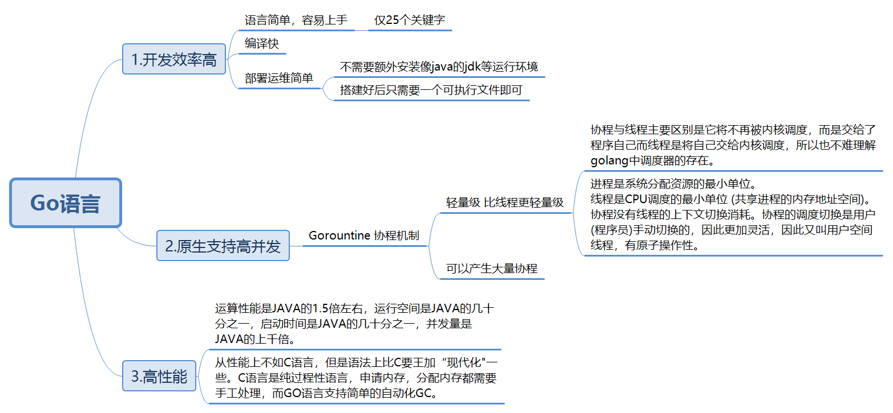
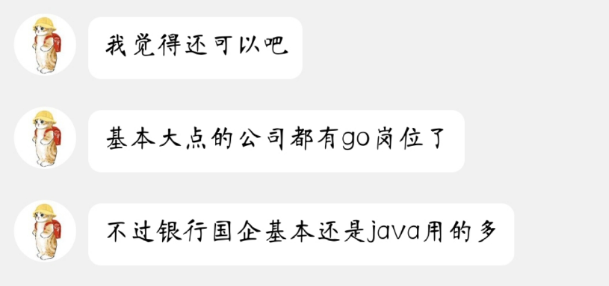
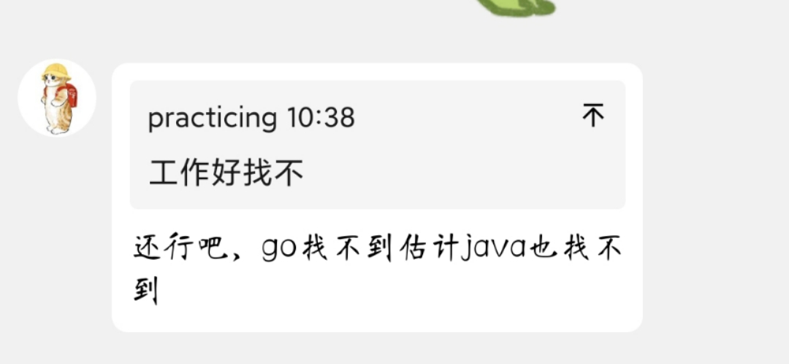

# Go语言调研

2023.08.23

## b站介绍视频

看了b站上的视频：[Golang (Go语言)是一门什么样的语言？为什么说每个程序员都应该学点Go?](https://www.bilibili.com/video/BV1bK411W74M/)

Go语言概述
1.开发效率高

- 语言简单，容易上手
  - 仅25个关键字
- 编译快
- 部署运维简单
  - 不需要额外安装像java的jdk等运行环境
  - 搭建好后只需要一个可执行文件即可

2.原生支持高并发

- Gorountine 协程机制

  - 轻量级 比线程更轻量级
    - 协程与线程主要区别是它将不再被内核调度，而是交给了程序自己而线程是将自己交给内核调度，所以也不难理解golang中调度器的存在。
    - 进程是系统分配资源的最小单位。
      线程是CPU调度的最小单位 (共享进程的内存地址空间)。
      协程没有线程的上下文切换消耗。协程的调度切换是用户(程序员)手动切换的，因此更加灵活，因此又叫用户空间线程，有原子操作性。

  - 可以产生大量协程

3.高性能

- 运算性能是JAVA的1.5倍左右，运行空间是JAVA的几十分之一，启动时间是JAVA的几十分之一，并发量是JAVA的上千倍。
- 从性能上不如C语言，但是语法上比C要王加“现代化"一些。C语言是纯过程性语言，申请内存，分配内存都需要手工处理，而GO语言支持简单的自动化GC。

## 问了王震师兄

Hollis: 师兄师兄，Go语言怎么样，你了解不

abbot: 你说的是前景吗

Hollis: 就是毕业找工作

Hollis: 好不好找，是不是要求特别高呀

abbot: 这个我不了解，你等下，我问个go的大佬

Hollis: 好

abbot:

abbot: 目标是私企的话可以冲，目标是银行国企还是java

Hollis: 帮我问下应届生毕业找这块的话，好不好进呢，我看很多都是要经验的

Hollis: 必然是私企呀

abbot:

Hollis: 懂了  还是看个人能力了

abbot: 反正现在这个大环境，都不是很好找

abbot: 不管啥语言难度都挺高的

Hollis: 嗯呐

Hollis: 不管了   先学一段时间

Hollis: 我之前学的java，然后感觉太卷了，而且薪资也没那么高

## 招聘网站

寰宇云科：[Golang 开发工程师 25-35K](https://www.zhipin.com/job_detail/7df9e4dd5996a51e1Xx73du_FlpU.html)

1、独立完成系统模块的开发，包括数据处理和业务逻辑处理；
 2、解决系统开发过程中的技术问题； 
3、参与 API 设计开发，以及相关支持功能的开发； 
岗位要求： 
1、5年以上工作经验，计算机或相关专业本科及以上学历，
2、熟练掌握 golang，熟悉 Linux 操作系统，熟练使用常见命令行工具 
3、有扎实的⽹络编程基础，对 Socket 通信、UDP/TCP 和 HTTP 协议及开发有深⼊理 解，对 Nginx、OpenResty 等有一定了解和使用经验 
4、了解容器相关知识，对 Docker, Kubernetes 等有实际操作使用经验优先 5、熟悉 Python, Java，Shell 脚本、Lua 脚本等更佳

Oppo：[高级后端工程师（go）25-50K·15薪](https://www.zhipin.com/job_detail/2bc8452886f7675a1HR50tq9GFRS.html)

岗位职责：
1、负责App/小游戏/快应用等内容的管理以及审核相关的核心模块代码开发工作；
2、主导/参与技术难题攻关，持续提升核心系统的性能和可用性；
3、负责项目开发团队的技术指导、技术把关等工作，提升团队的开发质量和效率；
任职要求：
1.三年以上PHP/Go开发经验，，熟悉主流开发框架；
2.熟悉MySQL、MongoDB、Redis等中间件产品，具有索引优化、查询优化、存储优化能力，有高并发高流量架构经验优先；
3.了解JavaScript，HTML，CSS，熟悉Linux系统的常用操作；
4.计算机基础知识良好，熟悉常用的网络协议、数据结构和算法；
5.态度积极主动负责，具备良好的分析解决问题能力，能独立承担任务和有系统进度把控能力。

字节跳动：[Golang 30-50K·15薪](https://www.zhipin.com/job_detail/f68ea41e406ec7e21XZ-2NW-GVtT.html)

职位描述
1、服务于字节跳动广告系统，负责广告商业变现基础平台研发工作；
2、设计并维护广告投放平台，优化改进微服务系统薄弱点，解决数据隔离、系统解耦等技术难题；
3、对接字节跳动抖音、头条等APP的广告投放；
4、深入理解广告投放流程，了解上下游投放链路和投放策略，参与现有投放链路和策略优化，助力平台营收；
5、提供百亿级广告基础数据服务，完成大规模、高可用的广告系统搭建。
职位要求
1、熟练掌握一门以上主流程序设计语言（Java，Python，Golang等），具备良好的编码能力；
2、基础扎实，熟悉网络编程，熟练使用至少一种数据库和缓存等基础组件；
3、学习能力强，能够独立分析和解决问题，逻辑思维能力强，善于分析和解决问题，能够处理复杂业务系统逻辑；
4、责任心强，具备良好的团队合作精神和承受压力的能力；
5、对技术有激情，勇于接受挑战，追求极致。